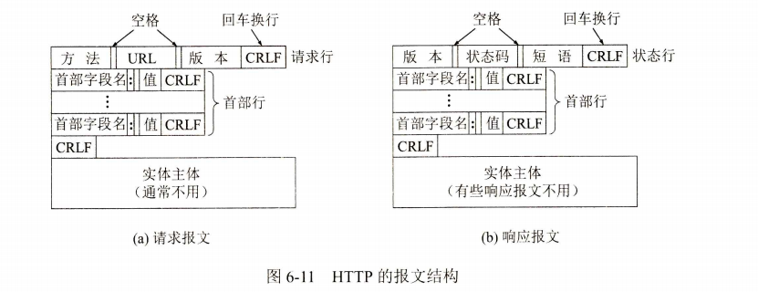
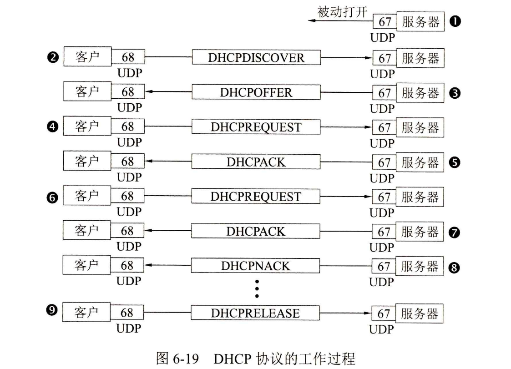

## 应用层

### 应用层的任务和协议

必须通过位于不同主机中的多个应用进程之间的通信和协同工作来完成

应用层的许多协议都是基于客户服务器方式。即使是P2P对等通信方式，实质上也是一种特殊的客户服务器方式。这里再明确一下，客户(client)和服务器(server)都是指通信中所涉及的两个应用进程。客户服务器方式所描述的是进程之间服务和被服务的关系。这里最主要的特征就是：客户是服务请求方，服务器是服务提供方。

### 域名系统DNS

#### 域名系统的概念

域名系统DNS (Domain Name System)是互联网使用的命名系统，用来把便于人们使用的机器名字转换为IP地址。域名系统其实就是名字系统。为什么不叫“名字”而叫“域名”呢?这是因为在这种互联网的命名系统中使用了许多的“域"(domain),因此就出现了“域名”这个名词

互联网的域名系统DNS被设计成为一个联机分布式数据库系统，并采用客户服务器方式。DNS使大多数名字都在本地进行解析(resolve)①,仅少量解析需要在互联网上通信，因此DNS系统的效率很高。由于DNS是分布式系统，即使单个计算机出了故障，也不会妨碍整个DNS系统的正常运行

当某一个应用进程需要把主机名解析为IP地址时，该应用进程就调用解析程序

#### 互联网的域名结构

早期的互联网使用了非等级的名字空间，其优点是名字简短。但当互联网上的用户数急剧增加时，用非等级的名字空间来管理一个很大的而且是经常变化的名字集合是非常困难的

互联网后来就采用了层次树状结构的命名方法，就像全球邮政系统和电话系统那样。

任何一个连接在互联网上的主机或路由器，都有一个唯一的层次结构的名字，即域名(domain name)。这里，“域”(domain)是名字空间中一个可被管理的划分。域还可以划分为子域，而子域还可继续划分为子域的子域，这样就形成了顶级域、二级域、三级域，等等

从语法上讲，每一个域名都由标号(label)序列组成，而各标号之间用点隔开

DNS规定，域名中的标号都由英文字母和数字组成，每一个标号不超过63个字符(但为了记忆方便，最好不要超过12个字符),也不区分大小写字母

原先的顶级域名共分为三大类：

(1)国家顶级域名nTLD:采用ISO 3166的规定。如：cn表示中国，us表示美国，uk表示英国，等等。国家顶级域名又常记为ccTLD(cc表示国家代码country-code)。截至2020年6月为止，国家顶级域名总数已达316个。

(2)通用顶级域名gTLD:到2006年12月为止，通用顶级域名的总数已经达到20个。最先确定的通用顶级域名有7个，即：
com(公司企业),net(网络服务机构),org(非营利性组织),int(国际组织),edu(美国专用的教育机构),gov(美国的政府部门),mil表示(美国的军事部门)。
以后又陆续增加了13个通用顶级域名：
aero(航空运输企业),asia(亚太地区),biz(公司和企业),cat(使用加泰隆人的语言和文化团体),coop(合作团体),info(各种情况),jobs(人力资源管理者),mobi(移动产品与服务的用户和提供者),museum(博物馆),name(个人),pro(有证书的专业人员),tel(Telnic股份有限公司),travel(旅游业)。

(3)基础结构域名(infrastructure domain):这种顶级域名只有一个，即arpa,用于反向域名解析，因此又称为反向域名。

我国把二级域名划分为“类别域名”和“行政区域名”两大类。
“类别域名”共7个，分别为：ac(科研机构),com(工、商、金融等企业),edu(中国的教育机构),gov(中国的政府机构),mil(中国的国防机构),net(提供互联网络服务的机构),org(非营利性的组织)。
“行政区域名”共34个，适用于我国的各省、自治区、直辖市。例如：bj(北京市),js(江苏省),等等

关于我国的互联网络发展现状以及各种规定(如申请域名的手续),均可在中国互联网网络信息中心CNNIC的网址上找到[W-CNNIC]。

#### 域名服务器

一个服务器所负责管辖的(或有权限的)范围叫作区(zone)。各单位根据具体情况来划分自己管辖范围的区。但在一个区中的所有节点必须是能够连通的。

每一个区设置相应的权限域名服务器(authoritative name server),用来保存该区中的所有主机的域名到IP地址的映射

每一个域名服务器都能够进行部分域名到IP地址的解析。当某个DNS服务器不能进行域名到IP地址的转换时，它就设法找互联网上别的域名服务器进行解析

域名服务器划分为以下四种不同的类型：
(1)根域名服务器(root name server):根域名服务器是最高层次的域名服务器，也是最重要的域名服务器。所有的根域名服务器都知道所有的顶级域名服务器的域名和IP地址。根域名服务器是最重要的域名服务器，因为不管是哪一个本地域名服务器，若要对互联网上任何一个域名进行解析(即转换为IP地址),只要自己无法解析，就首先要求助于根域名服务器。

假定所有的根域名服务器都瘫痪了，那么整个互联网中的DNS系统就无法工作。全世界的根域名服务器只使用13个不同IP地址的域名，即a.rootservers.net,b.rootservers.net,…,m.rootservers.net。

实际上，在互联网中是由13套装置(13 installations,也就是13套系统)构成这13组根域名服务器的[W-ROOT]。每一套装置在很多地点安装根域名服务器(也可称为镜像根服务器),但都使用同一个域名。负责运营根域名服务器的公司大多在美国，但所有的根域名服务器却分布在全世界

由于根域名服务器采用了任播(anycast)技术①,因此当DNS客户向某个根域名服务器的IP地址发出查询报文时，互联网上的路由器就能找到离这个DNS客户最近的一个根域名服务器

(2)顶级域名服务器(即TLD服务器):这些域名服务器负责管理在该顶级域名服务器注册的所有二级域名。当收到DNS查询请求时，就给出相应的回答(可能是最后的结果，也可能是下一步应当找的域名服务器的IP地址)。

(3)权限域名服务器：这就是前面已经讲过的负责一个区的域名服务器。当一个权限域名服务器还不能给出最后的查询回答时，就会告诉发出查询请求的DNS客户，下一步应当找哪一个权限域名服务器。例如在图6-2(b)中，区abc.com和区y.abc.com各设有一个权限域名服务器。

(4)本地域名服务器(local name server):它对域名系统非常重要。当一台主机发出DNS查询请求时，这个查询请求报文就发送给本地域名服务器。

每一个互联网服务提供者ISP,或一个大学，甚至一个大学里的系，都拥有一个本地域名服务器，本地域名服务器离用户较近，一般不超过几个路由器的距离

为了提高域名服务器的可靠性，DNS域名服务器都把数据复制到几个域名服务器来保存，其中的一个是主域名服务器(master name server),其他的是辅助域名服务器(secondaryname server)。当主域名服务器出故障时，辅助域名服务器可以保证DNS的查询工作不会中断。主域名服务器定期把数据复制到辅助域名服务器中，而更改数据只能在主域名服务器中进行。这样就保证了数据的一致性

#### 域名解析过程

域名的解析过程。这里要注意两点。
第一，主机向本地域名服务器的查询一般都采用递归查询(recursive query)。

所谓递归查询就是：如果主机所询问的本地域名服务器不知道被查询域名的IP地址，那么本地域名服务器就以DNS客户的身份，向其他根域名服务器继续发出查询请求报文(即替该主机继续查询),而不是让该主机自己进行下一步的查询。因此，递归查询返回的查询结果或者是所要查询的IP地址，或者是报错，表示无法查询到所需的IP地址。

第二，本地域名服务器向根域名服务器的查询通常采用迭代查询(iterative query)。

迭代查询的特点是这样的：当根域名服务器收到本地域名服务器发出的迭代查询请求报文时，要么给出所要查询的IP地址，要么告诉本地域名服务器：“你下一步应当向哪一个域名服务器进行查询”。然后让本地域名服务器进行后续的查询(而不是替本地域名服务器进行后续的查询)。根域名服务器通常是把自己知道的顶级域名服务器的IP地址告诉本地域名服务器，让本地域名服务器再向顶级域名服务器查询。顶级域名服务器在收到本地域名服务器的查询请求后，要么给出所要查询的IP地址，要么告诉本地域名服务器下一步应当向哪一个权限域名服务器进行查询，本地域名服务器就这样进行迭代查询。最后，知道了所要解析的域名的IP地址，然后把这个结果返回给发起查询的主机。当然，本地域名服务器也可以采用递归查询，这取决于最初的查询请求报文的设置要求使用哪一种查询方式。

主机m.xyz.com打算发送邮件给主机y.abc.com。这时就必须知道主机y.abc.com的IP地址。下面是图6-4(a)的几个查询步骤：
1主机m.xyz.com先向其本地域名服务器dns.xyz.com进行递归查询。

2本地域名服务器采用迭代查询。它先向一个根域名服务器查询。
③根域名服务器告诉本地域名服务器，下一次应查询的顶级域名服务器dns.com的IP
地址。
④4本地域名服务器向顶级域名服务器dns.com进行查询。
⑤顶级域名服务器dns.com告诉本地域名服务器，下一次应查询的权限域名服务器
dns.abc.com的IP地址。
6本地域名服务器向权限域名服务器dns.abc.com进行查询。
⑦权限域名服务器dns.abc.com告诉本地域名服务器，所查询的主机的IP地址。
8本地域名服务器最后把查询结果告诉主机m.xyz.com。

我们注意到，这8个步骤总共要使用8个UDP用户数据报的报文。本地域名服务器经过三次迭代查询后，从权限域名服务器dns.abc.com得到了主机y.abc.com的IP地址，最后把结果返回给发起查询的主机m.xyz.com。

为了提高DNS查询效率，并减轻根域名服务器的负荷和减少互联网上的DNS查询报文数量，在域名服务器中广泛地使用了高速缓存(有时也称为高速缓存域名服务器)。高速缓存用来存放最近查询过的域名以及从何处获得域名映射①信息的记录。

### 文件传送协议

#### FTP概述

文件传送协议FTP(File Transfer Protocol)曾是互联网上使用得最广泛的文件传送协议

FTP提供交互式的访问，允许客户指明文件的类型与格式(如指明是否使用ASCII码),并允许文件具有存取权限(如访问文件的用户必须经过授权，并输入有效的口令)

#### 文件共享协议

文件共享协议中的另一大类是联机访问(on-line access)。联机访问意味着允许多个程序同时对一个文件进行存取

透明存取的优点是：将原来用于处理本地文件的应用程序用来处理远地文件时，不需要对该应用程序做明显的改动。

属于文件共享协议的有网络文件系统NFS(Network File System）

网络文件系统NFS则采用另一种思路。NFS允许应用进程打开一个远地文件，并能在该文件的某一个特定的位置上开始读写数据

在网络上传送的只是少量的修改数据。

#### FTP的基本原理

文件传送协议FTP只提供文件传送的一些基本的服务，它使用TCP可靠的运输服务。FTP的主要功能是减少或消除在不同操作系统下处理文件的不兼容性。

FTP的服务器进程由两大部分组成：一个主进程，负责接受新的请求；另外有若干个从属进程，负责处理单个请求。

主进程的工作步骤如下：
(1)打开熟知端口(端口号为21),使客户进程能够连接上。
(2)等待客户进程发出连接请求。
(3)启动从属进程处理客户进程发来的请求。从属进程对客户进程的请求处理完毕后即终止，但从属进程在运行期间根据需要还可能创建其他一些子进程。
(4)回到等待状态，继续接受其他客户进程发来的请求。主进程与从属进程的处理是并发进行的。

  

在进行文件传输时，FTP的客户和服务器之间要建立两个并行的TCP连接：“控制连接”和“数据连接”。

控制连接在整个会话期间一直保持打开，FTP客户所发出的传送请求，通过控制连接发送给服务器端的控制进程，但控制连接并不用来传送文件。

**控制连接**：

- 整个会话期间都保持打开状态。
- 用于传送FTP相关的控制命令，如用户名验证、密码输入、列出目录等指令。
- 不负责实际的数据传输任务。

实际用于传输文件的是“数据连接”。服务器端的控制进程在接收到FTP客户发送来的文件传输请求后就创建“数据传送进程”和“数据连接”,用来连接客户端和服务器端的数据传送进程。

**数据连接**：

- 只在文件传输过程中短暂地建立起来，在传输结束后立即关闭。
- 专门用于文件的实际传输过程中的数据通信。

FTP并非对所有的数据传输都是最佳的。例如，计算机A上运行的应用程序要在远地计算机B的一个很大的文件末尾添加一行信息。若使用FTP,则应先将此文件从计算机B传送到计算机A,添加上这一行信息后，再用FTP将此文件传送到计算机B,来回传送这样大的文件很花时间

#### 简单文件传送协议TFTP

它是一个很小且易于实现的文件传送协议。虽然TFTP也使用客户服务器方式，但它使用UDP数据报，因此TFTP需视频讲解要有自己的差错改正措施。TFTP只支持文件传输而不支持交互。TFTP没有一个庞大的命令集，没有列目录的功能，也不能对用户进行身份鉴别。

TFTP的主要优点有两个。

第一，TFTP可用于UDP环境。例如，当需要将程序或文件同时向许多机器下载时就往往需要使用TFTP。

第二，TFTP代码所占的内存较小。这对较小的计算机或某些特殊用途的设备是很重要的。

#### 远程终端协议TELNET

TELNET是一个简单的远程终端协议，用户用TELNET就可在其所在地通过TCP连接注册(即登录)到远地的另一台主机上(使用主机名或IP地址）

这种服务是透明的，因为用户感觉到好像键盘和显示器是直接连在远地主机上的。因此，TELNET又称为终端仿真协议。

### 万维网WWW

#### 万维网概述

万维网WwW(World Wide Web)是一个大规模的、联机式的信息储藏所，英文简称为
Web,而不是什么特殊的计算机网络

万维网用链接的方法能非常方便地从互联网上的一个站点访问另一个站点

万维网是一个分布式的超媒体(hypermedia)系统，它是超文本(hypertext)系统的扩充。所谓超文本是指包含指向其他文档的链接的文本(text)。也就是说，一个超文本由多个信息源链接成，而这些信息源可以分布在世界各地，并且数目也是不受限制的。利用一个链接可使用户找到远在异地的另一个文档，而这又可链接到其他的文档(依此类推)。这些文档可以位于世界上任何一个接在互联网上的超文本系统中。超文本是万维网的基础。

超媒体与超文本的区别是文档内容不同。超文本文档仅包含文本信息，而超媒体文档还包含其他表示方式的信息，如图形、图像、声音、动画以及视频图像等。分布式的和非分布式的超媒体系统有很大区别。在非分布式系统中，各种信息都驻留

客户程序向服务器程序发出请求，服务器程序向客户程序送回客户所要的万维网文档

​    

#### 万维网必须解决以下几个问题：

怎样标志分布在整个互联网上的万维网文档?

- 维网使用统一资源定位符URL(Uniform Resource Locator)来标志万维网上的各种文档，并使每一个文档在整个互联网的范围内具有唯一的标识符URL。

用什么样的协议来实现万维网上的各种链接?

- 使万维网客户程序与万维网服务器程序之间的交互遵守严格的协议，这就是超文本传送协议HTTP(HyperText Transfer Protocol)

怎样使不同作者创作的不同风格的万维网文档，都能在互联网上的各种主机上显示出来，同时使用户清楚地知道在什么地方存在着链接?

- 万维网使用超文本标记语言HTML(Hyper Text Markup Language),使得万维网页面的设计者可以很方便地用链接从本页面的某处链接到互联网上的任何一个万维网页面，并且能够在自己的主机屏幕上将这些页面显示出来

#### 统一资源定位符URL

统一资源定位符URL是用来表示从互联网上得到的资源位置和访问这些资源的方法

URL给资源的位置提供一种抽象的识别方法，并用这种方法给资源定位。只要能够对资源定位，系统就可以对资源进行各种操作，如存取、更新、替换和查找其属性。由此可见，URL实际上就是在互联网上的资源的地址。

这里所说的“资源”是指在互联网上可以被访问的任何对象，包括文件目录、文件、文档、图像、声音等，以及与互联网相连的任何形式的数据。

URL相当于一个文件名在网络范围的扩展。因此，URL是与互联网相连的机器上的任何可访问对象的一个指针

##### URL的一般形式由以下四个部分组成：

URL最左边的协议指出使用何种协议来获取该万维网文档。现在最常用的协议就是http(超文本传送协议HTTP),其次是ftp(文件传送协议FTP)。在协议后面的“://”是规定的格式，必须写上。

主机名是万维网文档所存放的主机的域名，通常以www开头，但这并不是硬性规定。主机名用点分十进制的IP地址代替也是可以的。

主机名后面的“:端口”就是端口号，但经常被省略掉。这是因为这个端口号通常就是协议的默认端口号(例如，协议HTTP的默认端口号为80),因此就可以省略。但如不使用默认端口号，那么就必须写明现在所使用的端口号。

最后的路径可能是较长的字符串(其中还可包括若干斜线/),但有时也不需要使用。

##### 使用HTTP的URL

使用协议HTTP的URL最常用的形式是把“:端口”省略

若再将URL中的路径省略，则URL就指明互联网上的某个主页(home page)。主页是个很重要的概念，它可以是以下几种情况之一：
(1)一个WWW服务器的最高级别的页面。
(2)某一个组织或部门的一个定制的页面或目录。从这样的页面可链接到互联网上的与本组织或部门有关的其他站点。
(3)由某一个人自己设计的描述他本人情况的WWW页面。例如，要查有关清华大学的信息，就可先进入到清华大学的主页，其URL为：http://www.tsinghua.edu.cn

URL的“协议”和“主机名”部分，字母不区分大小写。但“路径”中的字符有时要区分大小写。

#### 超文本传送协议HTTP

##### HTTP的操作过程

协议HTTP定义了浏览器(即万维网客户进程)怎样向万维网服务器请求万维网文档，以及服务器怎样把文档传送给浏览器

从层次的角度看，HTTP是面向事务的(transaction-oriented)°应用层协议，它是万维网上能够可靠地交换文件(包括文本、声音、图像等各种多媒体文件)的重要基础

每个万维网网点都有一个服务器进程，它不断地监听TCP的端口80,以便发现是否有浏览器(即万维网客户。请注意，浏览器和万维网客户是同义词)向它发出连接建立请求。一旦监听到连接建立请求并建立了TCP连接之后，浏览器就向万维网服务器发出浏览某个页面的请求，服务器接着就返回所请求的页面作为响应。服务器在完成任务后，TCP连接就被释放了。在浏览器和服务器之间的请求和响应的交互，必须按照规定的格式和遵循一定的规则。这些格式和规则就是超文本传送协议HTTP。

HTTP使用了面向连接的TCP作为运输层协议，保证了数据的可靠传输。HTTP不必考虑数据在传输过程中被丢弃后又怎样被重传。但是，协议HTTP本身是无连接的。

协议HTTP是无状态的(stateless)。也就是说，同一个客户第二次访问同一个服务器上的页面时，服务器的响应与第一次被访问时的相同

用户在点击鼠标链接某个万维网文档时，协议HTTP首先要和服务器建立TCP连接。

这需要使用三报文握手。当建立TCP连接的三报文握手的前两个报文完成后(即经过了一个RTT时间后),万维网客户就把HTTP请求报文，作为建立TCP连接的三报文握手中的第三个报文的数据，发送给万维网服务器。

服务器收到HTTP请求报文后，就把所请求的文档作为响应报文返回给客户。

可看出，请求一个万维网文档所需的时间是该文档的传输时间(与文档大小成正比)加上两倍往返时间RTT(一个RTT用于连接TCP连接，另一个RTT用于请求和接收万维网文档。TCP建立连接的三报文握手的第三个报文段中的数据，就是客户对万维网文档的请求报文)。

协议HTTP/1.0的主要缺点，就是每请求一个文档就要有两倍RTT的开销。

另一种开销就是万维网客户和服务器每一次建立新的TCP连接都要分配缓存和变量。特别是万维网服务器往往要同时服务于大量客户的请求，所以这种非持续连接会使万维网服务器的负担很重

协议HTTP/1.1较好地解决了这个问题，它使用了持续连接(persistent connection)。所谓持续连接就是万维网服务器在发送响应后仍然在一段时间内保持这条连接，使同一个客户(浏览器)和该服务器可以继续在这条连接上传送后续的HTTP请求报文和响应报文

HTTP/1.1的持续连接有两种工作方式，即非流水线方式(without pipelining)和流水线方式(with pipelining)。

非流水线方式的特点，是客户在收到前一个响应后才能发出下一个请求。因此，在TCP连接已建立后，客户每访问一次对象都要用去一个往返时间RTT。这比 非持续连接要用去两倍RTT的开销，节省了建立TCP连接所需的一个RTT时间。

但非流水线方式还是有缺点的，因为服务器在发送完一个对象后，其TCP连接就处于空闲状态，浪费了服务器资源。

流水线方式的特点，是客户在收到HTTP的响应报文之前就能够接着发送新的请求报文。于是一个接一个的请求报文到达服务器后，服务器就可连续发回响应报文。

因此，使用流水线方式时，客户访问所有的对象只需花费一个RTT时间。流水线工作方式使TCP连接中的空闲时间减少，提高了下载文档效率。

协议HTTP/2是协议HTTP/1.1的升级版本，其HTTP方法/状态码/语义等都没有改变，其主要特点如下：

客户可以连续向服务器发出许多个请求，而不必等到收到一个响应后再发送下一个请求。但服务器发回响应时必须按先后顺序排队，逐个地发送给客户。有时遇到某个响应迟迟不能发回，那么排在后面的一些响应就必须等待很长的时间。HTTP/2把服务器发回的响应变成可以并行地发回(使用同一个TCP连接),这就大大缩短了服务器的响应时间。

使用HTTP/1.1时，当客户收到服务器发回的响应后，原来建立的TCP连接就释放了。如果客户还要继续向该服务器发送新的请求，就必须重新建立TCP连接

(3)HTTP/1.1的请求和响应报文是面向文本的(text-oriented)。当客户连续发送请求并受到响应时，在TCP连接上传送的HTTP报文首部成为不小的开销。在这些首部中有很多字段是重复的。为此，HTTP/2把所有的报文都划分为许多较小的二进制编码的帧，并采用了新的压缩算法，不发送重复的首部字段，大大减小了首部的开销，提高了传输效率。

##### 代理服务器

代理服务器(proxy server)是一种网络实体，它又称为万维网高速缓存(Web cache)。代理服务器把最近的一些请求和响应暂存在本地磁盘中

##### HTTP的报文结构

(1)请求报文——从客户向服务器发送请求报文
(2)响应报文——从服务器到客户的回答

由于HTTP是面向文本的，因此在报文中的每一个字段都是一些ASCII码串，因而各个字段的长度都是不确定的。
HTTP请求报文和响应报文都是由三个部分组成的

(1)开始行，用于区分是请求报文还是响应报文。在请求报文中的开始行叫作请求行(Request-Line),而在响应报文中的开始行叫作状态行(Status-Line)。在开始行的三个字段之间都以空格分隔开，最后的“CR”和"LF"分别代表“回车”和“换行”。

(2)首部行，用来说明浏览器、服务器或报文主体的一些信息。首部可以有好几行，但也可以不使用。在每一个首部行中都有首部字段名和它的值，每一行在结束的地方都要有“回车”和“换行”。整个首部行结束时，还有一空行将首部行和后面的实体主体分开。

(3)实体主体(entity body),在请求报文中一般都不用这个字段，而在响应报文中也可能没有这个字段。

##### HTTP请求报文的一些主要特点

请求报文的第一行“请求行”只有三个内容，即方法、请求资源的URL,以及HTTP的版本。

这里的名词“方法”(method)是面向对象技术中使用的专门名词。所谓“方法”就是对所请求的对象进行的操作，这些方法实际上也就是一些命令

##### HTTP响应报文的主要特点

每一个请求报文发出后，都能收到一个响应报文。响应报文的第一行就是状态行。状态行包括三项内容，即HTTP的版本、状态码，以及解释状态码的简单短语

状态码(Status-Code)都是三位数字的，分为5大类，原先有33种[RFC 2616],后来又增
加了几种[RFC6585,建议标准]。这5大类的状态码都是以不同的数字开头的。

- 1xx表示通知信息，如请求收到了或正在进行处理。
- 2xx表示成功，如接受或知道了。
- 3xx表示重定向，如要完成请求还必须采取进一步的行动。
- 4xx表示客户的差错，如请求中有错误的语法或不能完成。
- 5xx表示服务器的差错，如服务器失效无法完成请求。

##### 在服务器上存放用户的信息

对Cookie进行了定义，规定万维网站点可以使用Cookie来跟踪用户。，在这里Cookie表示在HTTP服务器和客户之间传递的状态信息

Cookie是这样工作的：当用户A浏览某个使用Cookie的网站时，该网站的服务器就为A产生一个唯一的识别码，并以此作为索引在服务器的后端数据库中产生一个项目。接着在给A的HTTP响应报文中添加一个叫作Set-cookie的首部行。这里的“首部字段名”就是“Set-cookie”,而后面的“值”就是赋予该用户的“识别码”。例如这个首部行是这样的：
Set-cookie:31d4d96e407aad42

当A收到这个响应时，其浏览器就在它管理的特定Cookie文件中添加一行，其中包括这个服务器的主机名和Set-cookie后面给出的识别码。当A继续浏览这个网站时，每发送一个HTTP请求报文，其浏览器就会从其Cookie文件中取出这个网站的识别码，并放到HTTP请求报文的Cookie首部行中：
Cookie:31d4d96e407aad42

于是，这个网站就能够跟踪用户31d4d96e407aad42(用户A)在该网站的活动。

#### 万维网的文档

##### 超文本标记语言HTML

超文本标记语言HTML(HyperText Markup Language)就是一种制作万维网页面的标准语言，它消除了不同计算机之间信息交流的障碍

HTML允许在万维网页面中插入图像。一个页面本身带有的图像称为内含图像(inlineimage)

HTML还规定了链接的设置方法。我们知道每个链接都有一个起点和终点。链接的起点说明在万维网页面中的什么地方可引出一个链接

链接的终点可以是其他网站上的页面。这种链接方式叫作远程链接。这时必须在HTML文档中指明链接到的网站的URL。有时链接可以指向本计算机中的某一个文件或本文件中的某处，这叫作本地链接

##### XML(Extensible Markup Language)是可扩展标记语言

XML(Extensible Markup Language)是可扩展标记语言，它和HTML很相似。但XML的设计宗旨是传输数据，而不是显示数据(HTML是为了在浏览器上显示数据)

###### XHTML(Extensible HTML)是可扩展超文本标记语言

XHTML是更严格的HTML版本，也是一个W3C标准(2000年1月制定),是作为一种XML应用被重新定义的HTML,并将逐渐取代HTML。所有新的浏览器都支持XHTML。

##### 语言CSS (Cascading Style Sheets)是层叠样式表

语言CSS (Cascading Style Sheets)是层叠样式表，它是一种样式表语言，用于为HTML文档定义布局。CSS与HTML的区别就是：HTML用于结构化内容，而CSS则用于格式化结构化的内容

##### 动态万维网文档

静态文档在文档创作完毕后就存放在万维网服务器中，在被用户浏览的过程中，内容不会改变

动态文档(dynamic document)是指文档的内容是在浏览器访问万维网服务器时才由应用程序动态创建的

动态文档和静态文档之间的主要差别体现在服务器一端。这主要是文档内容的生成方法不同。

##### 活动万维网文档

动态文档一旦建立，它所包含的信息内容也就固定下来而无法及时刷新屏幕。另外，像动画之类的显示效果，动态文档也无法提供。

有两种技术可用于浏览器屏幕显示的连续更新。

一种技术称为服务器推送(server push),这种技术是将所有的工作都交给服务器。服务器不断地运行与动态文档相关联的应用程序，定期更新信息，并发送更新过的文档。

服务器就要运行很多服务器推送程序。这将造成过多的服务器开销。

另一种提供屏幕连续更新的技术是活动文档(active document)。这种技术是把所有的工作都转移给浏览器端。每当浏览器请求一个活动文档时，服务器就返回一段活动文档程序副本，使该程序副本在浏览器端运行。这时，活动文档程序可与用户直接交互，并可连续地改变屏幕的显示。只要用户运行活动文档程序，活动文档的内容就可以连续地改变。由于活动文档技术不需要服务器的连续更新传送，对网络带宽的要求也不会太高。

#### 万维网的信息检索系统

##### 全文检索搜索与分类目录搜索

在万维网中用来进行搜索的工具叫作搜索引擎(search engine)。

搜索引擎的种类很多，但大体上可划分为两大类，即全文检索搜索引擎和分类目录搜索引擎。

全文检索搜索引擎是一种纯技术型的检索工具。它的工作原理是通过搜索软件(例如一种叫作“蜘蛛”或“网络机器人”的Spider程序)到互联网上的各网站收集信息，找到一个网站后可以从这个网站再链接到另一个网站，像蜘蛛爬行一样。然后按照一定的规则建立一个很大的在线索引数据库供用户查询

用户在查询时只要输入关键词，就从已经建立的索引数据库里进行查询(并不是实时地在互联网上检索到的信息)。因此很可能有些查到的信息已经是过时的(例如很多年前的)

分类目录搜索引擎并不采集网站的任何信息，而是利用各网站向搜索引擎提交网站信息时填写的关键词和网站描述等信息，经过人工审核编辑后，如果认为符合网站登录的条件，则输入到分类目录的数据库中，供网上用户查询

分类目录搜索也叫作分类网站搜索。分类目录的好处就是用户可根据网站设计好的目录有针对性地逐级查询所需要的信息，查询时不需要使用关键词，只需要按照分类(先找大类，再找下面的小类),因而查询的准确性较好

目前出现了垂直搜索引擎(vertical search engine),它针对某一特定领域、特定人群或某一特定需求提供搜索服务

还有一种元搜索引擎(meta search engine),它把用户提交的检索请求发送到多个独立的搜索引擎上去搜索，并把检索结果集中统一处理，以统一的格式提供给用户

##### Google搜索技术的特点

它的核心技术就是PageRankTM,译为网页排名。
PageRank对搜索出来的结果按重要性进行排序

#### 博客和微博

博客的作者可以源源不断地往万维网上的个人博客里填充内容，供其他网民阅读

微博就是微型博客(microblog),又称为微博客，它的意思已经非常清楚。博客或微博里的朋友，常称为“博友”。微博也被人戏称为“围脖”,把博友戏称为“脖友”。

#### 社交网站

社交网站SNS (Social Networking Site)是近年来发展非常迅速的一种网站，其作用是为一群拥有相同兴趣与活动的人创建在线社区

### 电子邮件

#### 电子邮件概述

电子邮件的两个最重要的草案标准，是2008年更新的简单邮件传送协议SMTP(Simple MailTransfer Protocol)和互联网文本报文格式。

电子邮件把邮件发送到收件人使用的邮件服务器，并放在其中的收件人邮箱(mail box)中，收件人可在自己方便时上网到自己使用的邮件服务器进行读取

MIME在其邮件首部中说明了邮件的数据类型(如文本、声音、图像、视像等)。在MIME邮件中可同时传送多种类型的数据。这在多媒体通信的环境下是非常有用的。

##### 电子邮件的最主要的组成构件

一个电子邮件系统应具有图6-16所示的三个主要组成构件，这就是用户代理、邮件服务器，以及邮件发送协议(如SMTP)和邮件读取协议(如POP3)。POP3是邮局协议(PostOffice Protocol)的版本3。

用户代理UA (User Agent)就是用户与电子邮件系统的接口，在大多数情况下它就是运行在用户计算机中的一个程序。因此用户代理又称为电子邮件客户端软件。

- 用户代理至少应当具有以下4个功能。
  (1)撰写。给用户提供编辑信件的环境。例如，应让用户能创建便于使用的通信录(有常用的人名和地址)。回信时不仅能很方便地从来信中提取出对方地址，并自动地将此地址写入到邮件中合适的位置，而且还能方便地对来信提出的问题进行答复(系统自动将来信复制一份在用户撰写回信的窗口中，因而用户不需要再输入来信中的问题)。
- (2)显示。能方便地在计算机屏幕上显示出来信(包括来信附上的声音和图像)。
- (3)处理。处理包括发送邮件和接收邮件。收件人应能根据情况按不同方式对来信进行处理。例如，阅读后删除、存盘、打印、转发等，以及自建目录对来信进行分类保存。有时还可在读取信件之前先查看一下邮件的发件人和长度等，对于不愿收的信件可直接在邮箱中删除。
- (4)通信。发信人在撰写完邮件后，要利用邮件发送协议将邮件发送到用户所使用的邮件服务器。收件人在接收邮件时，要使用邮件读取协议从本地邮件服务器接收邮件。

邮件服务器需要使用两种不同的协议。一种协议用于用户代理向邮件服务器发送邮件或在邮件服务器之间发送邮件，如SMTP协议，而另一种协议用于用户代理从邮件服务器读取邮件，如邮局协议POP3。

SMTP和POP3(或IMAP)都是使用TCP连接来传送邮件的，使用TCP的目的是为了可靠地传送邮件。

邮件不会在互联网中的某个中间邮件服务器落地。

TCP/IP体系的电子邮件系统规定电子邮件地址(E-mail address)的格式如下：
用户名@邮件服务器的域名

#### 简单邮件传送协议SMTP

SMTP规定了在两个相互通信的SMTP进程之间应如何交换信息

##### 1.连接建立

发件人的邮件送到发送方邮件服务器的邮件缓存后，SMTP客户就每隔一定时间(例如30分钟)对邮件缓存扫描一次。

如发现有邮件，就使用SMTP的熟知端口号码25与接收方邮件服务器的SMTP服务器建立TCP连接。在连接建立后，接收方SMTP服务器要发出“220 Service ready”(服务就绪)。

然后SMTP客户向SMTP服务器发送HELO命令，附上发送方的主机名。SMTP服务器若有能力接收邮件，则回答：“250 OK”,表示已准备好接收。若SMTP服务器不可用，则回答“421 Service not available”(服务不可用)。

##### 2.邮件传送

邮件的传送从MAIL命令开始。MAIL命令后面有发件人的地址。如：MAIL FROM:<xiexiren@tsinghua.org.cn>。若SMTP服务器已准备好接收邮件，则回答“250 OK”。否则，返回一个代码，指出原因。如：451(处理时出错)、452(存储空间不够)、500(命令无法识别)等。

##### 3.连接释放

邮件发送完毕后，SMTP客户应发送QUIT命令。SMTP服务器返回的信息是“221(服务关闭)”,表示SMTP同意释放TCP连接。邮件传送的全部过程即结束。
这里再强调一下，使用电子邮件的用户看不见以上这些过程，所有这些复杂过程都被电子邮件的用户代理屏蔽了。

#### 电子邮件的信息格式

一个电子邮件分为信封和内容两大部分。在草案标准RFC 5322文档中只规定了邮件内容中的首部(header)格式，而对邮件的主体(body)部分则让用户自由撰写。用户写好首部后，邮件系统自动地将信封所需的信息提取出来并写在信封上。所以用户不需要填写电子邮件信封上的信息。

To:”后面填入一个或多个收件人的电子邮件地址

“Subject:”是邮件的主题。它反映了邮件的主要内容

首部关键字还有“From”和“Date”,表示发件人的电子邮件地址和发信日期。这两项一般都由邮件系统自动填入。
另一个关键字是“Reply-To”,即对方回信所用的地址。

#### 邮件读取协议POP3和IMAP

现在常用的邮件读取协议有两个，即邮局协议第3个版本POP3和网际报文存取协议IMAP(Internet Message Access Protocol)

邮局协议POP是一个非常简单、但功能有限的邮件读取协议。

#### 基于万维网的电子邮件

不管在什么地方(在任何一个国家的网吧、宾馆或朋友家中),只要能够找到上网的计算机，在打开任何一种浏览器后，就可以非常方便地收发电子邮件。使用万维网电子邮件不需要在计算机中再安装用户代理软件

#### 通用互联网邮件扩充MIME

##### 前面所述的电子邮件协议SMTP有以下缺点：

(1)SMTP不能传送可执行文件或其他的二进制对象。

(2)SMTP限于传送7位的ASCII码。许多其他非英语国家的文字(如中文、俄文，甚至带重音符号的法文或德文)就无法传送。

(3)SMTP服务器会拒绝超过一定长度的邮件。
(4)某些SMTP的实现并没有完全按照SMTP的互联网标准。常见的问题如下：
●  回车、换行的删除和增加；
●  超过76个字符时的处理：截断或自动换行；
●后面多余空格的删除；

●  将制表符tab转换为若干个空格。

了通用互联网邮件扩充MIME [RFC 2045~2049,前三个文档是草案标准]。MIME并没有改动或取代SMTP。MIME的意图是继续使用原来的邮件格式，但增加了邮件主体的结构，并定义了传送非ASCII码的编码规则。也就是说，MIME邮件可在现有的电子邮件程序和协议下传送

##### 内容传送编码

最简单的编码就是7位ASCII码，而每行不能超过1000个字符。

另一种编码称为quoted-printable,这种编码方法适用于所传送的数据中只有少量的非ASCII码，例如汉字

对于任意的二进制文件，可用base64编码。

##### 内容类型

MIME标准规定Content-Type说明必须含有两个标识符，即内容类型(type)和子类型(subtype),中间用“/”分开。

#### 动态主机配置协议DHCP

互联网现在广泛使用的是动态主机配置协议DHCP (Dynamic Host ConfigurationProtocol),它提供了一种机制，称为即插即用连网(plug-and-play networking)。这种机制允许一台计算机加入新的网络和获取IP地址而不用手工参与。

DHCP使用客户服务器方式。需要IP地址的主机在启动时就向DHCP服务器广播发送发现报文(DHCPDISCOVER)(将目的IP地址置为全1,即255.255.255.255),这时该主机就成为DHCP客户。

发送广播报文是因为现在还不知道DHCP服务器在什么地方，因此要发现(DISCOVER)DHCP服务器的IP地址。这台主机目前还没有自己的IP地址，因此它将IP数据报的源IP地址设为全0。这样，在本地网络上的所有主机都能够收到这个广播报文，但只有DHCP服务器才对此广播报文进行回答。

当DHCP中继代理收到主机A以广播形式发送的发现报文后，就以单播方式向DHCP服务器转发此报文

我们并不愿意在每一个网络上都设置一个DHCP服务器，因为这样会使DHCP服务器的数量太多。因此现在是使每一个网络至少有一个DHCP中继代理(relay agent)(通常是一台路由器

DHCP服务器的回答报文叫作提供报文(DHCPOFFER),表示“提供”了IP地址等配置信息。

DHCP服务器分配给DHCP客户的IP地址是临时的，因此DHCP客户只能在一段有限的时间内使用这个分配到的IP地址。DHCP协议称这段时间为租用期(lease period)

DHCP客户使用的UDP端口是68,而DHCP服务器使用的UDP端口是67。这两个UDP端口都是熟知端口。

1、 DHCP服务器被动打开UDP端口67,等待客户端发来的报文。

2 、DHCP客户从UDP端口68发送DHCP发现报文。
③凡收到DHCP发现报文的DHCP服务器都发出DHCP提供报文，因此DHCP客户可能收到多个DHCP提供报文。
④DHCP客户从几个DHCP服务器中选择其中的一个，并向所选择的DHCP服务器发送DHCP请求报文。
⑤被选择的DHCP服务器发送确认报文DHCPACK。从这时起，DHCP客户就可以使
用这个IP地址了。这种状态叫作已绑定状态，因为在DHCP客户端的IP地址和MAC地址已经完成绑定，并且可以开始使用得到的临时IP地址了。
DHCP客户现在要根据服务器提供的租用期T设置两个计时器T₁和T₂,它们的超
时时间分别是0.5T和0.875T。当超时时间到了就要请求更新租用期。
⑥租用期过了一半(T₁时间到),DHCP客户发送请求报文DHCPREQUEST要求更
新租用期。
⑦DHCP服务器若同意，则发回确认报文DHCPACK。DHCP客户得到了新的租用期，
重新设置计时器。
8 DHCP服务器若不同意，则发回否认报文DHCPNACK。这时DHCP客户必须立即停止使用原来的IP地址，而必须重新申请IP地址(回到步骤2)。
若DHCP服务器不响应步骤⑥的请求报文DHCPREQUEST,则在租用期过了
87.5%时(T₂时间到),DHCP客户必须重新发送请求报文DHCPREQUEST(重复
步骤6),然后又继续后面的步骤。
9 DHCP客户可以随时提前终止服务器所提供的租用期，这时只需向DHCP服务器发送释放报文DHCPRELEASE即可。

#### 简单网络管理协议SNMP

##### 网络管理的基本概念

网络管理包括对硬件、软件和人力的使用、综合与协调，以便对网络资源进行监视、测试、配置、分析、评价和控制，这样就能以合理的价格满足网络的一些需求，如实时运行性能、服务质量等。网络管理常简称为网管。

管理站又称为管理器

管理站的所在部门也常称为网络运行中心NOC 

简单网络管理协议SNMP(Simple Network Management Protocol)中的管理程序和代理程序按客户服务器方式工作。管理程序运行SNMP客户程序，而代理程序运行SNMP服务器程序。在被管对象上运行的SNMP服务器程序不停地监听来自管理站的SNMP客户程序的请求(或命令)。

在被管对象上运行的SNMP服务器程序不停地监听来自管理站的SNMP客户程序的请求(或命令)。一旦发现了，就立即返回管理站所需的信息，或执行某个动作(例如，把某个参数的设置进行更新)。在网管系统中往往是一个(或少数几个)客户程序与很多的服务器程序进行交互。

若要管理某个对象，就必然会给该对象添加一些软件或硬件，但这种“添加”对原有对象的影响必须尽量小些。

SNMP的网络管理由三个部分组成，即SNMP本身、管理信息结构SMI(Structure ofManagement Information)和管理信息库MIB(Management Information Base)。

#### 管理信息结构SMI

管理信息结构SMI是SNMP的重要组成部分。SMI的功能应当有三个，即规定：
(1)被管对象应怎样命名；
(2)用来存储被管对象的数据类型有哪些；
(3)在网络上传送的管理数据应如何编码。

##### 被管对象的命名

SMI规定，所有的被管对象都必须处在对象命名树(object naming tree)上

##### 被管对象的数据类型

SMI使用基本的抽象语法记法1(即ISO制定的ASN.1①)来定义数据类型，但又增加了一些新的定义

SMI把数据类型分为两大类：简单类型和结构化类型。

##### 编码方法

SMI使用ASN.1制定的基本编码规则BER(Basic Encoding Rule)进行数据的编码

T字段(Tag)定义数据的类型，L字段(Length)定义V字段的长度，而V字段(Value)定义数据的值。

#### 管理信息库MIB

所谓“管理信息”就是指在互联网的网管框架中被管对象的集合。被管对象必须维持可供管理程序读写的若干控制和状态信息。这些被管对象构成了一个虚拟的信息存储器，所以才称为管理信息库MIB。

#### SNMP的协议数据单元和报文

实际上，SNMP的操作只有两种基本的管理功能，即：
(1)“读”操作，用Get报文来检测各被管对象的状况；
(2)“写”操作，用Set报文来改变各被管对象的状况。

一个SNMP报文共由四个部分组成，即版本、首部、安全参数和SNMP报文的数据部分。目前最新版本是版本3。首部包括报文标识(message identification)、最大报文长度、报文标志(message flag)。报文标志占1字节，其中的每一位定义安全类型或其他信息。安全参数用来产生报文摘要

前四种PDU的格式都是相同的，即由PDU类型、请求ID、差错状态、差错索引以及变量绑定这几个字段组成。

(1)请求ID(request ID)   由管理进程设置的4字节整数值。代理进程在发送响应报文时也要返回此请求ID。由于管理进程可同时向许多代理发出请求读取变量值的报文，因此设置了请求ID可使管理进程能够识别返回的响应是对应于哪一个请求报文。

(2)差错状态(error status)在请求报文中，这个字段是零。当代理进程响应时，就填入0~18中的一个数字。例如0表示noError(一切正常),1表示tooBig(代理无法把回答装入到一个SNMP报文之中),2表示noSuchName(操作指明了一个不存在的变量),3表示badValue(无效值或无效语法),等等

(3)差错索引(error index)  在请求报文中，这个字段是零。当代理进程响应时，若出现noSuchName,badValue或readOnly的差错，代理进程就设置一个整数，指明有差错的变量在变量列表中的偏移。

(4)变量绑定(variable-bindings)  指明一个或多个变量的名和对应的值。在请求报文中，变量的值应忽略(类型是NULL)。

### 应用进程跨越网络的通信

#### 系统调用和应用编程接口

大多数操作系统使用系统调用(system call)的机制在应用程序和操作系统之间传递控制权。

由于应用程序在使用系统调用之前要编写一些程序，特别是需要设置系统调用中的许多参数，因此这种系统调用接口又称为应用编程接口API(Application Programming Interface)

微软公司在其操作系统中采用了套接字接口API,形成了一个稍有不同的API

#### 几种常用的系统调用

##### 连接建立阶段

当套接字被创建后，它的端口号和IP地址都是空的，因此应用进程要调用bind(绑定)来指明套接字的本地地址

##### 数据传送阶段

客户和服务器都在TCP连接上使用send系统调用传送数据，使用recv系统调用接收数据。

##### 连接释放阶段

一旦客户或服务器结束使用套接字，就把套接字撤销。这时就调用close释放连接和撤销套接字。

### P2P应用

P2P，即点对点技术（Peer-to-Peer），是一种网络架构，它允许网络中的参与者直接相互通信，而不需要通过中心服务器。

#### 具有集中目录服务器的P2P工作方式

最早使用P2P工作方式的是Napster。这个名称来自1999年美国东北大学的新生ShawnFanning所写的一个叫作Napster的软件。利用这个软件就可通过互联网免费下载各种MP3

#### 具有全分布式结构的p2p文件共享程序

#### p2p文件分发的分析

#### 在p2p对等方中搜索对象

