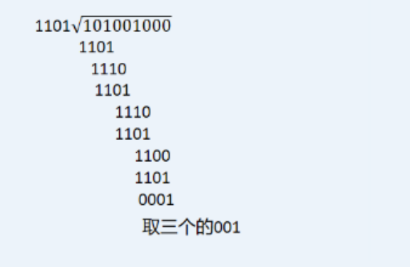
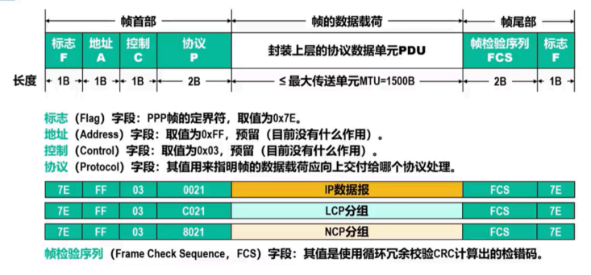
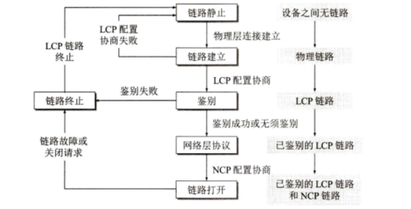
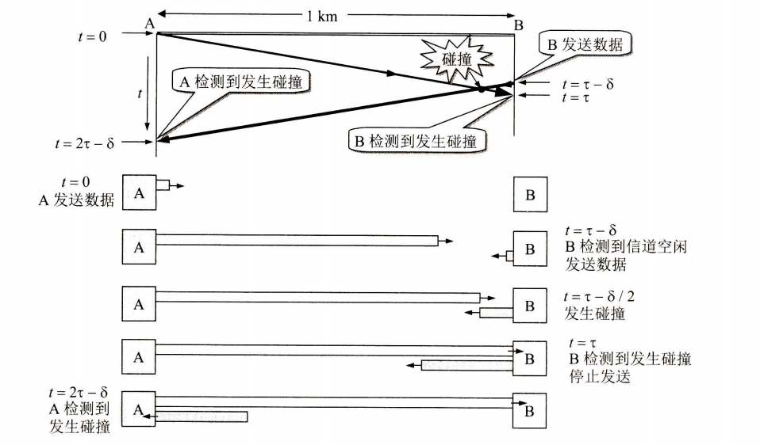
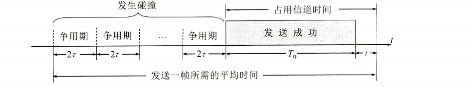
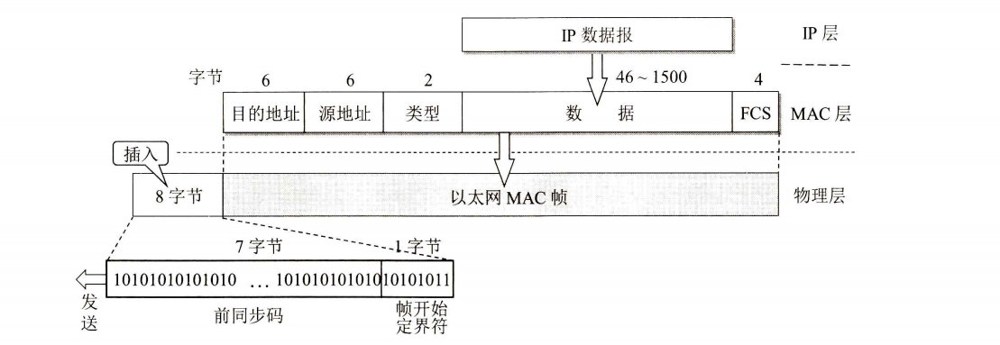
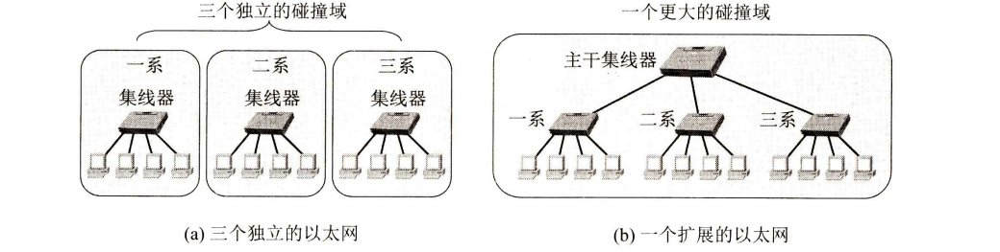
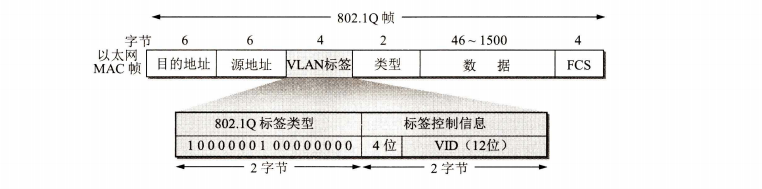

## 数据链路层

数据链路层使用的信道有两种类型

点对点信道：这种信道使用一对一的点对点通信方式。
广播信道：这种信道使用一对多的广播通信方式，

数据链路和帧 

所谓链路(link)就是从一个节点到相邻节点的一段物理线路（有线或无线），而中间没有任何其他的交换节点。                             

数据链路(data link)则是另一个概念。这是因为当需要在一条线路上传送数据时，除了必须有一条物理线路外，还必须有一些必要的通信协议来控制这些数据的传输。若把实现这些协议的硬件和软件加到链路上，就构成了数据链路。

数据链路：是结点之间的逻辑通道。除了物理路线以外，还需要有通信协议来控制这些数据的传输。若把实现这些协议的硬件和软件加到链路上，就构成了数据链路

数据链路层的协议数据单元帧

### 三个基本问题

封装成帧、透明传输和差错检测

#### 封装成帧

封装成帧(framing)就是在一段数据的前后分别添加首部和尾部，这样就构成了一个帧。接收端在收到物理层上交的比特流后，就能根据首部和尾部的标记，从收到的比特流中识别帧的开始和结束

一个帧的帧长等于帧的数据部分长度加上帧首部和帧尾部的长度。首部和尾部的一个重要作用就是进行帧定界（即确定帧的界限）。

每一种链路层协议都规定了所能传送的帧的数据部分长度上限一最大传送单元MTU(Maximum Transfer Unit)。

帧定界可以使用特殊的帧定界符。

控制字符SOH(Start Of Header)放在一帧的最前面，表示帧的首部开始。另一个控制字符EOT(End Of
Transmission)表示帧的结束。

#### 透明传送

“在数据链路层透明传送数据”表示无论什么样的比特组合的数据，都能够按照原样没有差错地通过这个数据链路层。

#### 差错控制

差错控制：

比特差错：比特在传输过程中可能会产生差错：1可能会变成0，而0也可能变成1。

在一段的间可内，传输错误的比特占所传输比特总数的比率称为误码率BER(Bit Error Rate)。

##### 循环冗余检验CRC

思想：数据发送、接受方约定一个“除数”
K个信息位+R个校验位作为“被除数”，添加校验位后需保证除法的余数为0

收到数据后，进行除法检查余数是否为0
若余数非0说明出错，则进行重传或纠错

这种为了进行检错而添加的冗余码常称为帧检验序列FCS(Frame Check Sequence)。

现假定待传送的数据M=101001(k=6).CRC运算就是在数据M的后面添加供差错检测用的n位冗余码

k=数据的长度    R为生成多项式的最高次   除数为=1101    多项式的系数           被除数=101001加上R个零

然后进行crc运算

将数据串第一个1与除数左对齐        按位进行异或操作

在数据链路层若仅仅使用循环冗余检验CRC差错检测技术，则只能做到对帧的无差错接受，即：“凡是接收端数据链路层接受的帧，我们都能以非常接近于1的概率认为这些帧在传输过程中没有产生差错”

“凡是接收端数据链路层接受的帧均无差错”。

### 点对点协议ppp

在通信线路质量较差的年代，在数据链路层使用可靠传输协议曾经是一种好办法。因此，能实现可靠传输的高级数据链路控制HDLC(High-level Data Link Control)就成为当时比较流行的数据链路层协议。

现在线路质量好，用点对点协议ppp

ppp协议就是用户计算机和isp进行通信所使用的数据链路层协议

#### ppp协议的特点

简单

封装成帧

透明性

支持多种网络层协议

支持多种类型链路

差错检测

检测连接状态

最大传送单元

网络层地址协商

数据压缩协商

ppp只支持点对点的链路通信和全双工链路

#### ppp协议的组成

PPP协议有三个组成部分：
(1)一个将IP数据报封装到串行链路的方法。
(2)一个用来建立、配置和测试数据链路连接的链路控制协议LCP(Link Control Protocol)。
(3)一套网络控制协议NCP(Network Control Protocol)

#### ppp协议的帧的格式

PPP帧的首部和尾部分别为四个字段和两个字段

首部的第一个字段和尾部的第二个字段都是标志字段F(Flg),规定为0x7E(符号“0x”表示它后而的字符是用十六进制表示的。十六进制的7E的二进制表示是01111110)。标志字段表示一个帧的开始和结束。

首部中的地址字段A规定为0xFF(即11111111)，控制字段C规定为0x03(即00000011)。最初曾考虑以后再对这两个字段的值进行其他定义，但至今也没有给出。可见这两个字段实际上并没有携带PPP帧的信息。

PPP首部的第四个字段是2字节的协议字段。当协议字段为0x0021时，PPP帧的信息字段就是IP数据报。若为OxC021,则信息字段是PPP链路控制协议LCP的数据，而0x8021表示这是网络层的控制数据。
信息字段的长度是可变的，不超过1500字节。
尾部中的第一个字段(2字节)是使用CRC的帧检验序列FCS。

#### ppp帧的传输

 

当ppp使用异步传输时，他把传义符定义为0x7D即0111 1101 ，并使用字节填充

填充方法：

(1)把信息字段中出现的每一个0x7E字节转变成为2字节序列(0x7D,0x5E)          
(2)若信息字段中出现一个0x7D的字节（即出现了和转义字符一样的比特组合），则把0x7D转变成为2字节序列(0x7D,0x5D)
(3)若信息字段中出现ASCI码的控制字符(即数值小于0x20的字符)，则在该字符前面要加入一个0x7D字节，同时将该字符的编码加以改变。例如，出现0x03(在控制字符中是“传输结束”ETX)就要把它转变为2字节序列(0x7D,0x23)。

总结：7E -- 7D 5E              7D--7D 5D     小于20的数--7D 该数

PPP协议用在SONET/SDH链路（同步光纤网和同步数字系列）时，使用同步传输（一连串的比特连续传送）而不是异
步传输（逐个字符地传送）。在这种情况下，PPP协议采用零比特填充方法来实现透明传输。

零比特填充的具体做法是：在发送端，先扫描整个信息字段（通常用硬件实现，但也
可用软件实现，只是会慢些）。只要发现有5个连续1，则立即填入一个0。因此经过这种零
比特填充后的数据，就可以保证在信息字段中不会出现6个连续1。

   

#### ppp协议的工作状态

5个状态                                                                                                                                                                                                                                                                                                                                                                                                                                                                                                                                                                                                                                                                                                                                                                                                                                                                                                                                                                                                                                                                                                                                                                                                                                                                                                                                                                                                                                                                                                             

用户拨号接入isp后，就建立了一条从用户个人电脑到isp的物理连接，这时用户个人电脑向ISP发送一系列的链路
控制协议LCP分组(封装成多个PPP帧)，以便建立LCP连接。这些分组及其响应选择了
将要使用的一些PPP参数。接着还要进行网络层配置，网络控制协议NCP给新接入的用户
个人电脑分配一个临时的P地址。这样，用户个人电脑就成为互联网上的一个有IP地址的主机了。

当用户通信完毕时，NCP释放网络层连                                                                                                                                                                                                                                                                                                                                                                                                                                                                                                                                                                                                                                                                                                                                                                                                                                                                                                                                                                                                                                                                                                                                                                                                                                                                                                                                                                                                                                                                                                                                                                                                                                                                                                                                                                                                                                                                                                                                                                                                                                                                                                                                                                                                                                                                                                                                                                                                                                                                                                                                                                                                                                                                                                                                                                                                                                                                                                                                                                                                                                                                                                                                                                                                                                                                                                                                                                                                                                                                                                                                                                                                                                                                                                                                                                                                                                                                                                                                                                                                                                          接，收回原来分配出去的IP地址。接着，LCP
释放数据链路层连接。最后释放的是物理层的连接。

在双方建立了物理层连接后，PPP就进入“链路建立”(Link Establish)状态，其目的是建立链路层的LCP连接。
这时LCP开始协商一些配置选项，即发送LCP的配置请求帧(Configure-Request)。
这是个PPP帧，其协议字段置为LCP对应的代码，而信息字段包含特定的配置请求。链路的另
一端可以发送以下几种响应中的一种：

(I)配置确认帧(Configure-.Ack):所有选项都接受。
(2)配置否认帧(Configure-.Nak):所有选项都理解但不能接受。
(3)配置拒绝帧(Configure-.Reject):选项有的无法识别或不能接受，需要协商

协商结束后双方就建立了LCP链路，接着就进入“鉴别”(Authenticate)状态。在这一
状态，只允许传送LCP协议的分组、鉴别协议的分组以及监测链路质量的分组。
若使用口令鉴别协议PAP(Password Authentication Protocol),则需要发起通信的一方发送身份标识符
和口令。
如果需要有更好的安全性，则可使用更加复杂的口令握手鉴别协议CHAP(Challenge-Handshake Authentication Protocol)。
若鉴别身份失败，则转到“链路终止”(Link Terminate)状态。若鉴别成功，则进入“网络层协议”Network-LayerProtocol)状态。

在“网络层协议”状态，PPP链路两端的网络控制协议NCP根据网络层的不同协议互
相交换网络层特定的网络控制分组。

当网络层配置完毕后，链路就进入可进行数据通信的“链路打开”(Link Open)状态。
链路的两个PPP端点可以彼此向对方发送分组。两个PPP端点还可发送回送请求LCP分组
(Echo-Request)和回送回答LCP分组(Echo-Reply),以检查链路的状态。

数据传输结束后，可以由链路的一端发出终止请求LCP分组(Terminate-Request)请求终
止链路连接，在收到对方发来的终止确认LCP分组(Terminate-.Ack)后，转到“链路终止”
状态。如果链路出现故障，也会从“链路打开”状态转到“链路终止”状态。当调制解调器的载波停止后，则回到“链路静止”状态。

### 使用广播信道的数据链路层

#### 局域网

局域网最主要的特点是：网络为一个单位所拥有，且地理范围和站点数目均有限。

局域网的优点：

具有广播功能，从一个站点可方便的访问全网

便于系统的拓展和逐渐地演变

提高了系统的可靠性、可用性和生存性

#### 共享通信媒体资源的方法有两种：

静态划分信道（各种复用技术）

动态媒体接入控制，又称为多点接入（随机接入和受控接入）

1. 随机接入的特点是所有的用户可随机地发送信息。（可能会产生冲撞）
2. 受控接入的特点是用户不能随机地发送信息而必须服从一定的控制。（轮询）

传统以太网：表示最早流行的10Mbit/s速率的以太网

#### 以太网的两个主要标准

EEE802委员会就把局域网的数据链路层拆成两个子层，即逻辑链路控制LLC(Logical Link Control)子层和媒体接入控制MAC(Medium Access Control)子层。

与接入到传输媒体有关的内容都放在MAC子层，而LLC子层则与传输媒体无关，不管采用何种传输媒体和MAC子层的局域网对LLC子层来说都是透明的

#### 适配器的作用

计算机与外界局域网的连接是通过适配器(adapter)。

又称为网络接口卡NIC(Network Interface Card或“网卡”

计算机的硬件地址就在适配器ROM中

计算机的软件地址--ip地址，则在计算机的存储器中 

#### 以太网采用两种措施

1、采用无连接的工作方式，对发送的数据帧不进行编号，也不要求对方发回确认。

目的站接收到错误的帧直接丢弃

2、以太网发送数据都使用曼切斯特编码的信号。

#### CSMA/CD协议

信号在以太网传播1km所需时间需要5us秒

以太网采用的协议是CSMA/CD,意思是载波监听多点接入/碰撞
(Carrier Sense Multiple Access with Collision Detection)

协议的要点是：发送前进行先监听，边发边监听，一旦发现总线上发生碰撞，就立即停止发送。然后按照躲避算法等待一段随机时间后在再次发送。

因此，每一站在自己发送数据之后的一段时间内，存在着遭遇碰撞的可能性。以太网个站点都平等争用以太网信道。

多点接入 ：说明是总线型网络，许多计算机以多点接入方式连接在一根总线上。

协议的本质是载波监听和碰撞检测

载波监听也就是边发送边监听（载波是翻译的错）

碰撞检测：是适配器发送数据便检测信道上的信号电压的变化情况

电磁波在 1 km电缆的传播时延约为5 us秒

使用CSMA/CD协议协议时，只能进行双向交替通信（半双工通信），因为不能同时发送和接收，要边发边监听

最先发送数据帧的A站，在发送数据帧后至多经过时间2t就可知道
所发送的数据帧是否遭受了碰撞。这就是δ→0的情况。因此以太网的端到端往返时间2t称为争用期(contention period),它是一个很重要的参数。争用期又称为碰撞窗口（collisionwindow)。

这是因为一个站在发送完数据后，只有通过争用期的“考验”，即经过争用期这
段时间还没有检测到碰撞，才能肯定这次发送不会发生碰撞。这时，就可以放心把这一帧数据顺利发送完毕。

以太网使用截断二进制指数退避(truncated binary exponential backoff)算法来确定碰撞后重传的时机。

基本退避时间为争用期2t,具体的争用期时间是51.2us。对于10 Mbit/s以太网，
在争用期内可发送512比特，即64字节（512位）。

基本原理：**争用期与基本退避时间** 	**碰撞检测与停止发送**	**随机退避时间计算**

**重传策略**	**强化碰撞**	**帧间最小间隔**

1、如果在争用期内没有检测到碰撞，那么可以认为信道是安全的，发送可以继续。

2、一旦检测到碰撞，发送方不仅停止发送，还会发送一个“碰撞终止”信号（jamming signal），确保所有节点都知道发生了碰撞。

3、每个碰撞后的站点会等待一个随机的时间间隔再尝试重传。这个随机时间是通过选择一个0到2的幂次减1之间的随机数来确定的。2^0^、~   2^15^。重传尝试次数达到16次后，如果仍然失败，则放弃该帧。

4、

- 第一次碰撞后，n=1，所以退避时间可能是0或1个时隙。
- 每次重传失败后，n增加，退避时间的选择范围扩大，但不超过一个预设的最大值。

5、**强化碰撞**：发送碰撞信号是为了确保所有节点都能意识到碰撞，从而避免立即重传。发送32比特或者48比特的人为干扰信号

6、**帧间最小间隔**：为了确保接收方有足够的时间处理前一帧并准备好接收下一帧，规定了帧间最小间隔时间。以太网还规定了帧间最小间隔为9.6us秒

#### 使用集线器的星型拓扑

传统以太网最初使用粗同轴电缆，后来演进到使用比较便宜的细同轴电缆，最后发展
为使用更便宜和更灵活的双绞线。

这种以太网采用星形拓扑，在星形的中心则增加了一种可靠性非常高的设备，叫作集线器hub)

##### 集线器的特点

使用集线器的以太网在逻辑上仍是一个总线网，各站共享逻辑上的总线，使用的还是
CSMA/CD协议(更具体些说，是各站中的适配器执行CSMA/CD协议)。

网络中的各站必须竞争对传输媒体的控制，并且在同一时刻至多只允许一个站发送数据。

(3)集线器工作在物理层，它的每个端口仅仅简单地转发比特一收到1就转发1，收
到0就转发0，不进行碰撞检测。

以太网的信道利用率

必须在经过时间t。t后以太网的媒体才完全进入空闲状态，才能允许其他站发送数据。

当α→0时，表示只要一发生碰撞，就立即可以检测出来，并立即停止发送，因而信道
资源被浪费的时间非常非常少。反之，参数α越大，表明争用期所占的比例越大，这就使得每发生一次碰撞就浪费了不少的信道资源，使得信道利用率明显降低。因此，以太网的参数α的值应当尽可能小些。

##### 以太网mac层

在局域网中，硬件地址又称为物理地址或MAC地址（因为这种地址用在MAC帧中）。

这就是局域网上的每一台计算机中固化在适配器的ROM中的地址。

mac地址的前三个字节位组织唯一标识符OUI，通常也称为公司标识符

后三个字节位拓展标识符，由公司自由委派

这种地址一般被称为EUI-48.

IEEE规定地址字段的第一字节的最低有效位为I/G位。I/G表示Individual/Group。
当I/G位为0时，地址字段表示一个单个站地址。当I/G位为1时表示组地址，用来进行多播。

IEEE把地址字段第一字节的最低第二位规定为G/L位，表示Global/Local。
当G/L位为0时是全球管理（保证在全球没有相同的地址），厂商向EEE购买的OUI都属于全球管理。当地址字段的GL位为1时是本地管理，这时用户可任意分配网络上的地址。
采用2字节地址字段时全都是本地管理。但应当指出，以太网几乎不理会这个GL位。

(I)单播(unicast)帧（一对一），即收到的帧的MAC地址与本站的MAC地址相同。
(2)广播(broadcast)帧（一对全体），即发送给本局域网上所有站点的帧(全1地址)。
(3)多播(multicast)帧（一对多），即发送给本局域网上一部分站点的帧。

 **所有 ** **的适配器都**  **至少** **能够识别前两种帧，即** **能够识别单** **播** **地址** **和广播地址**

##### mac帧的格式

常用的以太网MAC帧格式有两种标准，一种是DIX Ethernet V2标准（即以太网V2标
准），另一种是IEEE的802.3标准。这里只介绍使用得最多的以太网V2的MAC帧格式

5个字段

前两个为目的地址和源地址字段

第三个字段为2字节的类型字段

第四个字段为数据字段

最后的一个为4字节的fcs的帧校验序列

在帧的前面插入（硬件生成）的8字节中，第一个字段共7个字
节，是前同步码，用来迅速实现MAC顿的比特同步。第二个字段
1个字节是帧开始定界符，表示后面的信息就是MAC帧

第一个字段是7个字节的前同步码(1和0交替码)，它的作用是
使接收端的适配器在接收MAC帧时能够迅速调整其时钟频率，使它和发送端的时钟同步，也就是“实现位同步”（位同步就是比特同步的意思）。

第二个字段是帧开始定界符，定义为10101011。它的前六位的作用和前同步码一样，最后的两个连续的1就是告诉接收端适配器：“MAC帧的信息马上就要来了，请适配器注意接收。
”MAC帧的FCS字段的检验范围不包括前同步码和帧开始定界符。
顺便指出，在使用SONET/SDH进行同步传输时则不需要用前同步码，因为在同步传输时收发双方的位同步总是一直保持着的。

IEEE802.3标准规定凡出现下列情况之一的即为无效的MAC帧：
(1)帧的长度不是整数个字节：
(2)用收到的帧检验序列FCS查出有差错：
(3)收到的帧的MAC客户数据字段的长度不在46~1500字节之间。考虑到MAC帧首
部和尾部的长度共有18字节，可以得出有效的MAC帧长度为64~1518字节之间。

#### 拓展的以太网

本节先讨论在物理层把以太网扩展，然后讨论在数据链路层把以太网扩展。这种扩展的以太网在网络层看来仍然是一个网络。

##### 物理层拓展以太网

以太网上的主机之间的距离不能太远（例如，10BASE-T以太网的两台主机之间的距离不超过200)

在过去广泛使用粗缆或细缆以太网时，常使用工作在物理层的转发器来扩展以太网的地理覆盖范围。

使用双绞线以太网成为以太网的主流后，不用转发器了

现在，扩展主机和集线器之间的距离的一种简单方法就是使用光纤（通常是一对光纤）和一对光纤调制解调器

使用集线器

##### 数据链路层拓展以太网

扩展以太网更常用的方法是在数据链路层进行的。
最初人们使用的是网桥(bridge)。
网桥对收到的帧根据其MAC帧的目的地址进行转发和过滤。

1990年问世的交换式集线器(switching hub),很快就淘汰了网桥。交换式集线器常称以太网交换机(switch)或第二层交换机(L2 switch),强调这种交换机工作在数据链路层。

以太网交换机实质上就是一个多端口的网桥，一般为全双工方式

以太网交换机是一种即插即用设备，其内部的帧交换表（又称为地址表）是通过自学习算法自动地逐渐建立起来的。

实际上，这种交换表就是一个内容可寻址存储器CAM
(Content Addressable Memory)。

交换机在接收到一个数据帧时，会查看数据帧的源MAC地址，并将该地址与接收端口的对应关系记录在转发表中。同时，交换机会检查数据帧的目的MAC地址，并根据转发表中的信息决定将数据帧转发到哪个端口。这样，交换机能够精确地转发数据帧，减少广播流量，提高网络效率‌

##### 自学习功能

交换机接收到数据帧后，将该帧的mac地址记录到MAC地址表中。

##### 从总线型以太网到星形以太网

总线以太网使用csma/cd协议，以半双工方式工作

而以太网交换机不使用共享总线，以全双工方式，为什么还叫以太网呢

因为采用以太网的帧结构

##### 虚拟以太网

虚拟局域网其实只是局域网给用户提供的一种服务，而并不是一种新型局域网。

在以太网的帧的格式中插入一个4字节的标识符，称为vlan标签，插入vlan标签的帧称为802.1Q帧

VLAN标签字段的长度是4字节，插入在以太网MAC帧的源地址字段和类型字段之间。
VLAN标签的前两个字节总是设置为0x8100(即二进制的1000000100000000)，称为IEEE802.1Q标签类型。

VLAN标签的后两个字节中，前面4位实际上并没有什么作用，这里不讨论，后面的12位是该虚拟局域网VLAN标识符VID(VLAN ID),它唯一地标志了802.1Q帧属于哪一个VLAN.12位的VID可识别4096个不同的VLAN。插入VLAN标签后，802.1Q帧最后的帧检验序列FCS必须重新计算。

当数据链路层检测到MAC帧的源地址字段后面的两个字节的值是Ox8100时，就知道现在插入了4字节的VLAN标签。

由于用于VLAN的以太网帧的首部增加了4个字节，因此以太网的最大帧长从原来的1518字节(1500字节的数据加上18字节的首部和尾部)变
为1522字节。

##### 高速以太网

100BASE-T是在双绞线上传送100Mbit/s基带信号的星形拓扑以太网，仍使用IEEE 802.3的CSMA/CD协议，它又称为快速以太网(Fast Ethernet)。

##### 吉比特以太网

##### 10G比特以太网

工作在全双工方式

##### 使用以太网进行宽带接入

pppoe

