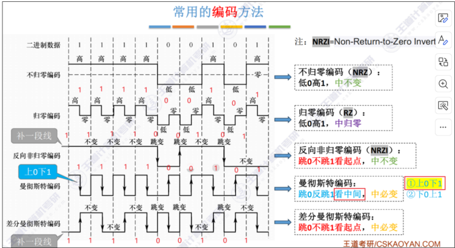
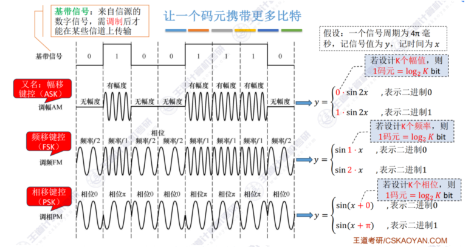
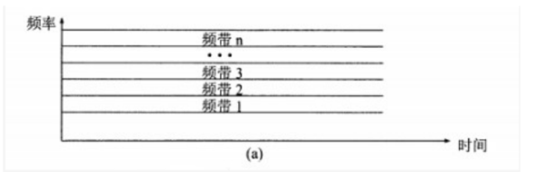
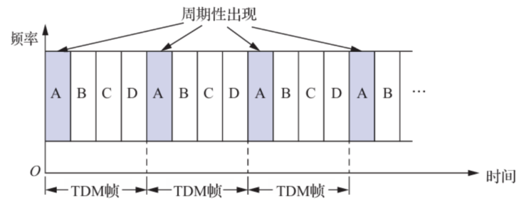
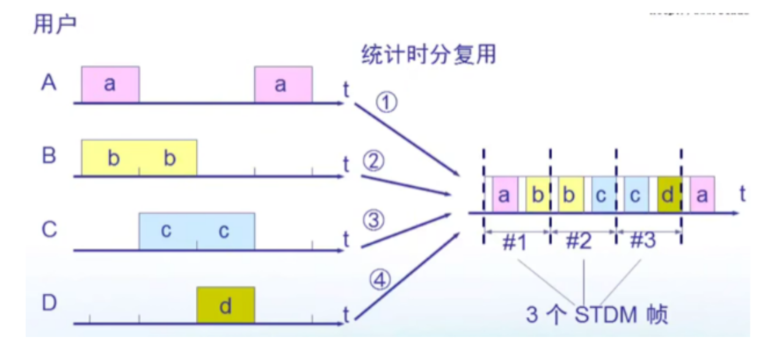
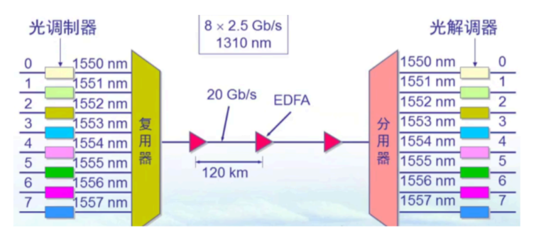
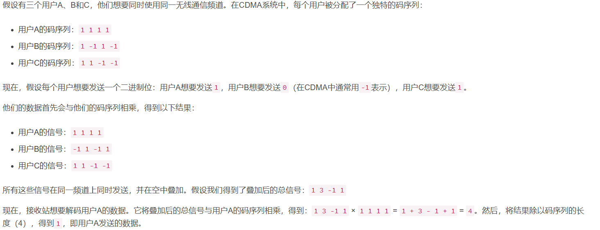

### 物理层

#### 物理层的基本概念

##### 物理层要解决的问题

物理层要解决的问题是怎样才能连接各种各种计算机的传输媒体上的传输数据比特流

##### 物理层的任务

物理层的任务是透明传输比特流

##### 规程和协议的区别

规程这个名词仅用于物理层，物理层的规程就是物理层的协议

#### 物理层的接口特性

（1）机械特性:说明接口所用的接线器的形状和尺寸、引线数目和排列、固定和锁定装置等。

（2）电气特性:指明在接口电缆的各条线上出现的电压的范围。

（3）功能特性:指明某条线上出现的某一电平的电压的意义

（4）过程特性:说明对于不同功能的各种可能事件的出现顺序。

#### 数据通信系统

一个数据通信系统可划分为三大部分：源系统（发送端）、传输系统和目的系统（接收端）

源系统包括以下两个部分：

源点 ：源点设备产生要传输的数据，源点也称为源站和信源

发送器：通常源点生成的数字比特流要通过发送器编码才能够在传输系统中进行传输

目的系统包括以下两个部分：

接收器：接收传输系统传送过来的信号，并把它转换为能够被目的设备处理的信息

终点：终点设备从接收器获取传送的数字比特流，然后把信息输出。终点也称为目的站和信宿。

#### 物理层设备

中继器

[中继器](https://baike.baidu.com/item/中继器/1867747?fromModule=lemma_inlink)（RP repeater）是工作在[物理层](https://baike.baidu.com/item/物理层/4329158?fromModule=lemma_inlink)上的连接设备。适用于完全相同的两个网络的互连，主要功能是通过对数据信号的重新发送或者转发，来扩大网络传输的距离。 中继器是对信号进行再生和还原的[网络设备](https://baike.baidu.com/item/网络设备/7667828?fromModule=lemma_inlink)：[OSI](https://baike.baidu.com/item/OSI/5520?fromModule=lemma_inlink)模型的物理层设备。

集线器

集线器是多端口的中继器

集线器的主要功能是对接收到的[信号](https://baike.baidu.com/item/信号/19190844?fromModule=lemma_inlink)进行  再生整形放大，以扩大网络的传输距离，同时把所有[节点](https://baike.baidu.com/item/节点/865052?fromModule=lemma_inlink)集中在以它为中心的节点上。

#### 数据和信号和信道

数据是运送信息的实体

信道是信号的媒介，一般来表示  向某个方向发送信息的介质

信号是数据的电气或电磁的表现

信号的划分

模拟信号，或连续信号	代表信息的参数的取值是连续的

数字信号，或离散信号	代表信息的参数的取值是离散的

基带信号：即来自信源的信号

带通信号：把基带信号的频率范围搬移到较高的频段以在信道中传输。经过载波调制后的信号称为带通信号

#### 通信双方信息交互方式

单向通信又称为单工通信，只能有一方的通信而没有反方向的交互

双向交替通信又称为半双工通信，即通信双方都可以发送信息，但不能双方同时发送和接收

双向同时通信也被称为全双工通信，即通信双方可以同时发送信息和接收信息

#### 传输方式

串行传输

数据在传输时是逐个比特按照时间顺寻依次传输的

并行传输

数据在传输时采用n个并行的信道

#### 物理层下面的传输媒体

传输媒体也成为传输介质和传输媒介，它就是数据传输系统中发送器和接收器之间的物理链路

传输媒体可分为两大类：即导向传输媒体和非导向传输媒体

导向传输媒体

在导向传输媒体中，电磁波被导向沿着固体媒体（铜线或光纤）传播

双绞线：两根相互绝缘的铜导线并排放在一起，然后用规则的方法绞合起来

双绞线又有无屏蔽双绞线utp、屏蔽双绞线stp

绞合能减少相邻导线的电磁干扰

同轴电缆：由内导体铜质芯线，绝缘层、网状编织的外导体屏蔽层以及保护塑料外层所组成。

同轴电缆具有很好的抗干扰特性，被广泛用于传输高速率的数据

光纤：光纤是光纤通信的传输媒体

存在 多条不同角度入射的光线在一条光纤中传输，这种光纤被称为多模光纤

多模光纤只适合近距离通信

架空明线：铺设简单、通信质量差、受气候环境影响大

非导向传输媒体

非导向传输媒体就是指自由空间，在非导向媒体中电磁波的传输常称为无线传输

无线电波：穿透能力强、传输距离长、信号指向性差 例如：手机信号

微波：频率带宽高、信号指向性强、保密差

卫星通信：通信距离长，具有较大的传播时延

红外线和激光：信号指向性强

#### 同步通信和异步通信

异步通信在发送字符时，所发送的字符之间的时间间隔可以是任意的。因为每一帧的数据都有开始和停止位，他们之间的数据位才是实际数据。

同步通信的通信双方必须先建立同步，即双方的时钟要调整到同一个频率。收发双方不停的发送和接受连续的同步比特流。

#### 数字传输系统

早期数字传输系统的缺点：

速率标准不统一

不是同步传输

推出：美国1988年推出同步光纤网 SONET  synchronous(同步)

同步数字序列SDH ：ITU-T以美国为SONET为标准制定出的国际标准

STM-1:1表述的第一级同步传递模块，STM为通过光纤传输数据的一系列标准

OC-48:OC的意思为就是光载波，是SONET标准的表示方法     1：一级光载波的传输速率   48为48倍的oc-1的速率

#### 调制和编码

调制分两大类

基带调制

仅仅对基带信号的波形进行变换，变换后的信号仍然是基带信号

基带调制是把数字信号转换为另一种形式的数字信号，大家更愿意把这种过程称为编码

带通调制

把基带信号的频率范围搬移到较高的频段，并转换为模拟信号。经过载波调制后的信号称为带通信号

（仅在一段频率范围内能够通过信道），而使用载波的调制成为带通调制。

编码方式

不归零制：正电平代表1 ，负电平代表0  低零高一

归零制：正脉冲代表1，负脉冲代表0 低零高一，中归零

曼切斯特编码：位周期中心的向上跳代表0，位周期中心的向下跳代表1  上跳0，中必变    

差分曼切斯特编码：在每一位的中心处始终都有跳变。位开始边界有跳变代表0，而位开始边界没有有跳变代表1

跳变0，看起点，中必变  

反向非归零编码：看起点、跳变为0 

基本的带通调制方法

调幅：即载波的振幅随基带数字信号而变化

调频：即载波的频率随基带数字信号而变化

调相：即载波的初始相位随基带数字信号而变化

#### 信道复用技术

复用就是在一条传输媒体上同时传输多路用户的信号

如果在发送端使用一个复用器，就可以多个用户通过复用器使用一个大容量共享的信道进行通信。

在接收端使用分用器，将共享信道中传输的信息分别发送到相应的用户

频分复用FDM  frequency 频率   DM 为复用

频分复用的各路信号在同样的时间占用不用的频带宽度

时分复用 TDM   TIME   时间    DM 为复用

时分复用的所有用户是在不同时间占用同样的频带宽度

统计时复用 STDM    statistic    统计数据     TDM  为时分复用

统计时分复用STDM改进的时分复用，它能明显地提高信道的利用率。

统计时分复用使用STDM帧来传送复用的数据。把缓存中的输入数据放入STDM帧中。对没有数据的缓存

就跳过去。当一个帧的数据放满了，就发送出去。可以看出，STDM帧不是固定分配时隙，而是**按需动态**

**地分配时隙**。因此，统计时分复用可以提高线路的利用率。

波分复用WDM  wavelength   波长   DM为复用

波分复用WDM就是光的频分复用。

密集波分复用（DWDM）为一条光纤上复用几十路或更多路数的光载波信号

码分复用CDM code 代码  DM为复用

码分复用常称为码分多址（CDM A) access    ，它是在扩频通信技术的基础上发展起来的一种无线通信技术

每一个比特时间划分为 m 个短的间隔，称为**码片** (chip)

每个站被指派一个**唯一**的 m bit 码片序列

每个站分配的码片序列不仅必须各不相同，并且还必须互相正交 (orthogonal)。

CDMA的每一个用户可以在相同时间使用相同的频带进行通信

码分复用的计算

结果：1表示发送的是1    0表示没发送     -1 表示发送的是0

#### 信道的极限容量

限制码元在信道中传输速率的元素只有两种

信道中所能通过的频率范围和信噪比

信噪比就是信号的平均功率和噪声的平均功率之比，常记为S/N。使用分贝为单位（dB）

信噪比=10 log~10~ （S/N）对数函数

奈式准则（奈奎斯特定理）

再带宽w（hz）的低通信道中，若不考虑噪音影响，则码元传输的最高速率为2w（码元/秒）。传输速率超过此上限，就会出现严重串扰的问题，是接受端对码元的判决（即识别）成为不可能。

公式：极限波特率=2w

香农定理

香农公式指出：信道的极限信息传输速率C是

C=wlog~2~ （1+S/N)（bits）（w为信道的带宽频带）

可得信道的带宽或信道中的信噪比越大，信道的极限传输速率就越高

#### 用户接入互联网宽带

##### 宽带接入技术

非对称数字用户线ADSL技术是用数字技术对现有模拟电话的用户进行改造，使其能够承载宽带数字业务。

ADSL 最大好处：**可以利用现有电话网中的用户线（铜线），而不需要重新布线**。

靠先进的代码，使得每秒传送一个码元就相当于传送多个比特

非对称：adsl的下行带宽远远大于上行带宽（用户从数据端的下载数据远远多于上传数据）

adsl采用频分复用，将电话线分为上行、下行和电话三个独立的信道

adsl不能保证固定的数据率

adsl的接入网由三大部分组成：数字用户线接入复用器DSLAM、用户线和用户家中的一些设施

数字用户线接入复用器DSLAM包括ADSL调制解调器，ADSL调制解调器又称为接入端单元ATU

ADSL调制解调器分别记为ATU-C（电话端局）和ATU-R（远端）

ADSL二代

无缝速率自适应技术SRA，可在运用在不中断通信和不产生无码

ADSL的变型

对称DSL,即SDSL，带宽平均分配到上行和下行

##### 光纤同轴混合网（HFC网）

在有线电视网的基础上开发的一种居民宽带接入网

- **改造**：把原有线电视网中的同轴电缆主干部分改换为光纤

- 模拟光纤从头端连接到光纤结点 (fiber node)，即**光分配结点 ODN** (Optical Distribution Node)。在光纤结点光信号被转换为电信号。在光纤结点以下就是同轴电缆。

##### FTTx技术

多种光纤接入方式，称为FTTx技术，表示fiber to the ……这里字母x可代表不同的光纤接入地点

**光配线网 ODN** (Optical Distribution Network)：位于光纤干线和广大用户之间

无源的光配线网常称为**无源光网络 PON** (Passive Optical Network)。

无源表示无需要配备电源，因此基本上不用维护，长期运营成本和管理成本都低

光线路终端OLT是连接到光纤干线的终端设备。

OLT把收到的下行数据发往无源的1：N的光分路器，然后用广播方式向所有用户端的光网络单元ONU发送。

光配线网采用的波分复用，上行和下行采用不同的波长

2 种最流行的   **无源光网络 PON (Passive Optical Network)**：

以太网无源光网络 EPON (Ethernet PON)
在链路层使用以太网协议，利用 PON 的拓扑结构实现以太网的接入。
与现有以太网的兼容性好，并且成本低，扩展性强，管理方便。

吉比特无源光网络 GPON (Gigabit PON)
采用通用封装方法 GEM (Generic Encapsulation Method)，可承载多业务，且对各种业务类型都能够提供服务质量保证，总体性能比EPON好。成本稍高。

