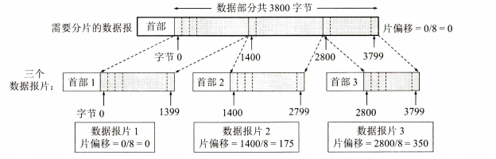

## 网络层

问题：在计算机通信中，可靠交付应当由谁来负责?是网络还是端系统?

互联网采用的设计思路是这样的：网络层要设计得尽量简单，向其上层只提供简单灵活的、无连接的、尽最大努力交付的数据报服务

网络层不提供服务质量的承诺。

#### 什么时候用面向连接服务和无连接服务

需要保证数据的可靠性时，使用面向连接服务

需要保证数据的实时性，使用无连接服务

### 网络层提供的两种服务

#### 面向连接的虚电路服务

1. 可靠通信由网络来保证

2. 必须建立网络层的连接(建立一条虚拟的连接)

3. 通信双方沿着已建立的虚电路发送分组

4. 通信结束后,需要释放之无连接的数据报服务

   

#### 无连接的数据报服务 (现在使用)

1. 可靠通信由主机来保证
2. 不需要建立网络层连接
3. 每个分组可走不同的路径
4. 网络层提供主机到主机的通信

### 网络层的两个层面

路由器之间传送的信息有以下两大类：

第一类是转发源主机和目的主机之间所传送的数据

第二类则是传送路由信息

用图4-2的方法来描述，也就是把网络层抽象地划分为数据层面(或转发层面)和控制层面。

软件定义网络SDN (Software Defined Network)°,正在对这两个层面的结构进行了重大的改变。

### 网络协议ip

由于网际协议IP是用来使互连起来的许多计算机网络能够进行通信的，因此物理硬件TCP/IP体系中的网络层常常被称为网际层(internet图4-4网际协议IP及其配套协议layer),或IP层。

与协议IP配套使用的还有三                                                                                                                                                                                                                                                                                                                                                                                                                                                                                                                                                                                                                                                                                                                                                                                                                                                                                                                                                                                                                                                                                                                                                                                                                                                                                                                                                                                                                                                                                                                                                                                                                                                                                                                                                                                                                                                                                                                                                                                                                                                                                                                                                                                                                                                                                                                                                                                                                                                                                                                                                                                                                                                                                                                                                                                                                                                                                                                                                                                                                                                                                                                                                                                                                                                                                                                                                                                                                                                                                                                                                                                                                                                                                                                                                                                                                                                                                                                                                                                                                                                                                                                                                                                                                                                                               个协议：
●地址解析协议ARP(Address Resolution Protocol)
●网际控制报文协议ICMP(Internet Control Message Protocol)
●网际组管理协议IGMP (Internet Group Management Protocol)

本来还有一个协议叫作逆地址解析协议RARP(Reverse Address Resolution Protocol),是和协议ARP配合使用的，但现在已被淘汰不使用了。

但是ARP并不知道自己是处在协议栈的哪一层。从程序调用的关系看，ARP实际上处在链路层和网络层之间

#### 异构网络的组成

因为用户的需求是多种多样的，没有一种单一的网络能够适应所有用户的需求。另外，网络技术是不断发展的，网络的制造厂家也要经常推出新的网络，在竞争中求生存。因此客观讲在市场上总是有很多种不同性能、不同网络协议的网络，供不同的用户选用。

中间设备

(1)物理层使用的中间设备叫作转发器(repeater)。
(2)数据链路层使用的中间设备叫作网桥或桥接器(bridge),以及交换机(switch)。
(3)网络层使用的中间设备叫作路由器(router)°。
(4)在网络层以上使用的中间设备叫作网关(gateway)。用网关连接两个不兼容的系统需要在高层进行协议的转换。

不需要经过路由器的是直接交付

需要交给路由器转发的是间接交付

分组在传送的途中的每一次的转发称为一跳                                                                                                                                                                                                                             

#### ip地址

整个的互联网就是一个单一的、抽象的网络。IP地址就是给连接到互联网上的每一台主机(或路由器)的每一个接口，分配一个在全世界范围内是唯一的32位的标识符。

一个IP地址在整个互联网范围内是唯一的。

表示手法：IP地址：:={<网络号>,<主机号>}

#### 分类ip地址

这里A类(n=8)、B类(n=16)和C类(n=24)地址都是单播地址视频讲解(一对一通信),是最常用的。

D类是多播地址(一对多通信，我们将在4.7节讨论IP多播),

而E类是保留地址。

#### 特殊地址

网络号为全0的IP地址有特殊的用途，它表示“本网络”;    （本机---网络地址）

第二，网络号为127(即01111111)保留作为本地软件环回测试(loopback test)本主机的进程之间的通信之用。

若主机发送一个目的地址为环回地址(例如127.0.0.1)的IP数据报，则本主机中的协议软件就处理数据报中的数据，而不会把数据报发送到任何网络。因此A类地址可指派的网络号是126个(即2⁷-2)。

总结：

网络号为0的不能当目的地址使用

全1 的主机号都不能当源地址使用

#### 无分类编址CIDR

这种编址方法的全名是无分类域间路由选择CIDR

##### 网络前缀

CIDR把图4-9中的网络号改称为“网络前缀”(network-prefix)(或简称为“前缀”),用来指明网络，剩下的后面部分仍然是主机号，用来指明主机。

CIDR的记法是：
IP地址：:={<网络前缀>,<主机号>}

这里最大的区别就是网络前缀的位数n不是固定的数，而是可以在0~32之间选取任意的值。

CIDR使用“斜线记法”(slash notation),或称为CIDR记法，即在IP地址后面加上斜线“/”,斜线后面是网络前缀所占的位数

##### 地址块

CIDR把网络前缀都相同的所有连续的IP地址组成一个“CIDR地址块”。

我们只要知道CIDR地址块中的任何一个地址，就可以知道这个地址块的起始地址(即最小地址)和最大地址，以及地址块中的地址数。

一定要记住，采用CIDR后，仅从斜线左边的IP地址已无法知道其网络地址了

##### 地址掩码

地址掩码(常简称为掩码)由一连串1和接着的一连串0组成，地址掩码又称为子网掩码。

在CIDR记法中，斜线后面的数字就是地址掩码中1的个数。

把二进制的IP地址和地址掩码进行按位AND运算，即可得出网络地址。

其规则是：1 AND 1=1,1 AND₀=0,  0 AND 0 =0

##### 特殊地址块

CIDR地址中还有三个特殊地址块，即：
(1)前缀n=32,即32位IP地址都是前缀，没有主机号。这其实就是一个IP地址。这个特殊地址用于主机路由
(2)前缀n=31,这个地址块中只有两个IP地址，其主机号分别为0和1。这个地址块用于点对点链路
(3)前缀n=0同时IP地址也是全0,即0.0.0.0/0。这用于默认路由

每一个CIDR地址块中的地址数一定是2的整数次幂。CIDR地址块都包含了多个C类地址(是一个C类地址的2”倍，n是整数，C类地址为256个地址),因此在文献中有时称CIDR编址为“构造超网”。

一个大的CIDR地址块中往往包含很多小地址块，所以在路由器的转发表中就利用较大的一个CIDR地址块来代替许多较小的地址块。这种方法称为路由聚合(route aggregation),它使得转发表中只用一个项目就可以表示原来传统分类地址的很多个(例如上千个)路由项目，因而大大压缩了转发表所占的空间，减少了查找转发表所需的时间。

K表示1024

#### ip地址的特点

每一个IP地址都由网络前缀和主机号两部分组成。从这个意义上说，IP地址是一种分等级的地址结构。

第一，IP地址管理机构在分配IP地址时只分配网络前缀(第一级),而剩下的主机号(第二级)则由得到该网络前缀的单位自行分配。

第二，路由器根据目的主机所连接的网络前缀(即地址块)来转发分组(而不考虑目的主机号)

实际上IP地址是标志一台主机(或路由器)和一条链路的接口。当一台主机同时连接到两个网络上时，该主机就必须同时具有两个相应的IP地址，其网络前缀必须是不同的。这种主机称为多归属主机(multihomed host)

用转发器或交换机连接起来的若干个局域网仍为一个网络

IP地址是标志一个主机连接在网络上的接口。

在同一个局域网上的主机或路由器的IP地址中的网络前缀必须是同样的，即必须具有同样的网络号

路由器总是具有两个或两个以上的IP地址。即路由器每个接口的IP地址的网络前缀都不同

#### ip地址与mac地址

MAC地址是数据链路层使用的地址，而IP地址是网络层和以上各层使用的地址，是一种逻辑地址(称IP地址为逻辑地址是因为IP地址是用软件实现的)。

在IP层抽象的互联网上只能看到IP数据报

虽然在IP数据报首部有源站IP地址，但路由器只根据目的站的IP地址进行转发

在局域网的链路层，只能看见MAC帧

尽管互连在一起的网络的MAC地址体系各不相同，但IP层抽象的互联网却屏蔽了下层这些很复杂的细节。只要我们在网络层上讨论问题，就能够使用统一的、抽象的IP地址研究主机和主机或路由器之间的通信。

#### 地址解析协议arp

根据ip地址找寻mac地址

主机的MAC地址实际上就是其网络适配器的MAC地址

地址解析协议ARP解决这个问题的方法是在主机的ARP高速缓存中存放一个从IP地址到MAC地址的映射表，并且这个映射表还经常动态更新

每一台主机都设有一个ARP高速缓存(ARP cache),里面存有本局域网上的各主机和路由器的IP地址到MAC地址的映射表

#### ip数据报的格式

一个IP数据报由首部和数据两部分组成。首部的前一部分长度是固定的，共20字节，是所有IP数据报必须具有的。在首部的固定部分的后面是一些可选字段，其长度是可变的

IP数据报首部的固定部分中的各字段

版本  占4位，指协议IP的版本。通信双方使用的协议IP的版本必须一致

首部长度  占4位，可表示的最大十进制数值是15。请注意，首部长度字段所表示数的单位是32位字长(1个32位字长是4字节)。因为IP首部的固定部分是20字节，因此首部长度字段的最小值是5(即二进制表示的首部长度是0101)

区分服务  占8位，用来获得更好的服务。这个字段在旧标准中叫作服务类型，但实际上一直没有被使用过

总长度  总长度指首部和数据之和的长度，单位为字节。总长度字段为16位，因此数据报的最大长度为2⁶-1=65535字节

在IP层下面的每一种数据链路层协议都规定了一个数据帧中的数据字段的最大长度，这称为最大传送单元MTU(Maximum Transfer Unit)

在进行分片时(见后面的“片偏移”字段),数据报首部中的“总长度”字段是指分片后的每一个分片的首部长度与该分片的数据长度的总和。

标识(identification)  占16位。IP软件在存储器中维持一个计数器，每产生一个数据报，计数器就加1,并将此值赋给标识字段

当数据报由于长度超过网络的MTU而必须分片时，这个标识字段的值就被复制到所有的数据报片的标识字段中。相同的标识字段的值使分片后的各数据报片最后能正确地重装成为原来的数据报。

标志(flag)  占3位，但目前只有两位有意义。
标志字段中的最低位记为MF(More Fragment)。MF=1即表示后面“还有分片”的数据报。MF=0表示这已是若干数据报片中的最后一个。
标志字段中间的一位记为DF (Don't Fragment),意思是“不能分片”。只有当DF=0时才允许分片。

片偏移占13位。片偏移指出：较长的分组在分片后，某片在原分组中的相对位置

片偏移以8个字节为偏移单位

生存时间  占8位，生存时间字段常用的英文缩写是TTL(Time To Live),表明这是数据报在网络中的寿命

由发出数据报的源点设置这个字段。其目的是防止无法交付的数据报无限制地在互联网中兜圈子

协议  占8位，协议字段指出此数据报携带的数据使用何种协议，以便使目的主机的IP层知道应将数据部分上交给哪个协议进行处理

首部检验和占16位。这个字段只检验数据报的首部，但不包括数据部分

源地址占32位。发送IP数据报的主机的IP地址。
目的地址占32位。接收IP数据报的主机的IP地址。

IP数据报首部的可变部分就是一个选项字段。选项字段用来支持排错、测量以及安全等措施，内容很丰富。此字段的长度可变，从1字节到40字节不等，取决于所选择的项目

### ip层转发分组的过程

#### 基于终点的转发

分组在互联网上传送和转发是基于分组首部中的目的地址的，因此这种转发方式称为基于终点的转发。

当路由器收到一个待转发的分组，在从转发表得出下一跳路由器的IP地址后，不是把这个地址填入分组首部，而是送交数据链路层的网络接口软件。

网络接口软件负责把下一跳路由器的IP地址转换成MAC地址(必须使用ARP),并将此MAC地址放在链路层的MAC帧的首部，然后利用这个MAC地址传送到下一跳路由器的链路层，再取出MAC帧的数据部分，交给网络层。

由此可见，当发送一连串的分组时，上述的这种查找转发表、调用ARP解析出MAC地址、把MAC地址写入MAC帧的首部等过程，都是必须做的(当然都是由机器自动完成的)。

这是因为查找转发表的过程就是寻找前缀匹配的过程。

#### 最长前缀匹配

这是因为公司B采用了路由聚合，把三个子网的所有地址聚合为一个网络前缀128.1.24.0/22。

那么为什么地址128.1.24.1不在公司B的聚合前缀128.1.24.0/22中，但匹配运算的结果却是匹配呢?这是因为在转发表中的项目128.1.24.0/22并未说明是由哪几个子网聚合而成的。

因此，在采用CIDR编址时，如果一个分组在转发表中可以找到多个匹配的前缀，那么就应当选择前缀最长的一个作为匹配的前缀。这个原则称为最长前缀匹配(longest prefixmatch)。

主机路由(host route)又叫作特定主机路由，这是对特定目的主机的IP地址专门指明的一个路由。主机路由的网络前缀就是a.b.c.d/32。我们知道，/32表示的子网掩码

还有一种特殊路由是默认路由(default route)。这就是不管分组的最终目的网络在哪里，都由指定的路由器R来处理

#### 使用二叉索查找转发表

为了进行更加有效的查找，通常是把无分类编址的转发表存放在一种层次的数据结构中，然后自上而下地按层次进行查找

这里通常使用二叉线索(binary trie),它是一种特殊结构的树

### 网际控制报文协议ICMP

为了更有效地转发IP数据报和提高交付成功的机会，在网际层使用了网际控制报文协议ICMP

ICMP允许主机或路由器报告差错情况和提供有关异常情况的报告

#### ICMP报文的种类

ICMP报文有两种，即ICMP差错报告报文和ICMP询问报文

ICMP报文的前4字节是统一的格式，共有三个字段：类型、代码和检验和

ICMP差错报告报文共有四种，即：
(1)终点不可达  当路由器或主机不能交付数据报时就向源点发送终点不可达报文。

(2)时间超过   当路由器收到生存时间为零的数据报时，除丢弃该数据报外，还要向源点发送时间超过报文

(3)参数问题   当路由器或目的主机收到的数据报的首部中有的字段的值不正确时，就丢弃该数据报，并向源点发送参数问题报文

(4)改变路由(重定向)路由器把改变路由报文发送给主机，让主机知道下次应将数据报发送给另外的路由器(也就是说，找到了更好的路由)。

#### ICMP报文格式

常用的ICMP询问报文有两种，即：
(1)回送请求或回送回答  ICMP回送请求报文是由主机或路由器向一个特定的目的主机发出的询问

(2)时间戳请求或时间戳回答  在ICMP时间戳请求报文发出后，就能够收到对方响应的ICMP时间戳回答报文

#### ICMP的应用举例

ICMP的一个重要应用就是分组网间探测PING(Packet InterNet Groper),用来测试两台主机之间的连通性

PING使用了ICMP回送请求与回送回答报文

如果邮件服务器mail.sina.com.cn正常工作而且响应这个ICMP回送请求报文(有的主机为了防止恶意攻击就不理睬外界发送过来的这种报文),那么它就发回ICMP回送回答报文。由于往返的ICMP报文上都有时间戳，因此很容易得出往返时间

另一个非常有用的应用是traceroute

超时就发送ICMP时间超过差错报告报文。

不可达就发送ICMP终点不可达差错报告报

### IPV6

2011年2月3日，IANA开始停止向地区互联网注册机构RIR分配IPv4地址，因为IPv4地址已经全部耗尽了

#### IPV6的基本首部

IPv6仍支持无连接的传送，但将协议数据单元PDU称为分组(packet),而不是IPv4的数据报(datagram)

IPv6所引进的主要变化如下：
(1)更大的地址空间。IPv6把地址从IPv4的32位增大到4倍，即增大到128位

(2)扩展的地址层次结构

(3)灵活的首部格式。IPv6数据报的首部和IPv4的并不兼容。IPv6定义了许多可选的扩展首部，不仅可提供比IPv4更多的功能，而且还可提高路由器的处理效率，这是因为路由器对扩展首部不进行处理(除逐跳扩展首部外)

(4)改进的选项。IPv6允许数据报包含有选项的控制信息，因而可以包含一些新的选项。但IPv6的首部长度是固定的，其选项放在有效载荷中

(5)允许协议继续扩充

(6)支持即插即用(即自动配置)。因此IPv6不需要使用DHCP

(7)支持资源的预分配。IPv6支持实时视像等要求保证一定的带宽和时延的应用

(8)IPv6首部改为8字节对齐(即首部长度必须是8字节的整数倍)。原来的IPv4首部是4字节对齐。

IPv6数据报由两大部分组成，即基本首部(base header)和后面的有效载荷(payload)。有效载荷也称为净负荷。有效载荷允许有零个或多个扩展首部(extension header),再后面是数据部分

#### ipv6的格式

(1)版本(version)   占4位。它指明了协议的版本，对IPv6该字段是6。

(2)通信量类(traffic class)占8位。这是为了区分不同的IPv6数据报的类别或优先级，和IPv4的区分服务字段的作用相似

(3)流标号(flow label)许路由器把每一个数据报与一个给定的资源分配相联系

(4)有效载荷长度(payload length)占16位。它指明IPv6数据报除基本首部以外的字节数(所有扩展首部都算在有效载荷之内)。这个字段的最大值是64 KB(65535字节)。占8位。它相当于IPv4的协议字段或可选字段

(5)下一个首部(next header)
●当IPv6数据报没有扩展首部时，下一个首部字段的作用和IPv4的协议字段一样，它的值指出了基本首部后面的数据应交付IP层上面的哪一个高层协议(例如：6或17分别表示应交付运输层TCP或UDP)。
●当出现扩展首部时，下一个首部字段的值就标识后面第一个扩展首部的类型。

(6)跳数限制(hop limit)  占8位。用来防止数据报在网络中无限期地存在。和IPv4的生存时间字段相似。源点在每个数据报发出时即设定某个跳数限制(最大为255跳)。每个路由器在转发数据报时，要先把跳数限制字段中的值减1。当跳数限制的值为零时，就要把这个数据报丢弃。

(7)源地址，占128位。是数据报的发送端的IP地址

(8)目的地址，占128位。是数据报的接收端的IP地址

在RFC 8200中定义了以下六种扩展首部：(1)逐跳选项；(2)路由选择；(3)分片；(4)鉴别；(5)封装安全有效载荷；(6)目的站选项

#### IPV6的地址

一般来讲，一个IPv6数据报的目的地址可以是以下三种基本类型地址之一：
(1)单播(unicast)   单播就是传统的点对点通信。
(2)多播(multicast)多播是一点对多点的通信，数据报发送到一组计算机中的每一个。IPv6没有采用广播的术语，而是将广播看作多播的一个特例。
(3)任播(anycast)  这是IPv6增加的一种类型。任播的终点是一组计算机，但数据报只交付其中的一个，通常是按照路由算法得出的距离最近的一个。

为了使地址再稍简洁些，IPv6使用冒号十六进制记法(colon hexadecimal notation,简写为colon hex),它把每个16位的值用十六进制值表示，各值之间用冒号分隔

68E6:8C64:FFFF:FFFF:0:1180:960A:FFFF

首先，冒号十六进制记法可以允许零压缩(zero compression),即一连串连续的零可以为一对冒号所取代，例如：
FF05:0:0:0:0:0:0:B3
可压缩为：
FF05::B3

#### 特殊地址

未指明地址  这是16字节的全0地址，可缩写为两个冒号“::”。这个地址不能用作目的地址，而只能将某台主机当作源地址使用，条件是这台主机还没有配置到一个标准的IP地址。这类地址仅此一个。

环回地址  IPv6的环回地址是0:0:0:0:0:0:0:1,可缩写为：:1。它的作用和环回地址IPv4的环回地址一样。这类地址也是仅此一个。

多播地址  功能和IPv4的一样。这类地址占IPv6地址总数的1/256。

本地站点单播地址(cite-local unicast address)有些单位的内部网络使用TCP/IP协议，但并没有连接到互联网

本地链路单播地址(link-local unicast address)个节点启用IPv6时就自动生成本地链路地址

全球单播地址IPv6的这一类单播地址是使用得最多的一类

#### 从IPV4向IPV6过渡

由于现在整个互联网的规模太大，IPv6系统能够向后兼容

两种向IPv6过渡的策略，即使用双协议栈和使用隧道技术

##### 1.双协议栈

双协议栈(dual stack)是指在完全过渡到IPv6之前，使一部分主机(或路由器)同时装有IPv4和IPv6这两种协议栈。因此双协议栈主机(或路由器)既能够和IPv6的系统通信，又能够和IPv4的系统通信

##### 2.隧道技术

这种方法的要点就是在IPv6数据报要进入IPv4网络时，把IPv6数据报封装成为IPv4数据报。现在整个的IPv6数据报变成了IPv4数据报的数据部分

要使双协议栈的主机知道IPv4数据报里面封装的数据是一个IPv6数据报，就必须把IPv4首部的协议字段的值设置为41(41表示数据报的数据部分是IPv6数据报)。

#### ICMPV6

因为互联网中的路由器可能会丢弃数据报。因此IPv6也需要使用ICMP来反馈一些差错信息

新的版本称为ICMPv6,它比ICMPv4要复杂得多。地址解析协议ARP和网际组管理协议IGMP的功能都已被合并到ICMPv6中

ICMPv6是面向报文的协议，它利用报文来报告差错，获取信息，探测邻站或管理多播通

在对ICMPv6报文进行归类时，不同的文献和RFC文档使用了不同的策略，有的把其中的一些报文定义为ICMPv6报文，

而把另一些报文定义为邻站发现ND(Neighbor-Discovery)报文或多播听众交付MLD(Multicast Listener Delivery)报文

### 互联网的路由选择协议

#### 有关路由选择协议的几个基本概念

(1)算法必须是正确的和完整的。这里，“正确”的含义是：沿着各路由表所指引的路由，分组一定能够最终到达目的网络和目的主机。

(2)算法在计算上应简单。路由选择的计算不应使网络通信量增加太多的额外开销。

(3)算法应能适应通信量和网络拓扑的变化，这就是说，要有自适应性。当网络中的通信量发生变化时，算法能自适应地改变路由以均衡各链路的负载。

(5)算法应是公平的。路由选择算法应对所有用户(除对少数优先级高的用户)都是平等的。

(6)算法应是最佳的。路由选择算法应当能够找出最好的路由，使得分组平均时延最小而网络的吞吐量最大。

所谓“最佳”只能是相对于某一种特定要求下得出的较为合理的选择而已。

倘若从路由算法能否随网络的通信量或拓扑自适应地进行调整变化来划分，则只有两大类，即静态路由选择策略与动态路由选择策略。

静态路由选择也叫作非自适应路由选择，其特点是简单和开销较小，但不能及时适应网络状态的变化

动态路由选择也叫作自适应路由选择，其特点是能较好地适应网络状态的变化，但实现起来较为复杂，开销也比较大

#### 分层次的路由选择协议

互联网采用的路由选择协议主要是自适应的(即动态的)、分布式路由选择协议

联网采用分层次的路由选择协议：

(1)互联网的规模非常大

(2)许多单位不愿意外界了解自己单位网络的布局细节和本部门所采用的路由选择协议(这属于本部门内部的事情),但同时还希望连接到互联网上

为此，可以把整个互联网划分为许多较小的自治系统

每一个AS对其他AS表现出的是一个单一的和一致的路由选择策略

这样，互联网就把路由选择协议划分为两大类，即：

(1)内部网关协议IGP(Interior Gateway Protocol)   即在一个自治系统内部使用的路由选择协议，而这与在互联网中的其他自治系统选用什么路由选择协议无关

(2)外部网关协议EGP(External Gateway Protocol))   若源主机和目的主机处在不同的自治系统中(这两个自治系统可能使用不同的内部网关协议),那么在不同自治系统AS之间的路由选择，就需要使用外部网关协议EGP。目前使用最多的外部网关协议是BGP的版本4(BGP-4)。

自治系统之间的路由选择也叫作域间路由选择(interdomain routing),而在自治系统内部的路由选择叫作域内路由选择(intradomain routing)。

总之，使用分层次的路由选择方法，可将互联网的路由选择协议划分为：
内部网关协议IGP:具体的协议有多种，如RIP和OSPF等。
外部网关协议EGP:目前使用的协议是BGP-4。

#### 内部网关协议RIP

##### RIP工作原理

路由信息协议。RIP是一种分布式视频讲解的基于距离向量的路由选择协议，是互联网的标准协议，其最大优点就是简单。

协议RIP将“距离”定义如下：
从一路由器到直接连接的网络的距离定义为1

协议RIP的“距离”①也称为“跳数”(hop count),并且每经过一个网络，跳数就加1。

RIP认为好的路由就是它通过的网络数目少，即“距离短”。RIP允许一条路径最多只能包含15个网络。因此“距离”等于16时即相当于不可达。可见RIP只适用于小型互联网。

##### rip的特点

我们一定要弄清以下三个要点，即和哪些路由器交换信息?交换什么信息?在什么时候交换信息?

(1)仅和相邻路由器交换信息。

(2)路由器交换的信息是当前本路由器所知道的全部信息，即自己现在的路由表。

也就是说，交换的信息是：“我到本自治系统中所有网络的(最短)距离，以及到每个网络应经过的下一跳路由器”。

(3)按固定的时间间隔交换路由信息，

例如，每隔30秒。然后路由器根据收到的路由信息更新路由表。当网络拓扑发生变化时，路由器也及时向相邻路由器通告拓扑变化后的路由信息。网络中的主机虽然也运行协议RIP,但只被动地接收路由器发来的路由信息。

路由表中最主要的信息就是：到某个网络的距离(即最短距离),以及应经过的下一跳地址。

路由表更新的原则是找出到每个目的网络的最短距离。这种更新算法又称为距离向量算法

##### rip优缺点

总之，协议RIP最大的优点就是实现简单，开销较小

好消息传的快，更新快

缺点：

规模小，

多次交换信息才能收敛，坏消息传的慢

交换完整的路由表，规模越大，开销越大

##### 距离向量算法

对每一个相邻路由器发送过来的RIP报文，执行以下步骤：
(1)对地址为X的相邻路由器发来的RIP报文，先修改此报文中的所有项目：把“下一跳”字段中的地址都改为X,并把所有的“距离”字段的值加1(见后面的解释1)。每一个项目都有三个关键数据，即：到目的网络Net,距离是d,下一跳路由器是X。
(2)对修改后的RIP报文中的每一个项目，进行以下步骤：
若原来的路由表中没有目的网络Net,则把该项目添加到路由表中(见解释2)。否则(即在路由表中有目的网络Net,这时就再查看下一跳路由器地址)。

若下一跳路由器地址是X,则把收到的项目替换原路由表中的项目(见解释3)。否则(即这个项目是：到目的网络Net,但下一跳路由器不是X)。
若收到的项目中的距离d小于路由表中的距离，则进行更新(见解释4),否则什么也不做(见解释5)。
(3)若3分钟还没有收到相邻路由器的更新路由表，则把此相邻路由器记为不可达的路由器，即把距离置为16(距离为16表示不可达)。
(4)返回。
上面给出的距离向量算法的基础就是Bellman-Ford算法(或Ford-Fulkerson算法)。这种算法的要点是这样的：
设X是节点A到B的最短路径上的一个节点。若把路径A→B拆成两段路径A→X和
X→B,则每一段路径A→X和X→B也都分别是节点A到X和节点X到B的最短路径。

协议RIP让一个自治系统中的所有路由器都和自己的相邻路由器定期交换路由信息，并不断更新其路由表，使得从每一个路由器到每一个目的网络的路由都是最短的(即跳数最少)

RIP报文由首部和路由部分组成。在路由部分要填入自治系统号ASN，还要指出目的网络地址(包括网络的子网掩码)、下一跳路由器地址以及到此网络的距离

#### 内部网关协议OSPF

##### 协议OSPF的基本特点

这个协议的名字是开放最短路径优先OSPF(Open Shortest Path First)。

“开放”表明OSPF协议不是受某一家厂商控制，而是公开发表的。“最短路径优先”是因为使用了Dijkstra提出的最短路径算法SPF。

请注意：OSPF只是一个协议的名字，它并不表示其他的路由选择协议不是“最短路径优先”

OSPF最主要的特征就是使用链路状态协议

##### ospf与rip的区别

ospf向本自治系统所有路由器发送信息，而rip向相邻路由器发送

发送链路状态

只有链路变化时，用泛洪法发送信息

ospf是网络层协议

协议OSPF的特点是：

(1)向本自治系统中所有路由器发送信息。这里使用的方法是洪泛法(flooding),这就是路由器通过所有输出端口向所有相邻的路由器发送信息。而每一个相邻路由器又再将此信息发往其所有的相邻路由器(但不再发送给刚刚发来信息的那个路由器)。这样，最终整个区域中所有的路由器都得到了这个信息的一个副本。

(2)发送的信息就是与本路由器相邻的所有路由器的链路状态，但这只是路由器所知道的部分信息。所谓“链路状态”就是说明本路由器都和哪些路由器相邻①,以及该链路的“度量”(metric)。OSPF将这个“度量”用来表示费用、距离、时延、带宽，等等。这些都由网络管理人员来决定，因此较为灵活。有时为了方便就称这个度量为“代价”。

(3)当链路状态发生变化或每隔一段时间(如30分钟),路由器向所有路由器用洪泛法发送链路状态信息。

由于各路由器之间频繁地交换链路状态信息，因此所有的路由器最终都能建立一个链路状态数据库(link-state database),这个数据库实际上就是全网的拓扑结构图。这个拓扑结构图在全网范围内是一致的(这称为链路状态数据库的同步)。因此，每一个路由器都知道

OSPF的链路状态数据库能较快地进行更新，使各个路由器能及时更新其路由表。OSPF的更新过程收敛得快是其重要优点。

为了使OSPF能够用于规模很大的网络，OSPF将一个自治系统再划分为若干个更小的范围，叫作区域(area)

为了使每一个区域能够和本区域以外的区域进行通信，OSPF使用层次结构的区域划分。在上层的区域叫作主干区域(backbonearea)。主干区域的标识符规定为0.0.0.0。主干区域的作用是用来连通其他在下层的区域。从其他区域来的信息都由区域边界路由器(area border router)进行概括

OSPF还具有下列的一些特点：
(1)OSPF允许管理员给每条路由指派不同的代价。

OSPF对于不同类型的业务可计算出不同的路由

(2)如果到同一个目的网络有多条相同代价的路径，那么可以将通信量分配给这几条路径。这叫作多路径间的负载均衡(load balancing)。

(3)所有在OSPF路由器之间交换的分组(例如，链路状态更新分组)都具有鉴别的功能，因而保证了仅在可信赖的路由器之间交换链路状态信息。

(4)OSPF支持可变长度的子网划分和无分类的编址CIDR。

(5)由于网络中的链路状态可能经常发生变化，因此OSPF让每一个链路状态都带上一个32位的序号，序号越大状态就越新。OSPF规定，链路状态序号增长的速率不得超过每5秒钟1次。这样，全部序号空间在600年内不会产生重复号。

##### OSPF的五种分组类型

(1)类型1,问候(Hello)分组，用来发现和维持邻站的可达性。

(2)类型2,数据库描述(Database Description)分组，向邻站给出自己的链路状态数据库中的所有链路状态项目的摘要信息。

(3)类型3,链路状态请求(Link State Request)分组，向对方请求发送某些链路状态项目的详细信息。

(4)类型4,链路状态更新(Link State Update)分组，用洪泛法对全网更新链路状态。这种分组是最复杂的，也是OSPF协议最核心的部分。路由器使用这种分组将其链路状态通知给邻站。链路状态更新分组共有五种不同的链路状态[RFC2328],这里从略。

(5)类型5,链路状态确认(Link State Acknowledgment)分组，对链路更新分组的确认。

OSPF分组是作为IP数据报的数据部分来传送的(如图4-43所示)。OSPF不用UDP而是直接用IP数据报传送(其IP数据报首部的协议字段值为89)

OSPF规定，每两个相邻路由器每隔10秒钟要交换一次问候分组。这样就能确知哪些邻站是可达的

两个同步的路由器叫作“完全邻接的”(fully adjacent)路由器

为了确保链路状态数据库与全网的状态保持一致，OSPF还规定每隔一段时间，如30分钟，要刷新一次数据库中的链路状态

#### 外部网关协议BGP

##### 协议BGP的主要特点

在外部网关协议(或边界网关协议)BGP中，现在使用的是第4个版视频讲解本BGP-4(常简写为BGP)

若没有协议BGP,那么分布在全世界数以万计的AS都将是一个个没有联系的孤岛

第一，互联网的规模太大，使得自治系统AS之间路由选择非常困难

第二，自治系统AS之间的路由选择必须考虑有关策略

由于上述情况，边界网关协议BGP只能是力求选择出一条能够到达目的网络前缀且比较好的路由(不能兜圈子),而并非要计算出一条最佳路由

BGP采用了路径向量(path vector)路由选择协议

##### BGP路由

在一个自治系统AS中有两种不同功能的路由器，即边界路由器(或边界网关)和内部路由器

协议BGP规定，在一个AS内部所有的iBGP必须是全连通的

eBGP是在不同AS的两个对等端之间的BGP连接，而iBGP是同一AS的两个对等端之间的BGP连接

BGP路由=“前缀，BGP属性”=“前缀，AS-PATH,NEXT-HOP”

但最重要两个就是这里列出的AS-PATH和NEXT-HOP。

AS-PATH(自治系统路径)是通告的BGP路由所经过的自治系统。

NEXT-HOP(下一跳)是通告的BGP路由起点。

##### 三种不同的自治系统AS

在互联网中自治系统AS的数量非常之多，其连接图也是相当复杂的

可以把AS划分为三大类，即末梢AS(stub AS)、穿越AS(transit AS)和对等AS(peering AS)。
穿越AS

末梢AS是比较小的AS(如图中的AS₄,AS₅和AS₆),其特点是这些AS或者把分组发送给其直接连接的AS,或者从其直接连接的AS接收分组，但不会把来自其他AS的分组再转发到另一个AS

末梢AS也可以同时连接到两个或两个以上的AS(如图4-49中的AS₅)。这种末梢AS就称为多归属AS

穿越AS₁往往是拥有很好的高速通信干线的主干AS,其任务就是为其他的AS有偿转发分组。通常都会有很多的AS连接到穿越AS上

对等AS(如图4-49中的AS₂和AS₃)是经过事先协商的两个AS,彼此之间的发送或接收分组都不收费，这样大家转发分组都比较方便

##### BGP的路由选择

本地偏好LOCAL-PREF (LOCAL PREFerence)值最高的路由要首先选择

选择具有AS跳数最少的路由

使用热土豆路由选择算法，这种算法把分组比喻为烫手的热土豆，要尽快地转发出去

选择路由器BGP标识符的数值最小的路由

##### BGP的四种报文

在协议BGP刚运行时，BGP连接的对等端要相互交换整个的BGP路由表。但以后只需要在BGP路由发生变化时，才更新有变化的部分

(1)OPEN(打开)报文，用来与BGP连接对等端建立关系。
(2)UPDATE(更新)报文，用来通告某一路由的信息，以及列出要撤销的路由。
(3)KEEPALIVE(保活)报文，用来周期性地证实与对等端的连通性。
(4)NOTIFICATION(通知)报文，用来发送检测到的差错。

#####  bgp的特点

bgp在自治系统之间交换可达性信息

路由选择必须考虑有关策略

力求一个比较好的路由

OPEN报文是两个路由器之间建立了TCP连接后接着就必须发送的报文。OPEN报文的作用是相互识别对方，协商一些协议参数(如计时器的时间)。收到OPEN报文的路由器，就发回

KEEPALIVE报文表示接受建立BGP连接。

UPDATE报文是BGP协议的核心，用来撤销它以前曾经通知过的路由，或宣布增加新的路由。撤销路由可以一次撤销许多条，但增加新路由时，每个更新报文只能增加一条。

每个路由器都有一个保持时间计时器(Hold Timer)。路由器每收到一个BGP报文，这个计时器就重置一次，继续从0开始计时。如果在商定的保持时间内没有收到对等端发来的任何一种BGP报文，就认为对方已经不能工作了。发送KEEPALIVE报文的时间间隔取为双方事先商定的保持时间(Hold Time)的1/3。

例如，在BGP连接建立阶段，双方商定保持时间为180秒，那么KEEPALIVE报文就每隔60秒发送一次

#### 路由器的构成

##### 路由器的结构

路由器是一种具有多个输入端口和多个输出端口的专用计算机，其任务是转发分组

整个的路由器结构可划分为两大部分：路由选择部分和分组转发部分。
路由选择部分也叫作控制部分，或控制层面，其核心构件是路由选择处理机

分组转发部分，也就是数据层面，它由三部分组成：交换结构、一组输入端口和一组输出端口(请注意：这里的端口就是硬件接口)

交换结构(switching fabric)又称为交换组织，它的作用就是根据转发表(forwarding table)对分组进行处理，将某个输入端口进入的分组从一个合适的输出端口转发出去。

交换结构是路由器的关键构件。正是这个交换结构把分组从一个输入端口转移到某个合适的输出端口

### IP多播

##### IP多播的基本概念

IP多播是一种高效的网络通信机制，它允许单个发送者（多播源）将数据包同时发送给多个接收者

现在IP多播(multicast,以前曾译为组播)已成为互联网的一个热门课题。这是由于有许多的应用需要由一个源点发送到许多个终点

这些路由器必须增加一些能够识别多播数据报的软件。能够运行多播协议的路由器称为多播路由器

为了适应交互式音频和视频信息的多播，从1992年起，在互联网上开始试验虚拟的多播主干网MBONE

其实多播组的标识符就是IP地址中的D类地址。D类IP地址的前四位是1110,因此D类地址范围是224.0.0.0到239.255.255.255

多播地址只能用于目的地址，而不能用于源地址。此外，对多播数据报不产生ICMP差错报文

IP多播可以分为两种。一种是只在本局域网上进行硬件多播，另一种则是在互联网的范围进行多播。前一种虽然比较简单，但很重要，因为现在大部分主机都是通过局域网接入到互联网的

#### 在局域网上进行硬件多播

以太网MAC地址字段中的第1字节的最低位为1时即为多播地址

#### 网际组管理协议IGMP和多播路由选择协议

##### IP多播需要两种协议

但这些路由器又怎样知道多播组的成员信息呢?这就要利用一个协议，叫作网际组管理协议IGMP(Internet Group Management Protocol)。

IGMP是一种用于管理多播组成员资格的协议

IGMP协议是让连接在本地局域网上的多播路由器知道本局域网上是否有主机(严格讲，是主机上的某个进程)参加或退出了某个多播组。

连接在局域网上的多播路由器还必须和互联网上的其他多播路由器协同工作，以便把多播数据报用最小代价传送给所有的组成员。这就需要使用多播路由选择协议

多播转发必须动态地适应多播组成员的变化

##### 网际组管理协议IGMP

IGMP已有了三个版本

和网际控制报文协议ICMP相似，IGMP使用IP数据报传递其报文(即IGMP报文加上IP首部构成IP数据报),但它也向IP提供服务

第一阶段：当某台主机加入新的多播组时，该主机应向多播组的多播地址发送一个IGMP报文，声明自己要成为该组的成员。

第二阶段：组成员关系是动态的。本地多播路由器要周期性地探询本地局域网上的主机，以便知道这些主机是否还继续是组的成员。

##### 多播路由选择协议

多播路由选择实际上就是要找出以源主机为根节点的多播转发树

已有了多种实用的多播路由选择协议，它们在转发多播数据报时使用了以下的三种方法：

(1)洪泛与剪除。这种方法适合于较小的多播组，而所有的组成员接入的局域网也是相邻接的

一开始，路由器转发多播数据报使用洪泛的方法(这就是广播)。为了避免兜圈子，采用了叫作反向路径广播RPB(Reverse Path Broadcasting)的策略

如果在多播转发树上的某个路由器发现它的下游树枝(即叶节点方向)已没有该多播组的成员，就应把它和下游的树枝一起剪除

(2)隧道技术(tunneling)。隧道技术适用于多播组的位置在地理上很分散的情况

 

(3)基于核心的发现技术。这种方法对于多播组的大小在较大范围内变化时都适合

这种方法是对每一个多播组G指定一个核心(core)路由器，给出它的IP单播地址

##### 下面是一些建议使用的多播路由选择协议。

距离向量多播路由选择协议DVMRP(Distance Vector Multicast Routing Protocol)是在互
联网上使用的第一个多播路由选择协议

基于核心的转发树CBT(Core Based Tree)[RFC 2189,2201]。这个协议使用核心路由器作为转发树的根节点。一个大的自治系统AS可划分为几个区域，每一个区域选择一个核心路由器(也叫作中心路由器center router,或汇聚点路由器rendezvous router)。

开放最短通路优先的多播扩展MOSPF(Multicast extensions to OSPF)[RFC 1585]。这个协议是单播路由选择协议OSPF的扩充，使用于一个机构内。MOSPF使用多播链路状态路由选择创建出基于源点的多播转发树。

协议无关多播-稀疏方式PIM-SM (Protocol Independent Multicast-Sparse Mode)[RFC
7761,STD83]。这是唯一成为互联网标准的一个协议，它使用和CBT同样的方法构成多播转发树。采用“协议无关”这个名词是强调：虽然在建立多播转发树时是使用单播数据报来和远程路由器联系的，但这并不要求使用特定的单播路由选择协议。这个协议适用于组成员的分布非常分散的情况。

协议无关多播-密集方式PIM-DM (Protocol Independent Multicast-Dense Mode)[RFC3973]。这个协议适用于组成员的分布非常集中的情况，例如组成员都在一个机构之内。PIM-DM不使用核心路由器，而是使用洪泛方式转发数据报。

### 虚拟专用网VPN和物理地址转换NAT

#### 虚拟专用网VPN

由于IP地址的紧缺，一个机构能够申请到的IP地址数往往远小于本机构所拥有的主机

假定在一个机构内部的计算机通信也是采用TCP/IP协议，那么从原则上讲，对于这些仅在机构内部使用的计算机就可以由本机构自行分配其IP地址。这就是说，让这些计算机使用仅在本机构有效的IP地址(这种地址称为本地地址),而不需要向互联网的管理机构申请全球唯一的IP地址(这种地址称为全球地址)。这样就可以大大节约宝贵的全球IP地址资源。

采用这样的专用IP地址的互连网络称为专用互联网或本地互联网，或更简单些，就叫作专用网

#### 网络地址转换

所有使用本地地址的主机在和外界通信时，都要在NAT路由器上将其本地地址转换成全球IP地址，才能和互联网连接

使用端口号的NAT也叫作网络地址与端口号转换

### 多协议标签交换MPLS

多协议标签交换MPLS(MultiProtocol Label Switching)。“多协议”表示在MPLS的上层可以采用多种协议。IETF还综合了许多公司的类似技术，如思科公司的标签交换(Tag Switching),以及Ipsilon公司的IP交换(IP Switching)等

MPLS具有以下三个方面的特点：(1)支持面向连接的服务质量。(2)支持流量工程，
均衡网络负载。(3)有效地支持虚拟专用网VPN

#### MPLS首尾工作原理

在传统的IP网络中，分组每到达一个路由器，都必须查找转发表，并按照“最长前缀匹配”的原则找到下一跳的IP地址(请注意，前缀的长度视频讲解是不确定的)

MPLS的一个重要特点就是在MPLS域的入口处，给每一个IP数据报打上固定长度“标签”,然后对打上标签的IP数据报用硬件进行转发，这就使得IP数据报转发的过程大大地加快了

②采用硬件技术对打上标签的IP数据报进行转发就称为标签交换。“交换”也表示在转发时不再上升到第三层查找转发表，而是根据标签在第二层(链路层)用硬件进行转发

MPLS域(MPLS domain)是指该域中有许多彼此相邻的路由器，并且所有的路由器都是支持MPLS技术的标签交换路由器LSR(Label Switching Router)

MPLS域中的各LSR使用专门的标签分配协议LDP (Label Distribution Protocol)交换报文，并找出和特定标签相对应的路径，即标签交换路径LSP (Label Switched Path

(2)当一个IP数据报进入到MPLS域时，MPLS入口节点(ingress node)就给它打上标签(后面我们就会知道，这实际上是插入一个MPLS首部),并按照转发表把它转发给下一个LSR。以后的所有LSR都按照标签进行转发。

大多数运营商实现了第四层(运输层)分类(除了要检查IP首部外，运输层还要检查TCP或UDP首部中的协议端口号),而有些运营商则实现了第五层(应用层)分类(更进一步地检查数据报的内部并考虑其有效载荷)

因此一个标签仅仅在两个标签交换路由器LSR之间才有意义。分组每经过一个LSR,LSR就要做两件事：一是转发，二是更换新的标签，即把入标签更换成为出标签。这就叫作标签对换(label swapping)

当IP数据报离开MPLS域时，MPLS出口节点(egress node)就把MPLS的标签去除，把IP数据报交付非MPLS的主机或路由器，以后就按照普通的转发方法进行转发。

MPLS有个很重要的概念就是转发等价类FEC (Forwarding Equivalence Class)。所谓“转发等价类”就是路由器按照同样方式对待的IP数据报的集合。这里“按照同样方式对待”表示从同样接口转发到同样的下一跳地址，并且具有同样服务类别和同样丢弃优先级等

网络管理员采用自定义的FEC就可以更好地管理网络的资源。这种均衡网络负载的做法也称为流量工程TE(Traffic Engineering)°或通信量工程

#### MPLS首部的位置与格式

从层次的角度看，MPLS首部就处在第二层和第三层之间(如图4-68所示)。在把加上MPLS首部的IP数据报封装成以太网帧时，以太网的类型字段在单播的情况下设置为8847~16~(下标16表示这是十六进制的数字),而在多播的情况下为8848~16~。这样，接收方可以用帧的类型来判决这个帧是携带了MPLS标签还是一个常规的IP数据报

MPLS首部的格式其实就是在以太网的帧首部和IP数据报的首部之间插入一个4字节的MPLS首部

具体的标签就在“标签值”这个字段中

MPLS首部共包括以下四个字段：
标签值 占20位。由于一个MPLS标签占20位，因此从理论上讲，在设置(1)标签值MPLS时可以使用标签的所有20位，因而可以同时容纳高达220个流(即1048576个流)。但是，实际上几乎没有哪个MPLS实例会使用很大数目的流，因为通常需要管理员人工管理和设置每条交换路径。
(2)试验占 3位，目前保留用于试验。
(3)S  占1位，S(Stack)表示栈，在有“标签栈”时使用。
(4)生存时间TTL 占8位，用来防止MPLS分组在MPLS域中兜圈子。

#### 新一代的MPLS

为了根据需要灵活地选择流量的转发路径，就还需要再使用资源预留协议RSVP

RSVP不支持等价多路径路由选择ECMP(Equal-CostMultipath Routing),而只会选择一条最优路径进行转发。

为了解决上述问题，一种保留了MPLS的主要特点，但更加简单的新的源路由选择协议出现了。这就是段路由选择协议(Segment Routing),简称为SR

在SR中，“段(segment)”就是标签，也就是转发指令的一种标识符。SR的工作原理仍然是基于标签交换的，不过现在不需要使用协议LDP,因此简化了设备运行的协议数量

### 软件定义网络SDN简介

SDN中，数据层面中的交换机是由控制层面进行控制的

在SDN的广义转发中，这种完成“匹配+动作”的设备，就不应当称为路由器了，而是叫作“分组交换机”或“OpenFlow交换机”,或更简单些就称为“交换机”

#### OpenFlow

每个OpenFlow交换机必须有一个或一个以上的流表。每一个流表可以包括很多行，即多个流表项(flow entry),它包括三个字段，即首部字段值(又称为匹配字段)、计数器和动作

首部字段值：这是一组字段，用来使入分组(incoming packet)的对应首部与之相匹配，因此又称为匹配字段

计数器：这是一组计数器，可包括已经与该表项匹配的分组数量，以及从该表项上次更新到现在经历的时间。
动作：这是一组动作

反映出SDN体系结构的四个关键特征：

基于流的转发。SDN的转发规则都精确规定在交换机中的流表中。所有交换机中的流表项，都是由SDN控制器进行计算、管理和安装的。

数据层面与控制层面分离。

位于数据层面交换机之外的网络控制功能。。SDN中的控制层面是用软件实现的，而且软件是处在不同的机器上，并且可能还远离这些网络交换机。

可编程的网络。通过在控制层面的一些网络控制应用程序，使整个网络成为可编程的。

#####  SDN控制器的三个层次

SDN控制器和下面数据层面的受控设备的通信接口，即南向API,以及SDN控制器和上面网络控制应用程序的接口，即北向API。

最下面的一层是通信层，其任务是完成SDN控制器与受控的网络设备之间的通信

通信层与数据层面的接口叫作南向API接口

在中间的一层是网络范围的状态管理层

最上面一层是到网络控制应用程序层的接口。SDN控制器与网络控制应用程序的交互都要通过北接口

