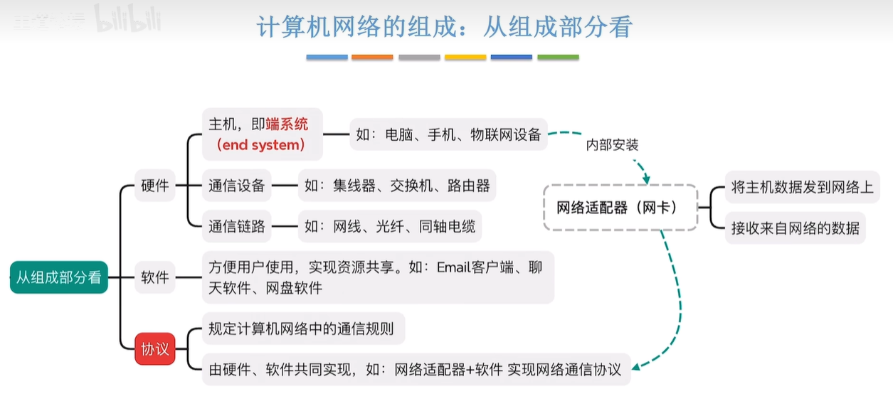
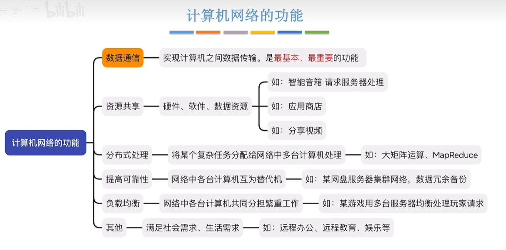
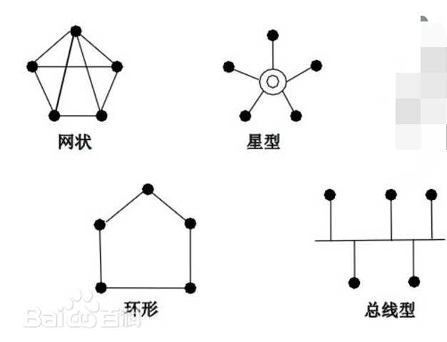
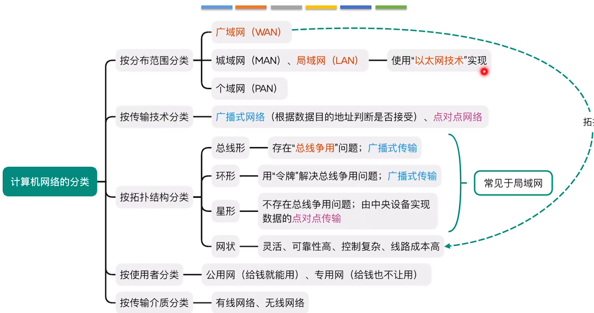
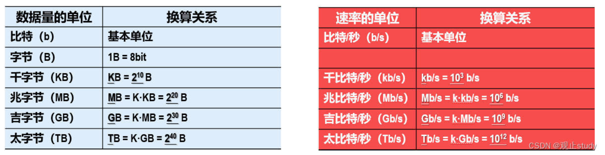
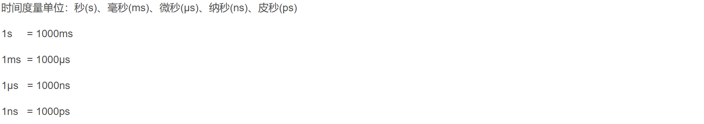
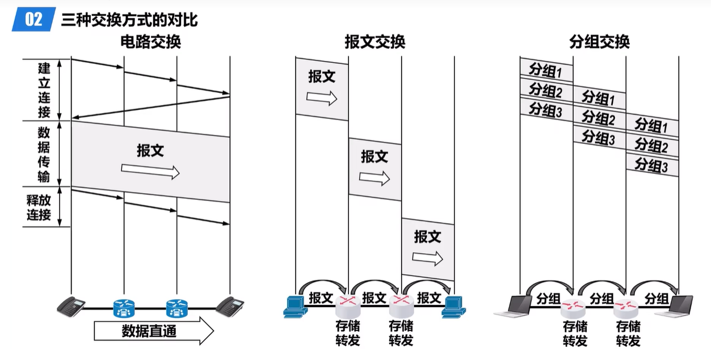
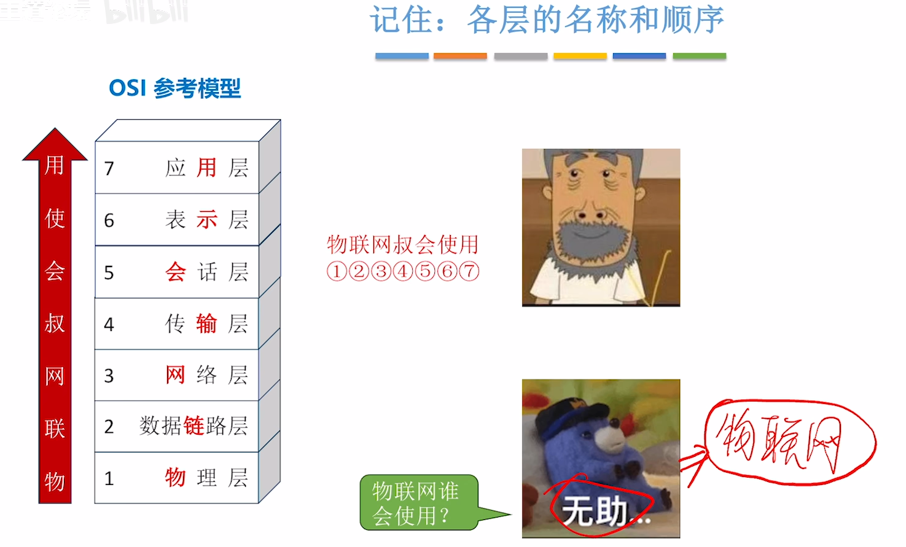

### 计算机网络基础

### 计网

#### 计算机网络

计算机网络由若干个节点和连接这些节点的链路组成

一个比较通用的定义是：利用[通信线路](https://baike.baidu.com/item/通信线路/1527630?fromModule=lemma_inlink)将地理上分散的、具有独立功能的[计算机系统](https://baike.baidu.com/item/计算机系统/7210959?fromModule=lemma_inlink)和通信设备按不同的形式连接起来，以功能完善的网络软件及协议实现资源共享和信息传递的系统。

#### 互连网 internet

 泛指由多个计算机网络互连而成的网络。

#### 网络的网络

网络将许多计算机连接在一起，而互连网则把许多网络连接在一起

#### ‌[internet](https://www.baidu.com/s?wd=internet&tn=15007414_20_dg&usm=4&ie=utf-8&rsv_pq=e4f5e54e001df311&oq=internet和Internet的区别&rsv_t=289euFwJXWB3vGordiiKYuukEXzH90gwGeYXWG4J3nw90lic8OAGMQXJOul0CTsYuhM0z70&sa=re_dqa_generate)和‌[Internet](https://www.baidu.com/s?wd=Internet&tn=15007414_20_dg&usm=4&ie=utf-8&rsv_pq=e4f5e54e001df311&oq=internet和Internet的区别&rsv_t=9610Pn9ogRYtDeA1ADRDj1YQaALaIFTnefKKdaBo7NfyG2Oi4bI9GG1%2FuUGdC5XUGgdkFJE&sa=re_dqa_generate)的定义和区别‌

- ‌**internet**‌是一个通用名词，泛指由多个计算机网络互连而成的计算机网络。这些网络之间的通信协议可以任意选择，不一定非要使用tcp/ip协议。
- ‌**Internet**‌是一个专用名词，特指当前世界上最大的、开放的、由众多网络相互连接而成的特定计算机网络。它采用‌[TCP/IP协议](https://www.baidu.com/s?wd=TCP%2FIP协议&tn=15007414_20_dg&usm=4&ie=utf-8&rsv_pq=e4f5e54e001df311&oq=internet和Internet的区别&rsv_t=35bdqJMNe%2B%2FF4RJU7qedCXUFCRBLiz0hgynFSE46AkDTk7dy0JNat%2F38KQhfosXe8go85rA&sa=re_dqa_generate)族作为通信规则，前身是美国的‌[ARPANET](https://www.baidu.com/s?wd=ARPANET&tn=15007414_20_dg&usm=4&ie=utf-8&rsv_pq=e4f5e54e001df311&oq=internet和Internet的区别&rsv_t=6b74EqCEz3s4XZazXCRKiJWOM%2B2l%2Bgt34WbvHpQPYF8NAjVgY7H2bhg3yg0VZPE94VOyTqk&sa=re_dqa_generate)。

#### 互连网Internet

特指全球最大的，最开放的，由从多网络相互连接而成的特定计算机网络，它采用tcp/ip协议族作为通信规则，其前身是美国的arpanet。

#### 四大计算机网络及其特点（错一次）

**面向终端的计算机网络--第一代计算机网络**

第一代计算机网络主要是面向终端的计算机网络，以单个计算机为中心，通过点对点的连接方式实现远程终端的数据输入和输出。硬件上：以电子管为基本电子器件，体积大，运行慢、成本高

特点： 第一代计算机，以电子管为基本电子器件，其显著特点包括体积庞大、运算速度慢、成本高昂。

**分组交换网--第二代计算机网络**

第二代计算机网络将分散在不同地点的计算机经通信线路互联，是以资源子网为中心的 计算机网络。硬件上：采用晶体管，相较上一代体积缩小，速度提升，降低能耗，可靠性更高。

特点： 第二代计算机采用晶体管，相较于第一代，其体积缩小、寿命延长、速度提升、能耗降低，且可靠性更高。

 **标准化的计算机网络--第三代计算机网络**

第三代计算机网络以标准化为主要特点，为了降低网络的复杂度，提出了分层设计方法，制定osi参考模型。硬件上采用中小规模集成电路，进一步缩小体积，提升速度，降低了能耗，并提高了可靠性。

特点：第三代计算机采用的是中小规模集成电路，进一步缩小了体积、提升了速度、降低了能耗，并提高了可靠性。

 **Internet--第四代计算机网络**

第四代计算机网络以互联网为中心，网络覆盖全球，信息传输速度大幅提升。这个阶段的特点包括：

**全球覆盖 **‌**高速传输** **多样化应用 **  **宽带 综合业务 数字化网络**

 第四代计算机以中、小规模集成电路为基础，引入了大规模和超大规模集成电路技术

因特网发展的三个阶段（错一次）

1. **第一阶段：从单个网络APPANET向互联网发展**‌
2. ‌**第二阶段：建成三级构造互联网**：‌主要分为主干网、地区网和校园网（或企业网）
3. ‌**第三阶段：形成全球范围内多层次ISP结构的互联网**

 

#### 互联网的标准化制定的几个阶段

互联网草案：该草案有效期只有6个月

建议标准:从这个阶段开始成为RFC文档

互联网标准：如果经过长期校验，将成为互联网标准

#### 互联网的组成（按工作方式）（错一次）

按工作方式看分为两部分

边缘部分：由所有连接在互联网的主机组成。这部分是用户直接使用的，用来通信和资源共享。

核心部分：由大量网络和连接这些网络的路由器组成。这部分是为边缘部分提供服务的（提供连通性和交换）

#### 计算机之间通信

主机A的某个进程和主机B的另一个进程进行通信。

#### 计算机网络通信

计算机网络采用的通信方式是客户-服务器方式和对等连接方式（p2p）

#### 客户-服务器方式和对等连接方式

客户和服务器都是指计算机中的进程。客户是服务请求方，服务器是服务提供方

服务器-[客户机](https://baike.baidu.com/item/客户机/5168153?fromModule=lemma_inlink)，即Client-Server(C/S)结构。C/S结构通常采取两层结构。服务器负责数据的管理，客户机负责完成与用户的[交互任务](https://baike.baidu.com/item/交互任务/54314909?fromModule=lemma_inlink)。

‌**对等连接（peer-to-peer，简称P2P）是指两个主机在通信时并不区分哪一个是服务请求方还是服务提供方**‌。

#### 计算机网络的组成（按组成部分来看）

硬件是计算机网络的基础，主要包括以下几类设备：

计算机系统、通信设备、通信链路。

计算机系统包括主机和各类终端，如计算机、手机等

通信设备包括路由器、交换机、网桥、集线器等

通信链路包括有线链路和无线链路。有线链路包括双绞线、同轴电缆、光纤等。无线链路包括无线电波、红外线等

软件是计算机网络运行的核心，主要包括以下几类：

软件包括系统软件、应用软件、支撑软件、中间件和‌嵌入式软件

协议是计算机网络中不可或缺的一部分，它规定了数据交换的格式、传输方式和控制机制。常见的网络协议包括：

‌**TCP/IP协议**、‌**HTTP协议**、‌**FTP协议**‌等

#### 计算机网络的功能

计算机网络的功能有

数据通信、

资源共享（软件共享、硬件共享、数据共享）、

分布式处理与负载均衡、

提高可靠性 

和综合信息服务

#### 计算机网络的分类

1、按分布范围分类

个人局域网pan person：个人局域网就是个人工作的地方把属于个人使用的电子设备用无线技术连接起来的网络，其作用范围为10m左右，也常称为无线个人局域网wpan

 局域网lan local：但地理上局限在较小的范围（如1km左右）

城域网man metropolitean：城域网的作用范围一般为一个城市，其作用的距离约为5-50km。

广域网wan wide：广域网的作用范围通常为几十到几千公里，有时也称为远程网。

2、按网络使用者分类

公用网指的是电信公司（国有或者私有）出资建造的大型网络，所有缴纳电信公司费用的人都可以使用该网络

专用网指的是某个部门为满足本部门的特殊业务的需要建造的网络。这种网络不向本部门以外的人提供服务。、

3、接入网

用来把用户接入互联网的网络

这种网络就是接入网AN，它又称为本地接入网或者居民接入网

按拓扑结构分类

1、总线结构

优点：结构简单，布线容易，可靠性高，易于扩充，节点的故障不会殃及系统，是局域网常用的拓扑结构；

2、星状结构

优点：结构简单、便于维护和管理，因为当网络中某个节点或者某条线缆出现问题时，不会影

响其他节点的正常通信，维护比较容易；

3、环状结构

优点：结构简单、控制简便、结构对称性好、传输速率高；

4、树状结构

优点：成本低、结构简单、维护方便、扩充节点方便灵活；

5、网状结构

优点：具有较高的可靠性，某一线路或节点有故障时，不会影响整个网络的工作；因为有多条

路径，所以可以选择最佳路径，减少时延，改善流量分配，提高网络性能，但路径选择比较复杂；

还有按传输介质分类，按交换方式分类和按传输技术分类

按交换方式有：电路交换网、分组交换网和报文交换网

#### 计算机网络性能

速率 ：速率是指数据的传送速率，即每秒传送多少个比特。也称为数据率和比特率

带宽 ：

带宽本来是指某个信号具有频带宽度。

在计算机网络中，带宽表示网络的通信线路 所能传送数据 的能力，即信道容量。单位也是bps（比特每秒）

网络带宽表示单位时间内网络中某信道所能通过的“最高数据率”。

吞吐量 ：吞吐量是指在单位时间内 通过 某个网络或接口的实际数据量。

时延：:时延是指数据从网络的一端传送到另一端所耗费的时间，包括发送时延                                                                                 、传播时延、处理时延和排队时延。

总时延：发送时延+传播时延+处理时延 +排队时延

总时延：发送时延+2^单向传播时延

总时延：发送时延+传播时延

发送时延：发送时延是主机或路由器发送数据帧所需要的时间，也就是从发送数据的第一个比特到该帧的最后一个比特发送完毕的所需的时间

公式：发送帧长度bit / 发送速率bit/s（带宽）

传播时延：传播时延是电磁波在信道中传播一定的距离需要花费的时间。

公式：信道长度 m / 电磁波在信道上的传播速率m/s（信号在媒体上的传播速率）

处理时延：处理时延指‌[主机](https://www.baidu.com/s?tn=15007414_20_dg&wd=主机&usm=3&ie=utf-8&rsv_pq=9613472c0011b967&oq=处理时延&rsv_t=150eIwm62sp0AplFiGQKTeV%2FeiVMWM9NeZRApuNHzy9e2fNxftK5hJhYoZvYzdzjH5Xms9s&sa=re_dqa_generate)或‌[路由器](https://www.baidu.com/s?tn=15007414_20_dg&wd=路由器&usm=3&ie=utf-8&rsv_pq=9613472c0011b967&oq=处理时延&rsv_t=c2a39sMl%2BvJlnkbYExlZ1m5600cPa3n4upbvH%2B6rFOajMT2gl%2FsNZuvcrX%2Fo25hV6BQtsbk&sa=re_dqa_generate)在收到分组时要花费的时间来处理分组

排队时延:排队时延指分组在进入路由器后要在输入队列中排队等待处理。在路由器确定了转发接口后，还要在输出队列中排队等待转发。

时延带宽积：传播时延*带宽

链路的时延带宽积是**传播时延和带宽的乘积**，也称为**以比特为单位的链路长度**。

注释：2*10^5bit为发送端连续发送数据时，则在发送第一个比特即将到达终点时，发送端就已经发送了20万个比特了

往返时间（RTT）：往返时间（`R`ound-`T`rip `T`ime，简称`RTT`）是指**从发送端发送数据分组开始，到发送端收到接收端发来的相应确认分组为止，总共耗费的时间**。

利用率：利用率有信道利用率和网络利用率两种。信道利用率指某信道有百分之几的时间是被利用的（有数据通过），完全空闲的信道的利用率是零。网络利用率则是全网络的信道利用率的加权平均值。

信道利用率或网络利用率过高就会产生非常大的时延

网络当前时延=网络空闲的时延 / 1-现在网络利用率

(当=空/1-利用率)

网络空闲的时延越大，网络当前时延越大。你平时的时延都大，当前时延肯定大

网络利用率越大，网络当前时延越大

丢包率：指在一定的时间范围内，传输过程中丢失的分组数量与总分组数量的比例。

计算机网络非性能指标特征

费用

质量

标准化

可靠性

可拓展性和可升级性

易于管理和维护

非性能特征和性能指标的主要区别就是：性能指标就是直接反映网络性能的，而非性能指标则是不是网络特有的指标

#### 计算机网络交换技术

电路交换技术

电路交换的主要特点：

通信前先要建立连接，通信完毕后要释放连接。也就是说，通信一定要有三个阶段：建立连接、通信、释放连接。

在通信过程中，通信双方自始至终占用着所使用的物理链路。

缺点对于计算机通信，由于计算机数据是突发式地出现在传输线路上的，及往往是高频次，少量地传输数据，所以电路交换的效率较低

- 建立/释放连接，需要额外的时间开销。
- 线路被通信双方独占，利用率低。
- 线路分配的灵活性差。
- 交换节点不支持“差错控制”（无法发现传输过程中的发生的数据错误） 

报文交换技术（分组交换的前身，分组交换比报文交换多一个报文定长）

 报文交换的优点:

- 通信前无需建立连接

- 在通信时间内，两个用户无需独占一整条物理线路。相比于电路交换，线路利用率高

- 交换节点支持“差错控制”（通过校验技术)

- 数据以“报文”为单位被交换节点间“存储转发”，通信线路可以灵活分配

  

报文交换的缺点:

- 报文不定长，不方便存储转发管理
- 长报文的存储转发时间开销大、缓存开销大
- 长报文容易出错，重传代价高

分组交换技术

过程：再发送报文前，先将较长的报文划为一个个更小的等长的数据段。

路由器每收到一个分组，先临时存储下来，再检查其首部，查找传发表，按照首部中的目的地址，找到合适的接口转换出去，把分组转换给下一个路由器。一步步的转换，把分组交付给最终的目的主机

分组交换的优点:

- 通信前无需建立连接
- 数据以“分组”为单位被交换节点间“存储转发”，通信线路可以灵活分配
- 在通信时间内，两个用户无需独占一整条物理线路。相比于电路交换，线路利用率高
- 交换节点支持“差错控制”(通过校验技术)

相比于报文交换，分组交换改进了如下问题:

- 分组定长，方便存储转发管理
- 分组的存储转发时间开销小、缓存开销小
- 分组不易出错，重传代价低

分组交换的缺点:

- 相比于报文交换，控制信息占比增加
- 相比于电路交换，依然存在存储转发时延
- 报文被拆分为多个分组，传输过程中可能出现失序、丢失等问题，增加处理的复杂度

#### 三种交换方式再数据传送的特点：

电路交换：整个报文的比特流        连续地从源头直达终点，好像在一个管道中传送

报文交换：整个报文先传送到相邻的节点，全部       存储下来后再查找转发表，转发到下一个节点

分组交换：单个分组（整个报文的一部分）传送到相邻节点，存储下来后查找转发表，转发到下一个节点

### 模型

#### 计算机网络OSI模型划分原则，分为哪几层？

（1）网路中各节点都有相同的层次；

（2）不同节点的同等层具有相同的功能；

（3）同一节点内相邻层之间通过接口通信；

（4）每一层      使用下层提供的服务，并向其上层提供服务；

（5）不同节点的同等层按照协议实现对等层之间的通信。

（6）根据功能需要进行分层，每层应当实现定义明确的功能。

（7）向应用程序提供服务

分为：物理层、数据链路层、网络层、传输层、会话层、表示层、应用层

分层的好处：

各层之间都是  独立

灵活性好

结构上可分  隔开

易于实现和维护

能促进标准化工作

#### 各层所要完成的功能主要有以下这些：

差错控制

流量控制

分段和重装

复用和分用

连接建立和释放

#### 网络的 体系 结构

**网络的体系结构是指计算机网络 各层次  及其协议的   集合**‌。

#### 讲述原理的五层协议

应用层：应用层的任务是   通过应用进程间的交互      来完成特定网络应用。

应用层协议定义的时应用进程间通信和交互的规则

应用层交互的数据单元称为报文

运输层：运输层的任务是负责   两台主机中进程之间的通信    和  提供通信的数据传输服务

运输层主要使用以下两种协议：

传输  控制协议T CP ：提供面向连接到可靠   的数据传输服务，其数据传输的单位是报文段。

用户  数据协议U DP：提供无连接的尽最大努力   的数据传输服务（不保证数据传输的可靠性），其数据传输的单位是用户数据报。

网络层：网络层负责为分组交换网上的不同主机提供通信服务。

网络层把运输层产生的报文段或用户数据封装成分组或包进行传送。 

数据链路层：将网络层交下来的IP数据报组装成帧，在两个相邻节点间的链路上传送帧。

物理层：物理层的任务是透明地传送比特流。

物理层上所传数据的单位是比特。

#### 计算机网络五层所面临的问题

物理层：

采用什么传输媒体 ：			双绞线、光纤、光缆

采用什么物理接口：			rj45以太网接口

采用什么信号：				高电平表示1，低电平表示0

数据链路层

如何标识网络中的各主机：		mac地址

如何区分地址  和数据：			约定数据的封装格式

如何协调各主机争用总线			使用以太网交换机

网络层

如何标识互联网中各网络以及网络中的各主机 		ip地址

路由器如何转发分组和进行路由选择		

运输层

如何 标识主机中与网络通信相关的应用进程

如何处理传输差错

应用层

采用何种编码、是否加密和压缩数据		

#### 五层协议中，数据在各层之间的转递过程

从应用层到物理层：

应用层的数据（假设是一个网页，构建http请求报文），在运输层被分割成许多份（段），在http请求报文前添加tcp首部，将其封装成tcp报文段。然后交付给网络层。网络层在tcp报文段添加ip首部，将其封装成ip数据报。ip首部的主要作用是ip寻址和路由。然后在数据链路层为ip数据报添加一个首部和一个尾部，将其封装成帧。帧首部和尾部的主要作用是mac寻址和帧校验。然后交付给物理层。物理层将其看作比特流，还会在比特流前面添加前导码，然后转换相应的电信号进行发送

路由器收到数据的处理过程：

物理层将收到的电信号转换成比特流，并去掉前导码，然后交付给数据链路层。

数据链路层去掉帧的首部和尾部，将ip数据报交付给网络层。

网络层从ip数据报的首部中提取出目的的ip地址，根据目的ip地址查找自己的转发表，以便从哪个接口转发给ip数据报。与之同时，还要对首部的某些字段值进行相应的修改，然后将给ip数据报向下交付给数据链路层。

数据链路层为IP数据报添加一个首部和尾部，将其封装成帧，然后将帧向下交付给物理层

物理层将其看作比特流，还会在比特流前面添加前导码，然后转换相应的电信号进行发送

从物理层到应用层：

另一终端接收到物理层的比特流，先判断数据链路层的接收端MAC地址是不是自己的

MAC地址，是的话接收，不是就丢弃，接收后去掉MAC地址部分的数据 ，然后网络层

判断目标ip地址是否正确，正确的话去掉ip首部，变成数据段，然后由传输层传

输，最终在应用层拼接传输层的数据，最终呈现给用户。

#### 协议、服务和实体、服务访问点和数据包术语

实体是指任何     可发送或接受信息的     硬件或软件进程。

对等实体是指通信双方     相同层次中的实体。

协议即网络协议，为计算机网络中进行   数据交换而建立的规则、标准或约定的集合

协议由语法、语义和同步三部分组成

语法：即数据与控制信息的格式   （定义通信双方所交换信息的格式）

语义：即需要发出何种控制信息，完成何种动作以及做出何种响应（定义通信双方所要完成的操作）

同步：即事件实现顺序的详细说明 （定义通信双方的时序关系）

协议是控制两个对等实体（或多个实体）进行通信的规则的集合

服务

在协议的控制下，两个对等实体间的通信使得本层能够向上一层提供服务。要实现本层协议，还需要使用下面一层所提供的服务。

协议是水平的，服务是垂直的

实体看得见相邻下层所提供的服务，但并不知道实现该服务的具体协议。也就是说，下面的协议对上面的实体是透明的。

服务访问点（SAP）

在同一系统中   相邻两层的实体交换信息    的逻辑接口，用来区分不同的服务类型。

数据包术语

- 协议数据单元PDU：对等层次之间传送的数据包称为该层的协议数据单元。（比特流、帧、IP数据报、tcp报文段或者udp用户数据报、应用报文）
- 服务数据单元SDU：同一系统内，层与层之间交换的数据包称为服务数据单元。
- （下层协议为上层协议提供服务，上层协议数据单元PDU将会成为下层的服务数据单元SDU。）
- 多个SDU可以合成为一个PDU；一个SDU也可划分为几个PDU。

#### 计算机网络协议的特点

必须把所有不利的条件事先都估计到，而不是假定一切都是正常的和非常理想的。
