## 运输层

### 运输层协议概述

#### 任务

运输层：运输层的任务是负责   两台主机中进程之间的通信    和  提供通信的数据传输服务

运输层主要使用以下两种协议：

传输控制协议TCP ：提供面向连接到可靠的数据传输服务，其数据传输的单位是报文段。

用户数据协议UDP：提供无连接的尽最大努力的数据传输服务（不保证数据传输的可靠性），其数据传输的单位是用户数据报

#### 进程之间的通信

运输层向它上面的应用层提供通信服务，它属于面向通信部分的最高层，同时也是用户功能中的最低层

两台主机进行通信就是两台主机中的应用进程互相通信

端到端的通信是应用进程之间的通信

运输层有一个很重要的功能——复用(multiplexing)和分用(demultiplexing)。

这里的“复用”是指在发送方不同的应用进程都可以使用同一个运输层协议传送数据(当然需要加上适当的首部),而“分用”是指接收方的运输层在剥去报文的首部后能够把这些数据正确交付目的应用进程

运输层提供应用进程间的逻辑通信

逻辑通信”的意思是：从应用层来看，只要把应用层报文交给下面的运输层，运输层就可以把这报文传送到对方的运输层

网络层为主机之间的通信提供服务，而运输层则在网络层的基础上，为应用进程之间的通信提供服务

#### 运输层的两个主要协议

(1)用户数据报协议UDP(User Datagram Protocol)
(2)传输控制协议TCP(Transmission Control Protocol)

根据应用程序的不同需求，运输层需要有两种不同的运输协议，即面向连接的TCP和无连接的UDP

当运输层采用面向连接的TCP协议时，尽管下面的网络是不可靠的(只提供尽最大努力服务),但这种逻辑通信信道就相当于一条全双工的可靠信道。但当运输层采用无连接的UDP协议时，这种逻辑通信信道仍然是一条不可靠信道。

UDP在传送数据之前不需要先建立连接

TCP则提供面向连接的服务

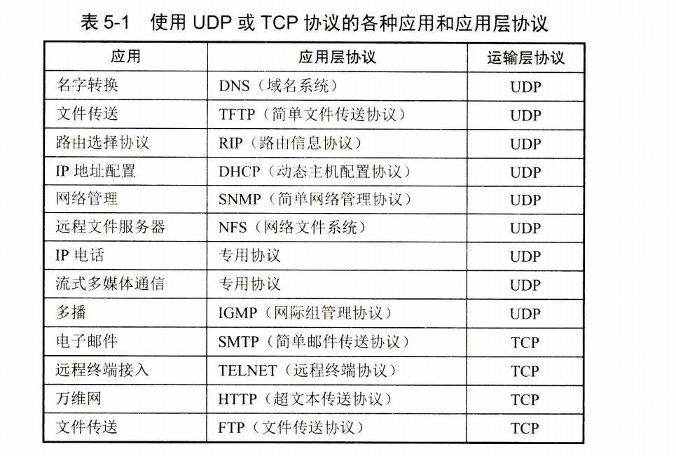

#### 运输层的端口

运输层的复用和分用功能也是类似的。应用层所有的应用进程都可以通过运输层再传送到IP层(网络层),这就是复用。运输层从IP层收到发送给各应用进程的数据后，必须分别交付指明的各应用进程，这就是分用

请注意，这种在协议栈层间的抽象的协议端口是软件端口，和路由器或交换机上的硬件端口是完全不同的概念。硬件端口是不同硬件设备进行交互的接口，而软件端口是应用层的各种协议进程与运输实体进行层间交互的地点。

TCP/IP的运输层用一个16位端口号来标志一个端口。但请注意，端口号只具有本地意义，它只是为了标志本计算机应用层中的各个进程在和运输层交互时的层间接口

运输层的端口号分为下面的两大类。

服务器端使用的端口号   这里又分为两类，最重要的一类叫作熟知端口号(well-known port number)或全球通用端口号，数值为0~1023

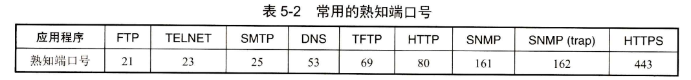

客户端使用的端口号  数值为49152~65535。由于这类端口号仅在客户进程运行时才动态选择，因此又叫作短暂端口号①。这类端口号就是临时端口号，留给客户进程选择临时使用

### 用户数据报协议UDP

#### UDP概述

用户数据报协议UDP只在IP的数据报服务之上增加了很少一点的功能，这就是复用和分用的功能以及差错检测的功能。

UDP的主要特点是：5个

(1)UDP是无连接的，即发送数据之前不需要建立连接(当然，发送数据结束时也没有连接可释放),因此减少了开销和发送数据之前的时延。

(2)UDP使用尽最大努力交付，即不保证可靠交付，因此主机不需要维持复杂的连接状态表(这里面有许多参数)。

(3)UDP是面向报文的。发送方的UDP对应用程序交下来的报文，在添加首部后就向下交付IP层。UDP对应用层交下来的报文，既不合并，也不拆分，而是保留这些报文的边界

(4)UDP没有拥塞控制，因此网络出现的拥塞不会使源主机的发送速率降低

(5)UDP支持一对一、一对多、多对一和多对多的交互通信

(6)UDP的首部开销小，只有8个字节，比TCP的20个字节的首部要短。

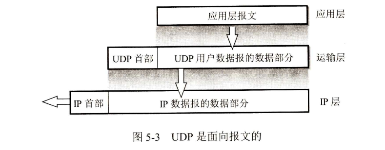

####  UDP的首部格式

用户数据报UDP有两个字段：数据字段和首部字段。首部字段很简单，只有8个字节

由4个字段组成，每个字段的长度都是2字节。各字段意义如下：
(1)源端口源  端口号。在需要对方回信时选用。不需要时可用全0。
(2)目的端口 目的端口号。这在终点交付报文时必须使用。
(3)长度  UDP用户数据报的长度，其最小值是8(仅有首部)。
(4)检验和   检测UDP用户数据报在传输中是否有错。有错就丢弃。

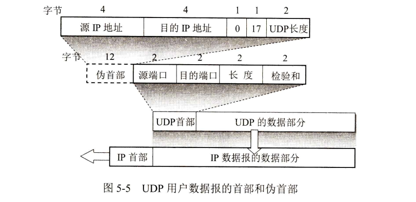

UDP用户数据报首部中检验和的计算方法有些特殊。在计算检验和时，要在UDP用户数据报之前增加12个字节的伪首部。所谓“伪首部”是因为这种伪首部并不是UDP用户数据报真正的首部。只是在计算检验和时，临时添加在UDP用户数据报前面，得到一个临时的UDP用户数据报

UDP计算检验和的方法和计算IP数据报首部检验和的方法相似。但不同的是：IP数据报的检验和只检验IP数据报的首部，但UDP的检验和是把首部和数据部分一起都检验

### 运输控制协议TCP概述

#### TCP最主要的特点

(1)TCP是面向连接的运输层协议。这就是说，应用程序在使用TCP协议之前，必须先建立TCP连接。在传送数据完毕后，必须释放已经建立的TCP连接

(2)每一条TCP连接只能有两个端点(endpoint),每一条TCP连接只能是点对点的(一对一)

(3)TCP提供可靠交付的服务。通过TCP连接传送的数据，无差错、不丢失、不重复，并且按序到达

(4)TCP提供全双工通信。TCP允许通信双方的应用进程在任何时候都能发送数据。TCP连接的两端都设有发送缓存和接收缓存，用来临时存放双向通信的数据

(5)面向字节流。TCP中的“流”(stream)指的是流入到进程或从进程流出的字节序列。“面向字节流”的含义是：虽然应用程序和TCP的交互是一次一个数据块(大小不等),但TCP把应用程序交下来的数据仅仅看成是一连串的无结构的字节流

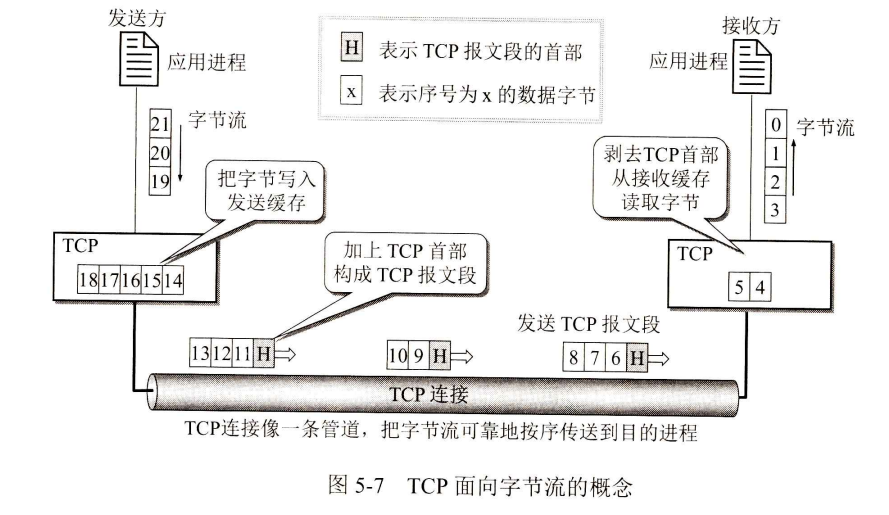

TCP连接是一条虚连接(也就是逻辑连接),而不是一条真正的物理连接

#### TCP的连接

TCP连接的端点叫作套接字(socket)或插口

套接字socket =(IP地址：端口号)

每一条TCP连接唯一地被通信两端的两个端点(即套接字对socket pair)所确定。

即：TCP连接：:={socket₁,socket₂}={(IP₁:port₁),(IP₂:port₂)}

以及网络技术的进步，同一个名词socket却可表示多种不同的意思。例如：
(1)允许应用程序访问连网协议的应用编程接口API(Application Programming Interface),即运输层和应用层之间的一种接口，称为socket API,并简称为socket。
(2)在socket API中使用的一个函数名也叫作socket。
(3)调用socket函数的端点称为socket,如“创建一个数据报socket”。
(4)调用socket函数时，其返回值称为socket描述符，可简称为socket。
(5)在操作系统内核中连网协议的Berkeley实现，称为socket实现。

### 可靠传输的工作原理

理想的传输条件有以下两个特点：
(1)传输信道不产生差错。
(2)不管发送方以多快的速度发送数据，接收方总是来得及处理收到的数据。

#### 停止等待协议

全双工通信的双方既是发送方也是接收方

“停止等待”就是每发送完一个分组就停止发送，等待对方的确认。在收到确认后再发送下一个分组

##### 1.无差错情况

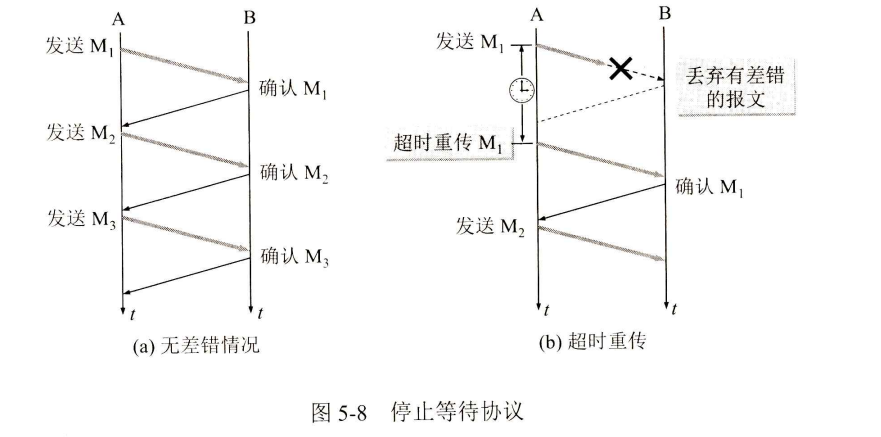

##### 2、出现差错

A只要超过了一段时间仍然没有收到确认，就认为刚才发送的分组丢失了，因而重传前面发送过的分组。这就叫作超时重传。要实现超时重传，就要在每发送完一个分组时设置一个超时计时器。如果在超时计时器到期之前收到了对方的确认，就撤销已设置的超时计时器

这里应注意以下三点。

第一，A在发送完一个分组后，必须暂时保留已发送的分组的副本(在发生超时重传时使用)。只有在收到相应的确认后才能清除暂时保留的分组副本。
第二，分组和确认分组都必须进行编号②。这样才能明确是哪一个发送出去的分组收到了确认，而哪一个分组还没有收到确认。
第三，超时计时器设置的重传时间应当比数据在分组传输的平均往返时间更长一些

但如果重传时间设定得太短，以致产生不必要的重传，就浪费了网络资源。然而，在运输层重传时间的准确设定是非常复杂的，这是因为已发送出的分组到底会经过哪些网络，以及这些网络将会产生多大的时延(这取决于这些网络当时的拥塞情况),这些都是不确定因素

##### 3.确认丢失和确认迟到

这时应采取两个行动。
第一，丢弃这个重复的分组M,不向上层重复交付。
第二，向A发送确认。不能认为已经发送过确认就不再发送，因为A之所以重传M₁就表示A没有收到对M₁的确认。

使用上述的确认和重传机制，我们就可以在不可靠的传输网络上实现可靠的通信。
像上述的这种可靠传输协议常称为自动重传请求

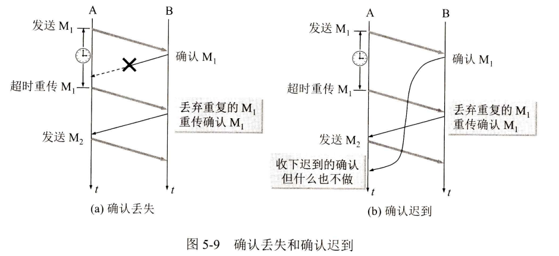

上述的这种可靠传输协议常称为自动重传请求ARQ(Automatic Repeat reQuest)。意思是重传的请求是自动进行的，因此也可见到自动请求重传这样的译名

##### 4.信道利用率

停止等待协议的优点是简单，但缺点是信道利用率太低

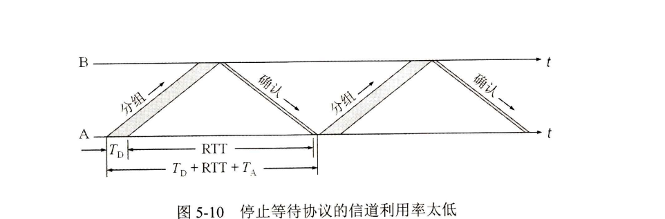

假定A发送分组需要的时间是T~D~。显然，T~D~等于分组长度除以数据率。

再假定分组正确到达B后，B处理分组的时间可以忽略不计，同时立即发回确认。假定B发送确认分组需要时间TA。

如果A处理确认分组的时间也可以忽略不计，那么A在经过时间(Tp+RTT+
TA)后就可以再发送下一个分组，

这里的RTT是往返时间。因为仅仅是在时间T~D~内才用来传送有用的数据(包括分组的首部),因此信道的利用率U可用下式计算：

当使用流水线传输时，就要使用下面介绍的连续ARQ协议和滑动窗口协议。

为了提高传输效率，发送方可以不使用低效率的停止等待协议，而是采用流水线传输(如图5-11所示)。流水线传输就是发送方可连续发送多个分组，不必每发完一个分组就停顿下来等待对方的确认

#### 连续ARQ协议

图5-12(a)表示发送方维持的发送窗口，它的意义是：位于发送窗口内的5个分组都可连续发送出去，而不需要等待对方的确认

连续ARQ协议规定，发送方每收到一个确认，就把发送窗口向前滑动一个分组的位置。图5-12(b)表示发送方收到了对第1个分组的确认，于是把发送窗口向前移动一个分组的位置。如果原来已经发送了前5个分组，那么现在就可以发送窗口内的第6个分组了。
接收方一般都是采用累积确认的方式。这就是说，接收方不必对收到的分组逐个发送确认，而是在收到几个分组后，对按序到达的最后一个分组发送确认，这就表示：到这个分组为止的所有分组都已正确收到了。

### TCP报文段的首部格式

TCP报文段首部的前20个字节是固定的(如图5-13所示),后面有4n字节是根据需要而增加的选项(n是整数)。因此TCP首部的最小长度是20字节。

首部固定部分各字段的意义如下：
(1)源端口和目的端口   各占2个字节，分别写入源端口号和目的端口号。和前面图5-5所示的UDP的分用相似，TCP的分用功能也是通过端口实现的。

(2)序号  占4字节。序号范围是[0,2³²-1],共2³²(即4294967296)个序号。序号增加到2³²-1后，下一个序号就又回到0。也就是说，序号使用mod 2³²运算。TCP是面向字节流的。在一个TCP连接中传送的字节流中的每一个字节都按顺序编号。整个要传送的字节流的起始序号必须在连接建立时设置。

(3)确认号是期望收到对方下一个报文段的第一个数据字节的序号

(4)数据偏移  占4位，它指出TCP报文段的数据起始处距离TCP报文段的起始处有多远

(5)保留  占6位，保留为今后使用，但目前应置为0。
下面有6个控制位，用来说明本报文段的性质，它们的意义见下面的(6)~(11)。

(6)紧急URG(URGent)  当URG=1时，表明紧急指针字段有效。它告诉系统此报文段中有紧急数据，应尽快传送(相当于高优先级的数据),而不要按原来的排队顺序传送

(7)确认ACK(ACKnowledgment)   仅当ACK=1时确认号字段才有效。当ACK=0时，确认号无效。TCP规定，在连接建立后所有传送的报文段都必须把ACK置为1

8)推送PSH(PuSH)  当两个应用进程进行交互式的通信时，有时在一端的应用进程希望在键入一个命令后立即就能够收到对方的响应。这时，发送方TCP把PSH置1,并立即创建一个报文段发送出去。接收方TCP收到PSH=1的报文段，就尽快地(即“推送”向前)交付接收应用进程，而不再等到整个缓存都填满了后再向上交付

(9)复位RST(ReSeT)  当RST=1时，表明TCP连接中出现严重差错(如主机崩溃或其他原因),必须释放连接，然后再重新建立运输连接。将RST置为1还用来拒绝一个非法的报文段或拒绝打开一个连接。RST也可称为重建位或重置位。

(10)同步SYN (SYNchronization)   在连接建立时用来同步序号。当SYN=1而ACK=0时，表明这是一个连接请求报文段。对方若同意建立连接，则应在响应的报文段中使SYN=1和ACK=1。因此，SYN置为1就表示这是一个连接请求或连接接受报文。关于连接的建立和释放

(11)终止FIN (FINish,意思是“完了”“终止”)   用来释放一个连接。当FIN=1时，表明此报文段的发送方的数据已发送完毕，并要求释放运输连接。

(12)窗口   占2字节。窗口值是[0,2¹⁶-1]之间的整数。窗口指的是发送本报文段的。窗口值作为接收方让发送方设置其发送窗口的依据。

(13)检验和   占2字节。检验和字段检验的范围包括首部和数据这两部分。和UDP用户数据报一样，在计算检验和时，要在TCP报文段的前面加上12字节的伪首部。

(14)紧急指针  占2字节。紧急指针仅在URG=1时才有意义，它指出本报文段中的紧急数据的字节数(紧急数据结束后就是普通数据)

(15)选项  长度可变，最长可达40字节。当没有使用“选项”时，TCP的首部长度是20字节。最后的填充字段仅仅是为了使整个TCP首部长度是4字节的整数倍。

TCP最初只规定了一种选项，即最大报文段长度MSS (Maximum Segment Size)[RFC6691]。请注意MSS这个名词的含义。

MSS是每一个TCP报文段中的数据字段的最大长度。数据字段加上TCP首部才等于整个的TCP报文段。所以MSS并不是整个TCP报文段的最大长度，而是“TCP报文段长度减去TCP首部长度”。

随着互联网的发展，又陆续增加了几个选项，如窗口扩大选项、时间戳选项等

窗口扩大选项是为了扩大窗口

窗口扩大选项占3字节，其中有一个字节表示移位值S。新的窗口值等于TCP首部中的窗口位数从16增大到(16+S)。移位值允许使用的最大值是14,相当于窗口最大值增大
到2(16+14)-1=2³0-1。

时间戳选项占10字节，其中最主要的字段是时间戳值字段(4字节)和时间戳回送回答字段(4字节)。时间戳选项有以下两个功能：
第一，用来计算往返时间RTT。发送方在发送报文段时把当前时钟的时间值放入时间戳字段，接收方在确认该报文段时把时间戳字段值复制到时间戳回送回答字段。因此，发送方在收到确认报文后，可以准确地计算出RTT。

第二，用于处理TCP序号超过2³²的情况，这又称为防止序号绕回PAWS (ProtectAgainst Wrapped Sequence numbers)。

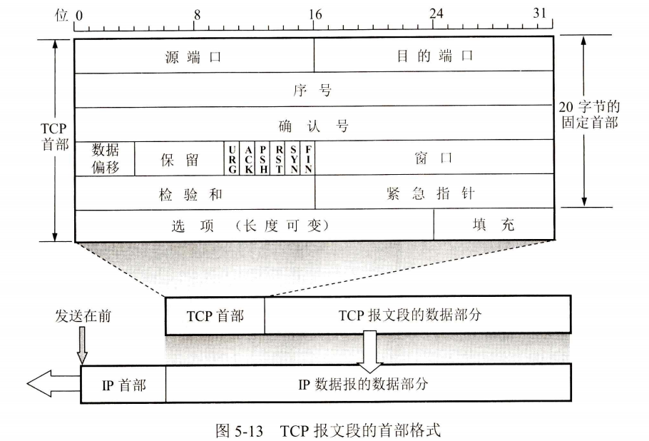

### TCP可靠传输的实现

#### 以字节为单位的滑动窗口

TCP的滑动窗口是以字节为单位的

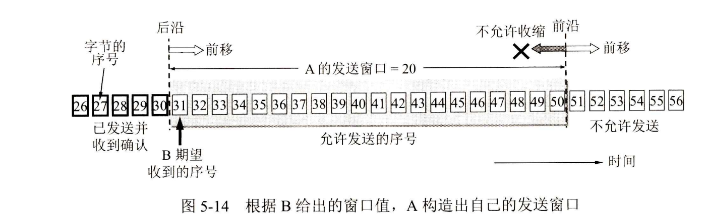

#### 超时重传时间的选择

TCP的发送方在规定的时间内没有收到确认就要重传已发送的报文段

TCP采用了一种自适应算法，它记录一个报文段发出的时间，以及收到相应的确认的时间。这两个时间之差就是报文段的往返时间RTT。TCP保留了RTT的一个加权平均往返时间RTTs(这又称为平滑的往返时间，S表示Smoothed。因为进行的是加权平均，因此得出的结果更加平滑)。

新的RTTs=(1-α)×(旧的RTTs)+α×(新的RTT样本)

#### 选择确认SACK

选择确认(Selective ACK)[RFC 2018,建议标准]就是一种可行的处理方法。

### TCP的流量控制

##### 利用滑动窗口实现流量控制

流量控制(flowcontrol)就是让发送方的发送速率不要太快，要让接收方来得及接收

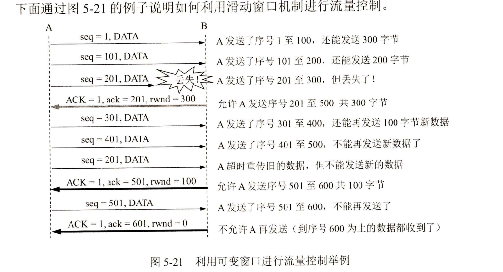

TCP的窗口单位是字节，不是报文段

B向A发送了rwnd=400的报文段。然而这个报文段在传送过程中丢失了。A一直等待收到B发送的非零窗口的通知，而B也一直等待A发送的数据。如果没有其他措施，这种互相等待的死锁局面将一直延续下去。
为了解决这个问题，TCP为每一个连接设有一个持续计时器

TCP连接的一方收到对方的零窗口通知，就启动持续计时器。若持续计时器设置的时间到期，就发送一个零窗口探测报文段

#### TCP的传输效率

用不同的机制来控制TCP报文段的发送时机

第一种机制是TCP维持一个变量，它等于最大报文段长度MSS。

第二种机制是由发送方的应用进程指明要求发送报文段，即TCP支持的推送(push)操作。

第三种机制是发送方的一个计时器期限到了，这时就把当前已有的缓存数据装入报文段(但长度不能超过MSS)发送出去。

另一个问题叫作糊涂窗口综合征(sillv window svndrome),有时也会使TCP的性能变坏

可以让接收方等待一段时间，使得或者接收缓存已有足够空间容纳一个最长的报文段，或者等到接收缓存已有一半空闲的空间。

### TCP的拥塞控制

#### 拥塞控制的一般原理

在某段时间，若对网络中某一资源的需求超过了该资源所能提供的可用部分，网络的性能就要变坏。这种情况就叫作拥塞

 ∑对资源的需求>可用资源

拥塞控制与流量控制的关系密切，它们之间也存在着一些差别。所谓拥塞控制就是防止过多的数据注入到网络中，这样可以使网络中的路由器或链路不至于过载。拥塞控制所要做的都有一个前提，就是网络能够承受现有的网络负荷

流量控制所要做的就是抑制发送端发送数据的速率，以便接收端来得及接收。

流量控制往往是指点对点通信量的控制，是个端到端的问题

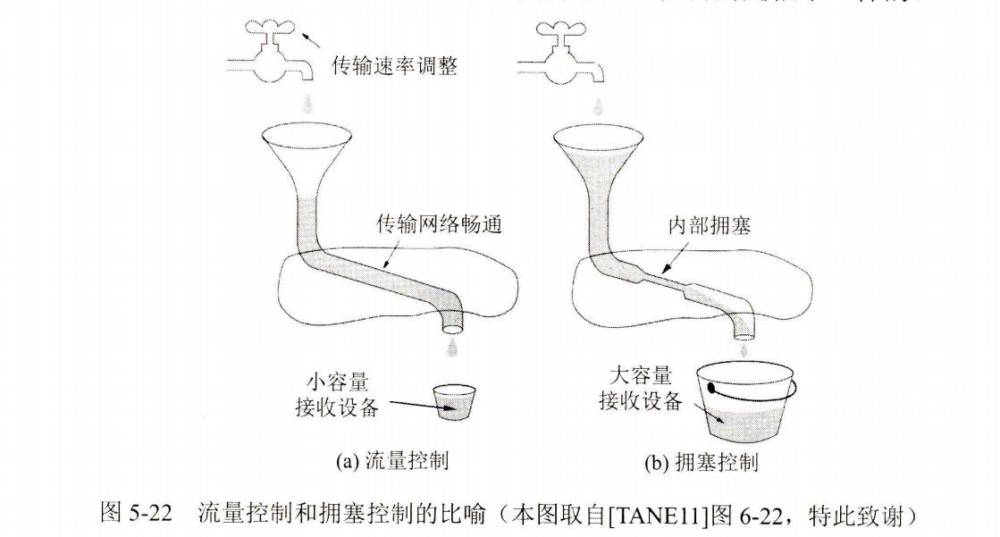

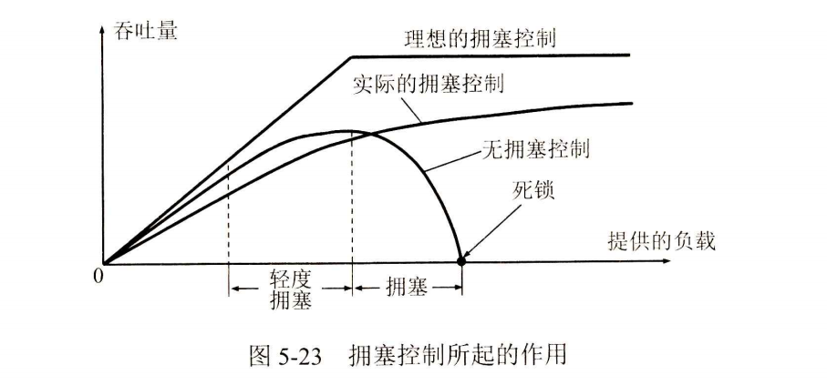

#### TCP的拥塞控制方法

TCP进行拥塞控制的算法有四种，即慢开始(slow-start)、拥塞避免(congestion avoidance)、快重传(fast retransmit)和快恢复(fast recovery）

##### 1.慢开始和拥塞避免

发送方维持一个叫作拥塞窗口cwnd (congestion window)的状态变量。拥塞窗口的大小取决于网络的拥塞程度，并且是动态变化着的。发送方让自己的发送窗口等于拥塞窗口

慢开始算法即由小到大逐渐增大注入到网络中的数据字节，也就是说，由小到大逐渐增大拥塞窗口数值。

为了防止拥塞窗口cwnd增长过大引起网络拥塞，还需要设置一个慢开始门限ssthresh状态变量(可以把门限ssthresh的数值设置大些，例如达到发送窗口的最大容许值)。慢开始门限ssthresh的用法如下：
当cwnd<ssthresh时，使用上述的慢开始算法。
当cwnd>ssthresh时，停止使用慢开始算法而改用拥塞避免算法。

当cwnd=ssthresh时，既可使用慢开始算法，也可使用拥塞避免算法。

拥塞避免算法的目的是让拥塞窗口cwnd缓慢地增大

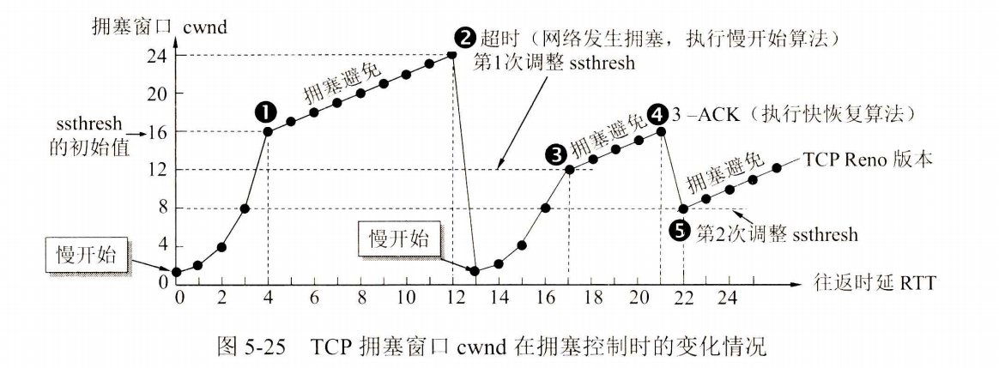

采用快重传算法可以让发送方尽早知道发生了个别报文段的丢失。快重传算法首先要求接收方不要等待自己发送数据时才进行捎带确认，而是要立即发送确认，即使收到了失序的报文段也要立即发出对已收到的报文段的重复确认

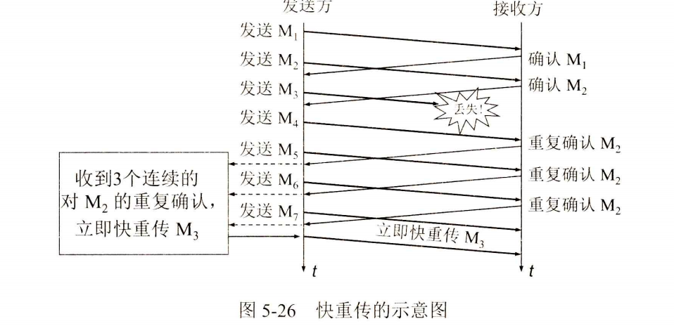

送方知道现在只是丢失了个别的报文段。于是不启动慢开始，而是执行快恢复算法

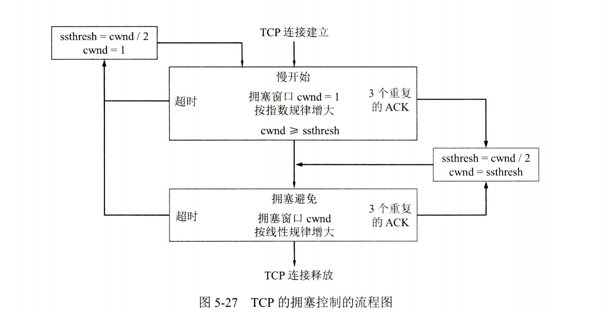

从接收方对发送方的流量控制的角度考虑，发送方的发送窗口一定不能超过对方给出的接收方窗口值rwnd。

#### 主动队列管理AQM

在最简单的情况下，路由器的队列通常都按照“先进先出”FIFO (First In First Out)的规则处理到来的分组。因此当队列已满时，以后再到达的所有分组续排队，这些分组都将排在队列的尾部)将都被丢弃。这就叫作尾部丢弃策略(tail-droppolicy)。

若发生了路由器中的尾部丢弃，就可能会同时影响到很多条TCP连接，结果使这许多TCP连接在同一时间突然都进入到慢开始状态。这在TCP的术语中称为全局同步

为了避免发生网络中的全局同步现象，在1998年提出了主动队列管理AQM(ActiveQueue Management)。所谓“主动”就是不要等到路由器的队列长度已经达到最大值时才不得不丢弃后面到达的分组。这样就太被动了。应当在队列长度达到某个值得警惕的数值时(即当网络拥塞有了某些拥塞征兆时),就主动丢弃到达的分组

### TCP的运输连接管理

TCP是面向连接的协议,运输连接是用来传送TCP报文的。TCP运输连接的建立和释放是每一次面向连接的通信中必不可少的过程

运输连接就有三个阶段，即：连接建立、数据传送和连接释放

在TCP连接建立过程中要解决以下三个问题：
(1)要使每一方能够确知对方的存在。
(2)要允许双方协商一些参数(如最大窗口值、是否使用窗口扩大选项和时间戳选项以及服务质量等)。
(3)能够对运输实体资源(如缓存大小、连接表中的项目等)进行分配。

TCP连接的建立采用客户服务器方式。主动发起连接建立的应用进程叫作客户(client),而被动等待连接建立的应用进程叫作服务器(server)

#### TCP的连接建立

TCP建立连接的过程叫作握手，握手需要在客户和服务器之间交换三个TCP报文段

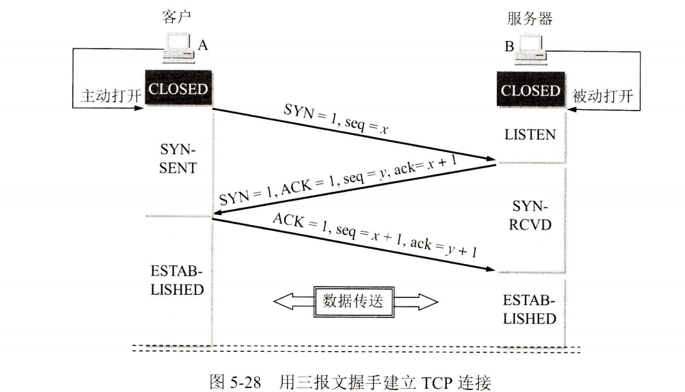

在本例中，A主动打开连接，而B被动打开连接。

B的TCP服务器进程先创建传输控制块TCB²,准备接受客户进程的连接请求。然后服务器进程就处于LISTEN(收听)状态

A的TCP客户进程也是首先创建传输控制块TCB。然后，在打算建立TCP连接时，向B发出连接请求报文段，这时首部中的同步位SYN =1,同时选择一个初始序号seq=x。

TCP规定，SYN报文段(即SYN=1的报文段)不能携带数据，但要消耗掉一个序号。这时，TCP客户进程进入SYN-SENT(同步已发送)状态。

B收到连接请求报文段后，如同意建立连接，则向A发送确认。在确认报文段中应把SYN位和ACK位都置1,确认号是ack=x+1,同时也为自己选择一个初始序号seq=y。

请注意，这个报文段也不能携带数据，但同样要消耗掉一个序号。这时TCP服务器进程进入SYN-RCVD(同步收到)状态

TCP客户进程收到B的确认后，还要向B给出确认。确认报文段的ACK置1,确认号
ack=y+1,而自己的序号seq=x+1。

TCP的标准规定，ACK报文段可以携带数据。但如果不携带数据则不消耗序号，在这种情况下，下一个数据报文段的序号仍是seq=x+1。这时，TCP连接已经建立，A进入ESTABLISHED(已建立连接)状态。

当B收到A的确认后，也进入ESTAB-LISHED状态。

上面给出的连接建立过程叫作三报文握手。

在图5-28中B发送给A的报文段，也可拆成两个报文段。可以先发送一个确认报文段(ACK=1,ack=x+1,然后再发送一个同步报文段(SYN=1,seq=y)。这样的过程就变成了四报文握手

为什么A最后还要发送一次确认呢?这主要是为了防止已失效的连接请求报文段突然又传送到了B,因而产生错误。所谓“已失效的连接请求报文段”是这样产生的

#### TCP的连接释放

TCP连接释放过程比较复杂，我们仍结合双方状态的改变来阐明连接释放的过程。

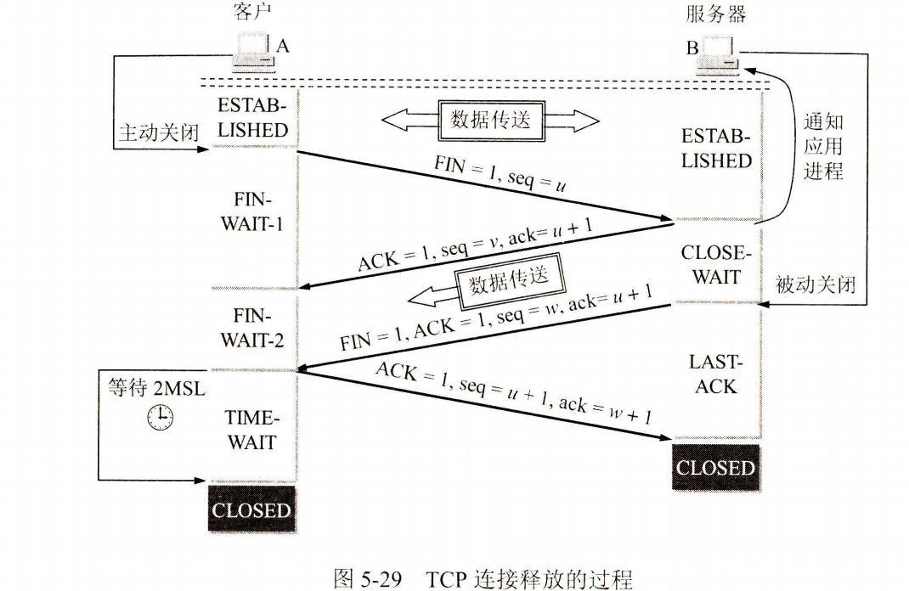

A的应用进程先向其TCP发出连接释放报文段，并停止再发送数据，主动关闭TCP连接。A把连接释放报文段首部的终止控制位FIN置1,其序号seq=u,它等于前面已传送过的数据的最后一个字节的序号加1。这时A进入FIN-WAIT-1(终止等待1)状态，等待B的确认。

请注意，TCP规定，FIN报文段即使不携带数据，它也消耗掉一个序号。

B收到连接释放报文段后即发出确认，确认号是ack=u+1,而这个报文段自己的序号是v,等于B前面已传送过的数据的最后一个字节的序号加1。然后B就进入CLOSE-WAIT(关闭等待)状态。

这时的TCP连接处于半关闭(half-close)状态，即A已经没有数据要发送了，但B若发送数据，A仍要接收。也就是说，从B到A这个方向的连接并未关闭，这个状态可能会持续一段时间。

A收到来自B的确认后，就进入FIN-WAIT-2(终止等待2)状态，等待B发出的连接释放报文段。

若B已经没有要向A发送的数据，其应用进程就通知TCP释放连接。这时B发出的连接释放报文段必须使FIN=1。现假定B的序号为w(在半关闭状态B可能又发送了一些数据)。B还必须重复上次已发送过的确认号ack =u+1。这时B就进入LAST-ACK(最后确认)状态，等待A的确认。

A在收到B的连接释放报文段后，必须对此发出确认。在确认报文段中把ACK置1,确认号ack =w+1,而自己的序号是seq=u+1(根据TCP标准，前面发送过的FIN报文段要消耗一个序号)。然后进入到TIME-WAIT(时间等待)状态。

请注意，现在TCP连接还没有释放掉。必须经过时间等待计时器(TIME-WAIT timer)设置的时间2MSL后，A才进入到CLOSED状态。时间MSL叫作最长报文段寿命(Maximum Segment Lifetime),RFC 793建议设为2分钟。

为什么A在TIME-WAIT状态必须等待2MSL的时间呢?这有两个理由。
第一，为了保证A发送的最后一个ACK报文段能够到达B。这个ACK报文段有可能丢失，因而使处在LAST-ACK状态的B收不到对已发送的FIN+ACK报文段的确认

第二，防止上一节提到的“已失效的连接请求报文段”出现在本连接中。A在发送完最后一个ACK报文段后，再经过时间2MSL,就可以使本连接持续的时间内所产生的所有报文段都从网络中消失

除时间等待计时器外，TCP还设有一个保活计时器(keepalive timer)。设想有这样的情况：客户已主动与服务器建立了TCP连接。但后来客户端的主机突然出故障。显然，服务器以后就不能再收到客户发来的数据

服务器每收到一次客户的数据，就重新设置保活计时器，时间的设置通常是两小时。若两小时没有收到客户的数据，服务器就发送一个探测报文段，以后则每隔75秒钟发送一次。若一连发送10个探测报文段后仍无客户的响应，服务器就认为客户端出了故障，接着就关闭这个连接

#### TCP的有限状态机

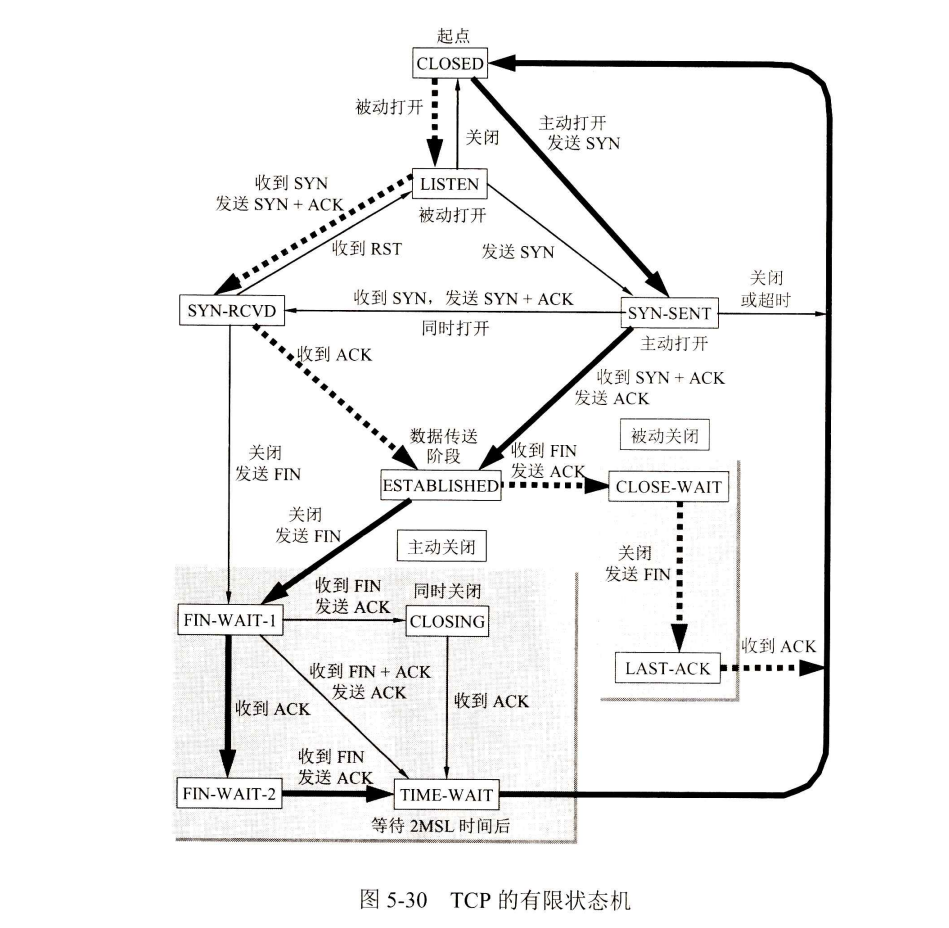

